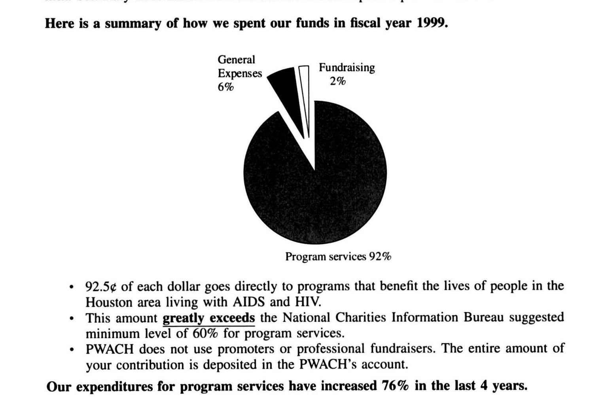
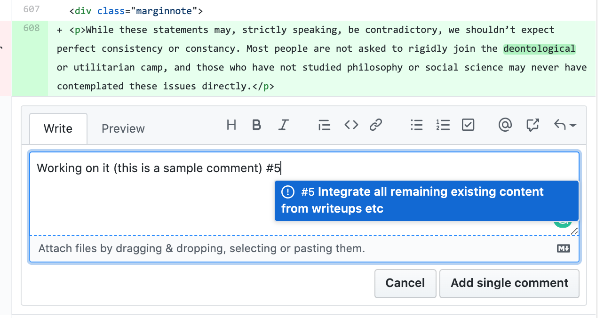
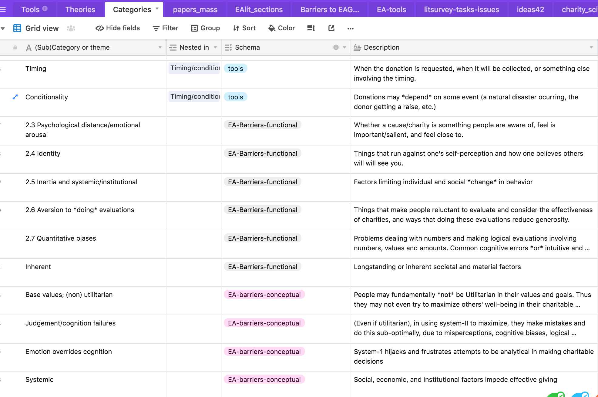
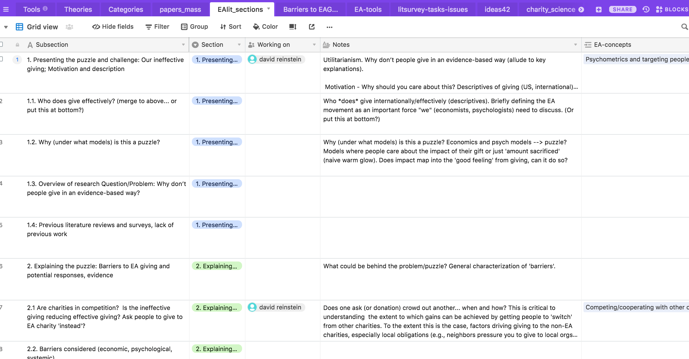
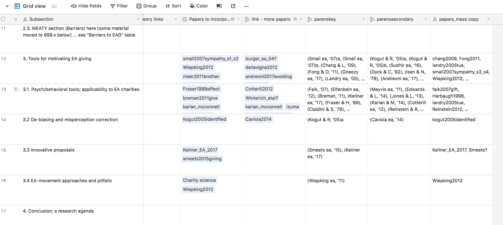
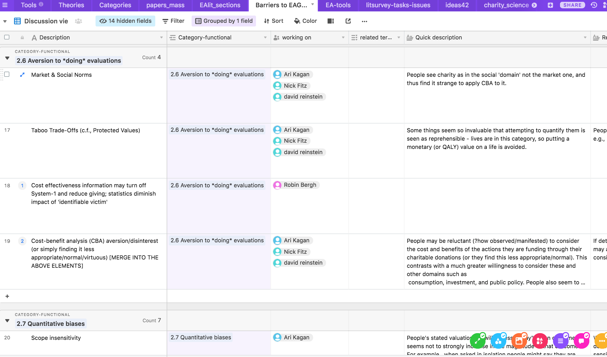
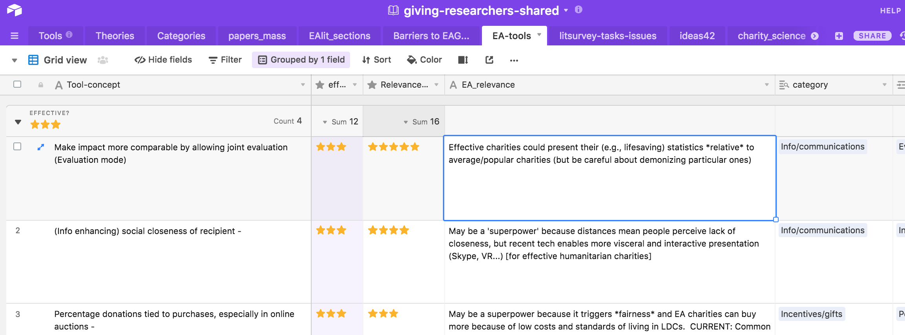

```{r}
library(pacman)
knitr::opts_chunk$set(echo = TRUE)
pacman::p_load(broom, dplyr, grid, huxtable, janitor, purrr, rlang, stats, tibble, tidyr, here, pryr, revealjs,
               install=FALSE)
```

```{r setting-up-based-on-template-files-and-code}

library(here)
here <- here::here()

try_download <- function(url, path) {
  new_path <- gsub("[.]", "X.", path)
  tryCatch({
    download.file(url = url,
                  destfile = new_path)
  }, error = function(e) {
    print("You are not online, so we can't download")
  })
  tryCatch(
    file.rename(new_path, path)
  )
}


#... Import packages for this project using template from dr-rstuff  ####
# - you don't need to do this each time, but it keeps it updated
try_download(
  "https://raw.githubusercontent.com/daaronr/dr-rstuff/master/functions/project_setup.R",
  here::here("code", "project_setup.R")
)

## You MUST run this for anything else to work (installs/loads key packages and functions):
source(here::here("code", "project_setup.R"))

```

```{r eval=FALSE}

install.packages("bookdown")
# or the development version
# devtools::install_github("rstudio/bookdown")

```

<!-- note installing packages is mainly removed because this is done in baseoptions.R -->

```{r }
# automatically create a bib database for R packages
knitr::write_bib(c(
  .packages(), 'bookdown', 'knitr', 'rmarkdown'
), 'packages.bib')
```

```{r somefunctions}

#possibly move these to a separate file

#multi-output text color
#https://dr-harper.github.io/rmarkdown-cookbook/changing-font-colour.html#multi-output-text-colour
#We can then use the code as an inline R expression format_with_col("my text", "red")

format_with_col = function(x, color){
  if(knitr::is_latex_output())
    paste("\\textcolor{",color,"}{",x,"}",sep="")
  else if(knitr::is_html_output())
    paste("<font color='",color,"'>",x,"</font>",sep="")
  else
    x
}

```

```{r html, echo=FALSE}
# globally set chunk options
knitr::opts_chunk$set(fig.align='center', out.width='80%')

my_output <- knitr::opts_knit$get("rmarkdown.pandoc.to")

```

```{=html}
<!--
Can define text blocks here, refer to them again and again if desired
-->
```
# Abstract {#abstract .unnumbered}

::: {.marginnote}
Future work: present or link a more extensive abstract here.
:::

[*David Reinstein, link to CV*](https://daaronr.github.io/markdown-cv/)

\

While hundreds of billions of dollars are donated to charity each year, the effectiveness of these charities differs by orders of magnitude, even within similar categories. Furthermore, many individuals do not donate substantially even though they believe that the cost of saving a life is small.\*

::: {.marginnote}
\* In an [exploratory survey](https://80000hours.org/2017/05/most-people-report-believing-its-incredibly-cheap-to-save-lives-in-the-developing-world/), the median belief was that a life could be saved for under \$40.
:::

This raises two related questions:

**1. "Why don't we give more to the most effective charities and to those most in need?",** and

**2. "Why are we not more efficient with our giving choices?"**

To address this, we must understand what drives giving choices, and perhaps, how people react to the presentation of charity-effectiveness information.\*\*

::: {.marginnote}
\*\* Do we need to understand "how people react to the presentation of charity-effectiveness information"? See discussion in [fold below](#why-understand-reactions).
:::

Our collaborative and dynamic synthesis considers this 'puzzle'. We outline and categorize potential barriers to effective giving and assess the evidence for each barrier. This directly informs "how to motivate effective giving". It also offers insights into the drivers of 'concern for' and 'willingness to act' to address the most neglected, tractable, and consequential global and humanitarian priorities.

\

*Why should 'Effective Altruists' and those interested in long-term global priorities care about the effective/ineffective giving behavior of 'typical' individuals?* Notes for Global Priorities Institute presentation (unfold)

```{block2,  type='fold'}

*Private 'small donor' donations are a substantial part of the global economy* (100s of Billions)...

... but most/much seems orders of magnitude less effective by any reasonable (cosmopolitan) consideration. Bold research and action into global priorities is and will be largely funded by private giving.

*How much private charitable giving is there?*  About $300b/year from the US alone (note appropriate caveats here; much of this goes to local 'club goods' like churches etc). (TODO: add some citations here, and give an overview of donation by 'mega-donors' versus the lay-person; see, e.g., recent paper by Meer et al.)


*How does this compare to the 'available pot of EA funds?'* GoodVentures spent 272 million USD in 2019, GiveWell 'directed' roughly 161 mln/year (Indirect source -- EA Forum post [here](https://forum.effectivealtruism.org/posts/4BJSXH9ho4eYNT73P/how-dependent-is-the-effective-altruism-movement-on-dustin)

*Giving is also an important metric for beliefs and attitudes:*

'(Lack of) effective giving (choices)' = a concrete, tangible, incentive-aligned measure of  ‘concern for’ and ‘willingness to act’ towards neglected/tractable/consequential global priorities, including long-term well-being and existential threats.

Drivers and barriers to effective giving are also drivers/barriers to effective pro-social personal, professional and political choices.

\

In 2014, Ben Todd of 80,000 hours rated 'Promoting effective altruism' as [tied for first-place](https://80000hours.org/2014/01/which-cause-is-most-effective-300/) in Importance, Tractibility and "Uncrowdedness" among 11 ranked causes, noting that 'interventions within this area include advocacy of key ideas in effective altruism and network-building'. This is at least *adjacent* to promoting effective charitable giving.

\
Relation to GPI research:

1. Knowing priorities is only helpful if we can motivate people to care about them and take action.

2. Knowing the 'barriers' requires a clear definition of the priorities.

3. The 'enlightement project', which involves overcoming many of these barriers, may itself be a priority, e.g., in preventing existential risk.

```

\

## Non-technical abstract (for mainstream audiences) {#pop-abstract .unnumbered}

Hunger, homelessness, mental and physical illness, environmental degradation, the suffering of humans and animals, the risks of human extinction: the needs are boundless, but the resources to solve these problems are limited. Even with the best of intentions and impressive generosity ([Americans give roughly 2% of their income to charity](https://www.philanthropy.com/article/The-Stubborn-2-Giving-Rate/154691#:~:text=Americans%20gave%20%24316.2%2Dbillion%20to,the%20same%20as%20in%202011.)), donors often contribute to inefficient charities -- ones that spend more but accomplish less than others that may be competing for the same funds.\*\* Each dollar given to the most effective charities (like those rated by [Givewell.org](http://givewell.org)) benefits greater numbers of people in more significant ways than the least effective ones. However, donors do not always consider effectiveness when deciding how much to give and to which organizations.

::: {.marginnote}
\*\* This holds even for charities pursuing similar goals; some are clearly more impactful per-dollar, even (presumably) by the lights and standards of the donors.
:::

Academics (in Economics, Psychology, Biology, and Philosophy) have applied a range of theories to explain what drives "inefficient altruism." Evidence comes from a variety of studies, involving surveys, observational work, laboratory experiments, and, where feasible, natural field experiments. These have not been run as part of a systematic project addressing this issue; goals, contexts, and approaches have varied as opportunities presented. Given the disparate findings, we do not have a definitive picture of which factors impact effective giving.

## Some links to presentations {#present-links}

-   [Introduction to the project: audio+slides](https://www.dropbox.com/s/i59imgi6tqmouj8/barriers_to_EA_overview_Screen%20Recording%202019-09-12%20at%2014.52.15.mov?dl=0)\*

::: {.marginnote}
\*Note: the first part of this is decent but there was a technical problem at the end.
:::

-   ['Revealjs' html slides of this project and associated field experiments: press 'o' to navigate](https://daaronr.github.io/dualprocess/GPI_barriers_evidence_sc.html#/)

## Discussions {#why-understand-reactions}

For 'Effective Altruists' ... (Why) do we care 'how people react to the presentation of charity-effectiveness information' from a practical point of view? (unfold discussion)

```{block2,  type='fold'}


*Jason Schukraft:*

> Maybe. I suppose it depends on our goals. Do we want people to give to top charities for the right reason (i.e., because those charities are effective) or do we just want people to give to top charities, simpliciter? If the latter, then maybe it doesn't matter how people react to effectiveness information; we should just go with whatever marketing strategy maximizes donations.


\

*David Reinstein:*

> Imho only the latter matters. Your argument makes sense but a typical marketing tool we find could equally be used by any charity. If we are ever to get people to systematically prioritise the effective charities, we need to a strategy that is tied to the effectiveness of the charities; the competitive advantage of the effective charities. The standard business argument is that 'to get people to buy a product based on characteristic A, we need to advertise characteristic A'.

\

*Michael Aird: *

> I think another point similar to David's is: If we use means other than cost-effectiveness information in order to get people to give to the charities we think are most cost-effective, then this positive outcome is "brittle" in a few ways:

> We might be wrong about relative cost-effectiveness (in fact, we almost certainly are to at least some extent). If we were focusing on cost-effectiveness, that probably increases the chance that someone else realises we're wrong and then makes a decision more in line with our principles than the specific decision we'd recommend, and/or gives us useful feedback.

> Which charities are (believed to be) most cost-effective will probably change over time. We'd like our old arguments to help people update, without us needing a new campaign that pushes a different angle (maybe moving from making malaria sound scary to making fish seem cute, or whatever).

> If we don't focus on our actual reasons for our beliefs, those alternative reasons might happen to push in favour of some charities that aren't actually great. E.g., some other charity that's superficially similar to AMF, but less well-run or focusing on a country where marginal improvements cost more.

> (But I do think that, even given that, it'll probably sometimes be best to promote charities in ways that don't emphasise things strongly relevant to their cost-effectiveness.)

This also feels reminiscent of two posts:

[CEA - the-fidelity-model-of-spreading-idea](https://www.centreforeffectivealtruism.org/blog/the-fidelity-model-of-spreading-ideas/)

[SlateStarCodex: guided-by-the-beauty-of-our-weapons](https://slatestarcodex.com/2017/03/24/guided-by-the-beauty-of-our-weapons/)


```

<!-- Global site tag (gtag.js) - Google Analytics -->

<html>

<!-- Global site tag (gtag.js) - Google Analytics -->

```{=html}
<script async src="https://www.googletagmanager.com/gtag/js?id=UA-148137970-4"></script>
```
```{=html}
<script>
  window.dataLayer = window.dataLayer || [];
  function gtag(){dataLayer.push(arguments);}
  gtag('js', new Date());

  gtag('config', 'UA-148137970-4');
</script>
```
</html>

## Notes on this format

```{block2,  type='note'}
This project is presented in ['Bookdown' format](https://bookdown.org/); it is not only a single page!
```

Please be aware that the left sidebar expands into sections and subsections...

{width="100"}

On the right sidebar you should see some icons...

{width="100"}

These are links to add and view comments using the tool [Hypothes.is](https://web.hypothes.is/start/). Please sign up (it only takes a moment) and get involved. I will try to respond to and acknowledge all comments (email me if I have overlooked yours.)

<!--chapter:end:index.Rmd-->

# Introduction and outline {#outline}

<center>

**Increasing effective charitable giving: The puzzle, what we know, what we need to know next**

</center>

<!-- #TODO: reconcile this with the outline in 'EA giving survey-working version'... -->

**This outline links, and gives a brief description of each section**

<!-- David Reinstein (drafted this version) with Nick Fitz and Ari Kagan -->

## Overview

**Section** \@ref(present-puzzle)**: [Presenting the puzzle and challenge: Our ineffective giving](#present-puzzle)** \*

::: {.marginnote}
\* Why should you care about this? Descriptives of giving (US, international) and how 'ineffective' it is. Potential global welfare gains to changing 'where we give'. Lack of previous evidence/synthesis
:::

<!-- -->

-   [Motivation and descriptives](#motivate-puzzle)

-   [Definitions - "Efficiency" versus impact](#impact-definitions)\*\*

    ::: {.marginnote}
    \*\* Relevant to charity 'quality ratings', overhead aversion
    :::

    <!-- -->

-   [Why (under which models) is this a puzzle?](#why-puzzle)\*\*\* 

<div class="marginnote">
\*\*\*

-   Do people *actually care about* impact? Does moral utilitarianism matter?

-   Economics and psych models $\rightarrow$ puzzle?

-   Models where people care about the impact of their gift or just 'amount sacrificed' (naive warm glow).

-   Does impact map into the 'good feeling' from giving, can it do so?

</div>

-   [Conceptual breakdown of 'barriers' (first presentation)](#barriers-concept)

<!-- Economic and psych models conceptualizing this -->

\

**Section** \@ref(substitution)**: Are charities in competition? Is the ineffective giving reducing effective giving? Should we ask people to give to EA charity 'instead' of the charities they currently give to?**

<!-- (Or put in section 2?) -->

Are charitable gifts complements or substitutes; are charities are rivals? Does one donation request ask (or donation itself) crowd out another, and if so when and how much? This is critical to understanding the extent to which gains can be achieved by getting people to 'switch' from less to more effective charities.

To the extent this crowding-out is present, *all* factors driving giving to the non-EA charities, especially local obligations (e.g., neighbors' pressuring you to give to local organisations) *themselves* represent barriers to EA giving.

\

**Section** \@ref(barriers-concept)**: [Explaining the puzzle: Barriers to EA giving and potential responses, evidence](#barriers-concept)**

<!-- moved old classification to barriers_old_classification.Rmd -->

Here we also give a general ['conceptual' overview of these barriers](#barriers-concept). We dig into each barrier more carefully in subsequent chapters.

\

**Barriers** chapters; these are outlined under ['practical barriers'](#practical-barriers) 


**Section** \@ref(tools)**: [Tools for motivating EA giving](#tools)**

**Section** \@ref(conclusion-agenda)**: [Conclusion; a research agenda](#conclusion-agenda)**

## Structure of each 'barriers' section {#structure-barriers}

**In each 'barriers' section we consider:**

**A category of barriers**; this is a first-level heading, e.g. '[Quantitative biases](#quant-biases)' is section \@ref(quant-biases).

Here we discuss this category in general, explaining its meaning and plausibility in terms of the underlying theories, models, and generalized observations.

\
**Each specific barrier in this category** gets a second-level heading, e.g., ["Proportional dominance effect"](#prop-dom) is section \@ref(prop-dom).

\

For each specific barrier we first present (third-level headings):

-   **Definition** of the barrier
-   **Conceptual explanation of the barrier**, relating this to theory and generalized observation
-   **Relevance to the effective giving** (sometimes recapping what was stated above)

\
Next we consider the **Evidence**, with a third-level header preamble discussing the nature of the evidence.

Within this, we consider the **evidence for each specific empirical claim** supporting the case for this barrier's existence and importance.

\

In considering the evidence for these claims, we generally consider one paper or project at a time (or a specific piece of independent evidence from this paper).\*

::: {.marginnote}
However, we are still thinking about the best narrative approach to presenting evidence from multiple papers/projects/analyses.
:::

### Consideration of each paper {#paper-structure}

For each paper we focus on key elements, including:

-   **Method** (lab experiment involving real charitable asks, natural field experiment with charity partner, observational analysis asserting causality via a regression discontinuity approach, etc.)

-   The **context** and data (the population of donors or lab participants, the charity(s) involved, etc.)

-   The **nature of the 'treatment'** or independent variable (e.g., realistic information presented about impact per dollar)

-   The **strength and credibility of the empirical results** (considering, e.g., limitations and confounds in the design, experimenter-demand effects, estimates' statistical strength and power, appropriateness of the statistical analysis, preregistration, signs of specification-fishing and multiple-testing without corrections, replications and citations, etc.)

We (should) also link where to find the paper itself as well as the materials and the data collected.\

```{block2,  type='note'}
For example, within the category **[Barriers: Aversion/obstacles to *doing* (using) evaluations; effect of analytical information on generosity](#eval-aversion)** ...

we consider the barrier ["General cost-benefit analysis (CBA)-aversion or reluctance"](#cba-aversion)...

weighing evidence  specific claims such as ["People sometimes actively avoid information about charity effectiveness that would motivate doing a CBA..."](-#avoid_info_CBA)...


coming from research papers/studies such as  @fongTruthGivingExperimental2010.

```


## Evidence and meta-analysis: discussion


To do: In this subsection (or somewhere in this draft), we intend to discuss...

1. The nature of evidence for drivers of effective/ineffective giving, and how we might evaluate it

2. Meta analysis: Existing work and plans for doing meta-analysis as part of this project

See [innovationsinfundraising](https://innovationsinfundraising.org/doku.php?id=tools:meta-analysis_approach#references_and_discussion_of_specific_issues_in_meta-analysis) for some earlier discussion of this, as well as ["What works to increase charitable donations? A meta-review with meta-meta-analysis" by Noetel et al](https://psyarxiv.com/yxmva/)

 

## Airtable organisation; contributing content {#airtable-contrib}

**These classifications of barriers** are organised, outlined, and defined in our Airtable; see the view below.

<iframe class="airtable-embed" src="https://airtable.com/embed/shr7Hs75V0k24wtI9?backgroundColor=purple&amp;viewControls=on" frameborder="0" onmousewheel width="100%" height="330" style="background: transparent; border: 1px solid #ccc;">

</iframe>

\

**The barriers themselves** are organised as well, see the view below:

<iframe class="airtable-embed" src="https://airtable.com/embed/shrUbA0AdoQNymoCU?backgroundColor=purple&amp;viewControls=on" frameborder="0" onmousewheel width="100%" height="330" style="background: transparent; border: 1px solid #ccc;">

</iframe>

\

**To suggest a new barrier,** or a modification of an existing proposed barrier, please fill out the form below [and linked here](https://airtable.com/embed/shr1i7JKagMxTIXR8?backgroundColor=purple) (or contact us otherwise, including via a hypothes.is comment):

<iframe class="airtable-embed" src="https://airtable.com/embed/shr1i7JKagMxTIXR8?backgroundColor=purple" frameborder="0" onmousewheel width="100%" height="330" style="background: transparent; border: 1px solid #ccc;">

</iframe>

\

**Did we leave out a paper or a source of evidence?** Please fill out the form below or [click the link HERE](https://airtable.com/embed/shr0fMY4izZX6Z0Hz?backgroundColor=purple) (or contact us otherwise, including via a hypothes.is comment):

\

<iframe class="airtable-embed" src="https://airtable.com/embed/shr0fMY4izZX6Z0Hz?backgroundColor=purple" frameborder="0" onmousewheel width="100%" height="400" style="background: transparent; border: 1px solid #ccc;">

</iframe>

**All contributions will be credited and engaged with.**

\

## Other practical considerations

Consider on potential integration with (no-longer-maintained) PriorityWiki/Rethink Charity {-}

How have EA orgs been brought together ...especially at universities?

-   [Effective thesis project](https://effectivethesis.org/project/)

-   [EA hub](https://eahub.org/)

-   [Facebook group](https://www.facebook.com/groups/effective.altruists/)

<html>

<!-- Global site tag (gtag.js) - Google Analytics -->

```{=html}
<script async src="https://www.googletagmanager.com/gtag/js?id=UA-148137970-4"></script>
```
```{=html}
<script>
  window.dataLayer = window.dataLayer || [];
  function gtag(){dataLayer.push(arguments);}
  gtag('js', new Date());  

  gtag('config', 'UA-148137970-4');
</script>
```
</html>

<!--chapter:end:sections/eagivingsurveyoutline.Rmd-->

---
bibliography: ../references.bib
---

# Presenting the puzzle and challenge: Our ineffective giving {#present-puzzle}

::: {.marginnote}
Overview of research question/problem: Why don't people give in an evidence-based way?
:::

::: {.marginnote}
For an introduction to the field of effective altruism, see [this article](https://www.effectivealtruism.org/articles/introduction-to-effective-altruism/) from [effectivealtruism.org](https://www.effectivealtruism.org/), as well as [here](https://www.effectivealtruism.org/resources/) for an introductory resource list.
:::

**(I) Limited giving to those most in need:** When faced with the ["girl drowning in the pond"](https://www.youtube.com/watch?v=rBMZiaD-OYo) we are willing to sacrifice substantial wealth to save a life. However, [most people don't make large donations to the very poor](https://givingusa.org/giving-usa-2017-total-charitable-donations-rise-to-new-high-of-390-05-billion/), in spite of evidence suggesting that lives can be saved [for less than 10,000 USD](https://www.givewell.org/how-we-work/our-criteria/cost-effectiveness). This is not for lack of generosity.

**(II) Inefficiency of charitable giving:** There is a strong case that most donations go to charities that improve well-being far less per-dollar than others. The figure below depicts estimates of 'cost per additional disease-adjusted-life-year ([DALY](https://en.wikipedia.org/wiki/Disability-adjusted_life_year))' from the most promising health interventions. Many of these interventions have room for more funding from private charity. Even the upper bound of these estimates is routinely below 100 (USD) per DALY.cited in

[{#daly-dcp3 width="1100"}](https://openknowledge.worldbank.org/handle/10986/28877)

::: {.marginnote}
Figure 7.1 is from original work by The World Bank. Views and opinions expressed in the present adaptation are the sole responsibility of the author or authors of the adaptation and are not endorsed by The World Bank.
:::

In contrast, charity-supported interventions such as providing guide dogs for the blind routinely cost over 5000 USD per dog per year, presumably yielding substantially less than a single DALY of benefit per year. Make-a-Wish 'wishes' for dying children [cost over 11,0000 USD on average](https://wish.org/faq#:~:text=to%20the%20top%20%5E-,How%20much%20does%20granting%20a%20wish%20cost%3F,of%20a%20wish%20was%20%2411%2C161); the same money may be able to *save* as many as four children's lives (on average) if devoted to (e.g.) [seasonal preventative anti-malarial drugs](https://www.givewell.org/charities/malaria-consortium).\*

::: {.marginnote}
\* See cell B-153 in the google sheet [here](https://docs.google.com/spreadsheets/d/16XOOB1oWse1ICbF0OVXUYtwWwpvG3mxAAQ6LYAAndQU/edit#gid=791021775) for the cost-per-life-saved estimate.
:::

<!-- Another costly example ... around 50k per DALY -- https://www.ncbi.nlm.nih.gov/pmc/articles/PMC3402472/ -->

In general, most charitable giving goes towards helping people in *wealthier* countries[^present_puzzle-1], even though it is widely accepted that far more lives can be saved and improved when funds are devoted towards more effective interventions in poor countries (see fold).

[^present_puzzle-1]: ref

```{block2,  type='fold'}

> This range of cost-effectiveness values draws from the growing literature on health care opportunity costs, which suggests that a figure approximating half of gross domestic product (GDP) per capita per DALY averted is a realistic level of willingness-to-pay for health care interventions in [low to middle income countries] (Ochalek, Lomas, and Claxton 2015) , cited in [@bundy2017], chapter 3, page 48.

Similar calculations referring to the value of a statistical life as being proportional to GDP per capita are found throughout this volume and beyond. E.g., (a random example) [@cobiac2012] considers "a cost-effectiveness threshold of 50,000 AUSD/DALY" (just a bit below their GDP per capita in 2012.).

As of 2021 the IMF reported ([wikipedia link, accessed 20 May 2021]([https://en.wikipedia.org/wiki/List_of_countries_by_GDP\_(nominal)\_per_capita\#cite_note-GDP_IMF-4](https://en.wikipedia.org/wiki/List_of_countries_by_GDP_(nominal)_per_capita#cite_note-GDP_IMF-4)) a GDP-per-capita of over 60,000 USD in the wealthiest countries like the United States and Australia, and under 550 USD in the poorest countries, such as Madagascar and Mozambique, a ratio of roughly 100 to 1.

```

As @burumEvolutionaryExplanationIneffective2020 state: "We donate billions of dollars to charities each year, yet much of our giving is ineffective. Why are we motivated to give, but not motivated to give effectively?"

The above points (I) and (II) raises two related questions:

**I. "Why don't we give more to the most effective charities and to those most in need?",** and

**II. "Why are we not more efficient with our giving choices?"**

To address this, we must understand what drives giving choices, and how people react to the presentation of charity-effectiveness information.\*

::: {.marginnote}
\*Note that these two questions are not identical: the first asks about the amounts given to the most needy charities, and the second about the choice of charities conditional on giving.
:::

## Motivation and descriptives {#motivate-puzzle}

Individual donors, governments and firms demonstrate substantial generosity (e.g., UK charity represents 0.5-1% of GDP, US charity around 2% of GDP).\*\*

::: {.marginnote}
\*\*[@CAFWorldGiving; @CharitableGivingTops]
:::

However, most donations go towards charities that are worthwhile but improve human well-being far less per dollar than basic medical interventions in poor countries, such as antimalarial bednets (see [Givewell.org](http://givewell.org)). Even within the same category, more can be achieved for less: e.g. while it costs around USD 50,000 to provide a blind person a guide dog, the equivalent amount may be able to be used to prevent many cases of visual impairment from trachoma for many people [@burton2009global] through preventative measures and surgery, perhaps [more than 50](https://blog.givewell.org/2009/01/30/surgeries-performed-vs-cases-of-blindness-prevented/).\*

::: {.marginnote}
\* The latter figure is an extrapolation from the more conservative estimates in the Givewell Blog. Note that while the effectiveness of the trachoma interventions seem to have been [overstated in the past](https://forum.effectivealtruism.org/posts/SMRHnGXirRNpvB8LJ/fact-checking-comparison-between-trachoma-surgeries-and) by Peter Singer and others. Still, they appear to be at least an order of magnitude more effective at prevventing harm from blindness as do guide dogs.
:::

\

Social science, biology and philosophy present a range of potential theoretical explanations of how values, preferences, and biases drive this 'inefficient altruism'. However, evidence (e.g., for 'availability bias', or for 'scope insensitivity') comes largely from small-scale experiments in domains outside of charitable-giving. It is difficult to distinguish robust, credible findings from one-off results that are vulnerable to hype, p-hacking and publication bias (echoing the 'replication crisis' in experimental social science [@shrout2018psychology]). Given the limited, scattered findings, we do not have a definitive picture of which factors substantially impact 'effective giving and support for policies that reduce extreme poverty'. (We give a review of papers surveying this evidence [below](#prevsurvey))

<!-- TODO: Reference survey articles for the above -->

A plain-language summary of key points, without references (unfold):

```{block2,  type='fold'}

**Charities’ impact differs by an order of magnitude:** Some charities are much more effective at saving/improving lives (and achieving other goals such as those involving animals and the environment) than others are. While it is difficult to gain precise estimate on the measures such as “cost of a life saved” there is strong evidence that there are orders of magnitude difference between different categories of charities and different interventions within these categories.

**There are some very effective lifesaving charities:** Some interventions seem likely to save or vastly improve individual lives at a cost in the range of USD 2000 -  USD 10,000. When people are asked whether they would be willing to spend this amount or even a vastly larger amount to save a life in other contexts they typically will agree to do so.

**There are two related and largely unresolved puzzles:**

1. Why are people not more generous with the most highly effective causes? and

2. When they give to charity why do they not choose more effective charities?

**There is some evidence on this but it is far from definitive.** We do not expect there to be only a single answer to these questions; there may be a set of beliefs, biases, preferences, and underlying circumstances driving this. We would like to understand which of these are robustly supported by the evidence, and will have a sense of how important each of these are in terms of the magnitude of driving and absence of effective giving. There has been only a limited amount of research into this and it has not been systematic, coordinated, nor heavily funded.

**We seek to understand because we believe that there is potential to change attitudes, beliefs, and actions** (primarily charitable giving, but also  political and voting behaviour and workplace/career choices). Different charitable appeals, information interventions and approaches may substantially change peoples charity choices. We see potential for changing the “domain” of causes chosen (e.g., international versus US domestic) as well as  the effectiveness of the charities chosen within these categories. (However, we have some disagreement over the relative potential for either of these.)

Our main ‘policy’ audience includes both effective nonprofit organisations and ‘effective altruists’. The EA movement is highly-motivated, growing, and gaining funding. However, it represents a niche audience: the ‘hyper-analytic but morally-scrupulous’. EA organisations have focused on identifying effective causes and career paths, but have pursued neither extensive outreach nor ‘market research’ on a larger audience (see [Charity Science](http://www.charityscience.com/operations-details/scaling-down-charity-science-outreach), [Gates Foundation/Ideas42](http://www.ideas42.org/wp-content/uploads/2018/08/ideas42-Best-of-Intentions_Charitable-Giving-1.pdf)).

```

<!-- Done? Why should you care about this? -->

### Descriptives of giving (US, international) and how 'ineffective' it is. {#ea-depict}

Who *does* give effectively? Potential global welfare gains to changing 'where we give'. Who does give effectively?

Fitz/Kagan: Understanding Effective Givers:

> In this study we attempt to understand who is predisposed towards effective giving. After providing a description of the effective giving movement, we measure support for effective giving and measure a wide range of personality traits and demographics that may predict support for effective giving. We briefly define the EA movement as an important force "we" (economists, psychologists) need to discuss.

Some references (WIP, unfold)

```{block2,  type='fold'}

- General giving statistics: @meerGenerosityIncomeWealth2020, @rooneyDynamicsAmericanGiving2019 - Various references at IUPIU; see also Osili, Weipking, Bekkers work

-   Sources of data: PSID, GVUSA, GINPS, [add the list here], Giving USA: The Annual Report on Philanthropy (raw data?), Study of High Net Worth Philanthropy

```

## (Lack of) previous synthesis on this {#prevsurvey}

While there have been some relevant prior reviews (@loewensteinScarecrowTinMan2007, introduction to @Berman2018, @baron2011heuristics),

::: {.marginnote}
There has also been some unpublished or non-academic work: 'Behavior and Charitable Giving' (Ideas42, 2016), 'Charitable Fundraising And Smart Giving' (Gertler, 2015), and 'The Psychology of Effective Altruism' (Miller, 2016, slides only).
:::

The current project uniquely combines

i.  A focus on effectiveness,

ii. considering 'choices among charities' as well as in isolation,

iii. incorporating recent work and developments from the 'EA movement',

iv. a rigorous, sceptical approach to evidence, and

v.  advancing a research agenda while building tools that promote robust evidence.

::: {.marginnote}
Ideas42: "We did not find many field-based, experimental studies on the factors that encourage people to choose thoughtfully among charities or to plan ahead to give. "
:::

\

*Note:* @greenhalghSystematicReviewBarriers2020 performed 'a systematic review of the barriers to and facilitators of the use of evidence by philanthropists when determining which charities (including health charities or programmes) to funds' using PRISMA guidelines.

```{block2,  type='fold'}

19 Feb 2021, DR: I am looking into this in more detail. My impression is that their approach is distinct. They seem not to focus on psychological barriers, they focus more on large philanthropists and foundations, and they put greater weight on qualitative work and self-reports than we do here.

I intend to look more closely at how they identified these studies, how they eliminated studies from consideration, and why many of the studies we discuss in the current project were not found or were excluded.

```

<!--Wiepking2012 -->

### Effectiveness-specific work

-   "[The many obstacles to effective giving](http://journal.sjdm.org/19/190810/jdm190810.pdf)" ... "on how both incorrect beliefs and preferences for ineffective charities contribute to ineffective giving." Mainly a series of MTurk experiments (and some with 'effective altruists' recruited through the EA Newsletter/Facebook) involving hypothetical donation choices, but also includes some literature review and conceptual breakdown

-   @baron2011heuristics - Heuristics and Biases in Charity: Largely conceptual, minimal survey of specific empirical/experimental papers

-   Gertler, [Charitable Fundraising and Smart Giving](https://aarongertler.net/wp-content/uploads/2018/01/Aaron-Gertler-Senior-Thesis-full-bibliography-1.pdf) (not peer-reviewed but very useful)

**Comparison of outlines: unfold**

```{block2,  type='fold'}

Gertler, "[Charitable Fundraising and Smart Giving](https://aarongertler.net/wp-content/uploads/2018/01/Aaron-Gertler-Senior-Thesis-full-bibliography-1.pdf)\"

- Substantial motivation
- A broad picture of the evidence on what motivates and can be used to giving *in general*
- "Strategies for Effective Charities" (pp 48-59) is most relevant to the current project

\

**[@baron2011heuristics] (chapter) **

-   Introduction (with problem/puzzle)

- Possible Nonutilitarian Heuristics

> Evaluability (focus on attributes easy to evaluate e.g., > efficiency/overhead)

"instead, what is more evaluable than the  lives saved per dollar of contribution is the operating cost per dollar"

-   Average vs. Marginal Benefit, Diversification, Prominence, Parochialism

-   Identifiability, Voluntary Versus Tax

-   Experiments

-   Waste, Average Cost

-   Diversification,

-   Unequal Efficiency; Unequal Efficiency, Several Projects Versus One

-   Nationalism

-   Forced Charity

-   Discussion: Utilitarian Models of Altruism, Maximize Total Utility,  Limited Self-Sacrifice, Limited Altruism, Moral Education,  Implications

```

#### Other (potentially) relevant work and examples

-   @gifford2011: "seven categories of psychological barriers..." that impede "climate change mitigation and adaptation"

-   Stefan Schubert's ongoing work and book in progress

## Definitions - "Efficiency" versus impact {#def-impact}

::: {.marginnote}
Consider: The measures used are relevant to how we consider issues such as charity 'quality ratings' and 'overhead aversion.'

Reference: Steinberg & Morris, 2010 wrote about marginal vs average effectiveness.
:::

It is important to define the concept of talking about. What, precisely, is this 'effectiveness' or 'impact' of a charity we are focusing on? It is not trivial to get this right and there are some delicate and hotly debated questions even within the EA movement. Nonetheless, I sketch the basic idea in the math below.

*Aside: 'but what about uncertainty?*

::: {.marginnote}
Thanks to Jason Schukraft for bringing up this point.
:::

```{block2,  type='fold'}
\* This discussion abstracts away from issues of empirical uncertainty. We obviously cannot be certain state of the world 'with or without' one's charitable giving. This we cannot be certain about the *impact* of a particular charitable gift. I aim to return to this issue in later sections.

For the sake of the discussion below, we might assume that either:

- donors essentially only care about the *expected value* consequences of their choices *or*
- to the extent that their is uncertainty over the 'impact' of donations and interventions, this uncertainty is similar across causes.

```

$G_j$: The total donations given to charity $j$ during some interval; i.e., the charity's income.

$B_j(G_j)$: A function defining the beneficial *outcome* achieved by charity $j$ with the total donations $G_j$.

Here, we are referring to $B_j(G_j)$ as (the improvement to) some *ultimate outcome*: Lives saved (i.e., deaths averted), quality adjusted life years (QALY) added, QALY weighted by age, Disease-adjusted (DALY), future happy lives generated, sentient suffering averted, etc.

::: {.marginnote}
As noted, there are disagreements over how and whether we should trade off among these outcomes. Issues such as population ethics, and the importance of sentience and experience --- come to the fore. We will ignore these for now.
:::

The important distinction here: $B(G_j)$ does not refer to a simple intermediate *'output'* such as 'antimalarial nets provided' nor 'textbooks purchased'. We are referring to the social *outcome* of ultimate value; an outcome that could be valued in and of itself.

This naturally takes into account *both* the 'technical efficiency' in terms of how many units of output can be produced per dollar, and the rate at which each unit of this output boosts the ultimate outcomes of interest.

\

```{block2,  type='note'}

The 'production function' is (perhaps tautologically) the product of two terms:

(Total or marginal) impact per dollar = output per dollar $\times$ impact per output
```

::: {.marginnote}
This is obviously an oversimplification. To achieve the beneficial outcome the charity will require many intermediate inputs (or "outputs" as noted above), including 'management' and 'careful targetting of programs'. Some charities may be able to acquire these inputs at better prices than others, and some may also use a more efficient mix of inputs.
:::

\

A donor may care about the 'impact' of her own donation; i.e., she may want to know the difference in outcomes that her donation achieves everything else equal. In other words, the difference in the ultimate outcome in a world with versus without her donation.

**Small donor assumption**: For a small donor (perhaps someone who donates less than USD 100,000), we may assume that this "rate of benefit" will be the same for both the first and the last dollar she donates.

::: {.marginnote}
See [this talk/article](https://www.effectivealtruism.org/articles/prospecting-for-gold-owen-cotton-barratt/) from Owen Cotton-Barratt for more on some key economic effective altruist concepts, including heavy tailed distributions, diminishing marginal returns and comparative advantage
:::

<!-- TODO -- how to tag and refer to assumptions and equations in R markdown? -->

Thus we consider the *marginal* impact, as a simplification:

$B_j^\prime (G_j)$ for the marginal donor.

I assert that $B_j^\prime(G_j)$ is the quantity that GiveWell (and perhaps other EA charity raters) are attempting to measure.

\

##### *We know (evidence cited in fold):* {#evidence_eff .unnumbered}

```{block2,  type='fold'}

There is abundant evidence for order-of-magnitude difference in the effectiveness of charities, and the most popular ones are far from the most effective. Some further links and references: 

Ord, T. (2013, March 12). "The moral imperative toward cost-effectiveness in global health. Center for Global Development." Retrieved from www.cgdev.org/content/publications/detail/142701. 

["Your dollar goes farther overseas"](http://www.givewell.org/giving101/Your-dollar-goes-further-overseas) (Givewell, 2016). 

```

$B_j^\prime(G_j)$ is much larger for the most *impactful* relative to the most *popular* charities.

\

Increased benefits could be achieved if donations were "reallocated" towards more impactful charities. An individual who gains value from her giving through it's *impact* alone would naturally donate to only the *one* charity that has the greatest marginal impact, the charity $j$ with the greatest $B_j'(G_j)$ term. If every donor is doing this, then as an 'equilibrium' result, *every charity receiving positive donations should have the same last-dollar marginal impact.* In maths:

```{=tex}
\begin{equation}

B_k^\prime(G_k) = B_j^\prime(G_j)\forall j,k s.t. G_j>0, G_k>0
\end{equation}
```
Caveats (unfold):

```{block2,  type='fold'}

This assumes a single impact goal, essentially 'cause neutrality'.

The idea that each donor gives only to a single charity essentially depends on the above 'Small donor assumption'. Still, allowing that the marginal-benefit-leading-charity may vary within the range of an individuals' donation simply implies that they should allocate among multiple charities each up to the point that the last dollar given yields the same marginal benefit as the other charities, yielding the above result. We can imagine an equilibrium in which all donors give to multiple charities, with each of these charities being virtually "tied" in their marginal effectiveness.


See also this brief (EA Forum) on the ["Market efficiency of philanthropy"](https://forum.effectivealtruism.org/tag/market-efficiency-of-philanthropy). I hope to extend the discussion here, considering the  'efficient market hypothesis' applied to charitable donations, and the limitations of this. 

```

\

But we do *not* seem to be doing this. Again: billions are given to charity, and these charities clearly have vastly different marginal impacts, even among those that seem to target very similar outcomes.

<!-- TODO:  many of the above arguments have probably been  made much more  carefully and completely both in Economics papers and in places like the EA Forum; draw and cite more from these -->

## Why (under which models) is this a puzzle? {#why-puzzle}

Does the set of facts mentioned above constitute a "puzzle" for our Economics and Psychology models, or are there obvious existing explanations? In Economics terms, are donors mysteriously ''leaving money on the table'' or are they simply optimizing given their their preferences and constraints? What could explain this?

*We return to this in the [next section](barriers-breakdown), while classifying potential 'barriers' to effective giving*.

::: {.marginnote}
Economists love when we can say that something is officially a *Puzzle*. It is an achievement in itself to be the researcher who first discovered a *Puzzle*, even if we have no clue how to resolve it.
:::

### Aside: Economic models of giving\* {#econ-models}

::: {.marginnote}
'\* I return to this discussion in section \@ref(subst-framework)
:::

Traditionally, economic models are essentially 'if then' exercises meant to illustrate what factors *might* be driving outcomes, perhaps facilitating empirical testing. They are not, in general, *claims* about people's preferences, how they behave, or what motivates them. The discussion of charity in the Economics literature has tended to focus on two extreme models, focusing on modeling assumptions that allow simple mathematical 'if-then' proofs. Most of these models involve an individual making choices between a private good and a homogenous charitable good so as to maximizing a "utility function" (value function), subject to their budget constraints

1.  A adaptation of the '**Public goods model**' (often attributed to @becker1974) in which individuals care about the total amount of a charitable good provided (no matter who contributes it), either because it benefits them directly or because they care about other people. (The utility of others might be subsumed into one's own utility function). This is sometimes labeled (confusingly in my opinion) called "pure altruism".

2.  An extreme representation of a '**Warm glow'** model [@andreoni1989giving] in which an individual's utility increases (presumably at a decreasing rate) in the 'amount they sacrifice' towards the charitable good.

It is also important to note that the 'warm glow' presented in the Economics literature does not map to only a single psychological mechanism or theory; it maps to many such mechanisms. There is some ambiguity as to which motivations should be subsumed in this 'warm glow'. According to Andreoni (who coined the term):

> The concept of warm-glow is only a convenient reduced-form representation for deeper and more complex considerations of givers [@andreoni2006]

In fact, each of the above models is an extreme representation that was originally used to provide insight into how to think about issues such as "does government spending crowd-out private donations" and "how do individuals respond to tax-benefits for giving"? In its simplest form, each model yields predictions that are profoundly unrealistic and can easily be "rejected" by real world data.

Much is left ambiguous in each model, as well as in other fairly prominent models such as the "Impact" [@duncan2004] or "Identification" [@atkinson2009] models of giving, or reputation-based models [@harbaugh1998]

\

*For the present discussion, our focus, in considering these models, is:*

(When and how) does the "actual impact of one's gift" have an impact

-   into the 'good feeling' one gets from giving

-   or the thing the individual is maximizing

... in a way that drives donation choices?

# Breakdown of barriers {#barriers-breakdown}

## Conceptual breakdown of 'barriers' (first presentation) {#barriers-concept}

We focus on the 'barriers' or 'hurdles to giving effectively' among individuals who *already* engage in some charitable giving and other-regarding acts. Loosely, a donor would need to "jump over all of these hurdles" and cross each of these barriers in order to be giving effectively.

::: {.marginnote}
Consider: is there a well-known psychological framework for these sorts of multiple-hurdle choices?
:::

We first consider a fairly *conceptual* breakdown. (However, for the main organization, we will use a less theoretically-precise categorization that proved more practically usable.)

::: {.marginnote}
Later chapters present the direct and indirect evidence for very specific barriers, with real-world examples, and proposed 'tools' for surmounting these. In doing this, the conceptual breakdown proved difficult, as most of the real-world cases fell into multiple theoretical categories.
:::

\

```{block2,  type='note'}

**A conceptual breakdown of barriers:**

- Base values may be (non) utilitarian: People are optimising their own 'X', which  does not coincide with impact $\rightarrow$ no puzzle?


- Judgement/cognition failures, information failure: People try but fail to optimize, and/or have persistent incorrect beliefs


\

- Emotion overrides cognition: Our brain serves two masters, those decisions are not consistent
\

- Identity and signalling: Effectiveness in giving clashes with our self-image/self-beliefs, or with  how we want to appear to others
\

- Systemic factors (and inertia): "It's society's fault, man" ... social systems leading to pressure and incentives from others to give to local or less-effective causes. Even if impact is a goal these systems take a long time to adjust.

```

```{=html}
<!--
(Yoruk, 2016), (Gneezy ea, '14)
yoruk_2016, Gneezy2014  brown_etal_2016, Chhaochharia_Ghosh_08?, Kinsbergen_tolsma_13
-->
```
### Are people utilitarian? {#are_we_util .unnumbered}

Most of our discussion above largely assumes that an individual is, at least to some extent:

i.  *Other-regarding/pro-social:* Her preferences or the "utility function she is maximizing" incorporates the well-being of others, at least to some extent

ii. *A moral utilitarian* (consequentialist): The value she places on helping others (or on others' outcomes) is principally increasing in some measure of the *amount* of good they have done for others, or in others' welfare. For a given personal sacrifice, she will always prefer to have made more people more well-off than to have made fewer people less well-off. In Economics terms, she strictly prefers and values *Pareto-improvements*.

::: {.marginnote}
To do: A mathematical statement of this may be helpful here.
:::

iii. *Agent-neutral* ('*universalist*'): In considering others' welfare, she values all others equally regardless of their identity. (Unfold for a precise example of this.)\*

     ::: {.marginnote}
     \* I believe this corresponds to a 'symmetric' welfare function in Economics.
     :::

```{block2,  type='fold'}

Agent-neutrality: a more precise example:

Consider a world with three other people (B,C,D). Suppose each begin in a poor state. Consider outcomes such as:

1. B and C are well off and D is poor

2. D is well-off and B and C are  poor

A universalist, as I define it, would always prefer outcome 1 over outcome 2. She would also rather achieve outcome 1 over outcome 2 with her charity, *no  matter the identity of persons B, C, and D.*

```

iv. *Not 'deontological':* She faces no other relevant absolute moral constraints (constraints such as 'do no harm in your actions, even if others are helped')

\

**To what extent does a 'moral utilitarian' (MU) consequentialist ethic govern beliefs and behaviour?** To the extent it *does*, limited effective giving represents a puzzling intention/action gap.

**However, for non-utilitarians this is no puzzle.** If other forces and motivations drive our giving choices, we might not expect these to be aligned with effectiveness.

It could be argued that the above is posed too starkly. People may embrace concepts such as utilitarianism, universalism, and cause neutrality, and at the same time be largely driven by other concerns and sympathetic to other moral frameworks. We may agree with statements that "all lives are equal" and "we should strive to do the most good for the largest number" but also support maxims such as "charity begins at home" and "giving is about supporting something you have a personal connection to."

::: {.marginnote}
While these statements may, strictly speaking, be contradictory, we shouldn't expect perfect consistency or constancy. Most people are not asked to rigidly join the deontological or utilitarian camp, and those who have not studied philosophy or social science may never have contemplated these issues directly.
:::

<!-- TODO: Citations here; I recall having seen evidence  and argumentation suggesting that people are far from consistently in one camp or another -->

Perhaps moral utilitarianism (MU) is relatively unimportant in most people's charitable choices. Even if this is the case, understanding the ways in which people *do* pursue their giving goals, and their obstacles and "biases" in doing so may suggest ways of making giving more impactful. For example, many donors may prioritize their local community, leading to their less-effective giving (from a universalist point of view). However, they might be persuaded to expand their definition of their own 'community', or more generally, expand their "moral circle" (discussed in [@crimston2018]).

<!-- Even if this is the case, specific campaigns, tools, and fundraising approaches may still help align their parochial, self-interested, or reputation-seeking values and intentions with more effective giving. -->

\

```{block2,  type='note'}

**Some examples of concerns other than Moral Utilitarianism that might drive giving and charity-choices:**

- Perfectionism/deontological aversion to 'waste'

- Social pressure

- Signaling virtue to others

- Emotional empathic reactions to particular images and situations

- A desire to identify with particular causes or particular groups of individuals, perhaps  in opposition to other groups

- Religious motivations

- Fairness concerns

```

\

### Judgement/cognition failures; Biases in perceiving impact and in making choices {#cog-failures .unnumbered}

People may (at least to some extent) *want* to be effective in their donation. However, they may simply not be good at doing this. Quantitative biases may drive departures from effectiveness in general. Anything that causes me to misunderstand effectiveness, to misapprehend the nature of the "production function for good outcomes", or to misjudge charities will lead me astray from effective giving. If I am making any mistake, I am failing to optimize. Furthermore, some biases may happen to be *particularly* harmful to those charities and causes that are most effective.

We consider these extensively in the section "[Barriers: Quantitative biases](#quant-biases)".

::: {.marginnote}
Cognitive biases include: - Overweighting and underweighting probabilities - Misunderstanding marginality - Scope-insensitivity - Opportunity-cost Neglect - Identifiable victims effect - Overhead aversion
:::

\

```{=html}
<!-- Responses: De-biasing, etc.

smallSympathyCallousnessImpact2007, gneezyAvoidingOverheadAversion2014, ein2013giving, kogut2005identified, kogut_2005b, Kinsbergen_tolsma_13 -->
```
<!-- (or excuse-driven, motivated reasoning), lack of tangibility (giving to a diffuse cause); Percieved lack of transparency, and perceived corruption overseas -->

```{=html}
<!-- Information about recipients' deservingness, Avoid uncertainties/excuses not to give/mental transactions costs
 (Fong & O, '10), (Exley, '16b) (Andreoni ea, '17), (Dellavigna ea, '12) -->
```
### Emotion overrides cognition {.unnumbered}

See section \@ref(analytical-grinch)

**Presenting analytical/impact information switches off system 1**

Charity effectiveness (info/deliberation)

-   Donor's mood (Impacting)

-   Affect prime

-   Evaluation mode

::: {.marginnote}
See: (Karlan & W, '07),[@kogut2005singularity; @kogutIdentifiedVictimEffect2005], [@Small2007], [@Drouvelis2016], [@Caviola2014]
:::

\

### Avoiding information, motivated reasoning in processing it

[See 'Cost-benefit analysis aversion'](#cba-aversion)

::: {.marginnote}
See: @andreoniAvoidingAskField2017, @exleyExcusingSelfishnessCharitable2016, @exleyImpactSurpriseDonation2018, @dellavigna2012testing, @reinstein2018commitments
:::

\

## Practical breakdown (organizing this resource) {#barriers-practical}

Most of this bookdown is devoted to classifying potential barriers to effective giving and assessing the general and specific evidence for these barriers. We use a more practical breakdown to organize this, particularly trying to avoid overlap between sections.

### [Barriers: Awareness, consideration, and distance distance (Physical, Psychological/Emotional, Social)](#aware-distance) {.unnumbered}

People may tend to give more to a cause/charity that they are more aware of, that they feel is more important and salient, and that they feel close to. Some causes will be *closer* to the mass of potential donors than others; this can include physical closeness, cultural proximity, and more. As a result, other causes may be relatively neglected. This relates to "moral circle expansion" but as well as quantitative biases such as the "availability heuristic".

::: {.marginnote}
Responses?: (Information enhancing) the social closeness of a recipient/beneficiary.
:::

Less proximate needs are less salient, thus under-funded.

### [Identity and signaling](#identity) {.unnumbered}

Considering effectiveness in giving (and publicizing this concern) may conflict with an individual's self-perception. It may also harm her reputation, at least relative to emotional or 'deontological' helping responses.

[@burumEvolutionaryExplanationIneffective2020]

Includes, e.g.,

-   social perceptions and 'signaling empathy vs effectiveness' ([@caviola2020many])

-   difficulty of coordinated signaling with a hard-to-coordinate measure such as 'effectiveness' @burumEvolutionaryExplanationIneffective2020

-   **Section** \@ref(identity)**: [Barriers: Identity and cognitive dissonance](#identity)**

<!-- Volunteer experience unlocks emotion and giving -->

-   **Section** \@ref(social)**: [Barriers: Signaling and social pressures/social identity](#social)**

-   social obligations to give locally (and 'crowding out'/moral licencing) (see, e.g., [@meerBrotherCanYou2011])

Does one contribution crowd out another? If so, social pressure, systems enforcing 'local public goods' and inertial factors may limit effective (non-local) giving.

```{=html}
<!-- #TODO: At some point we should make the point that in order for people to give effectively they need to know which charities are effective. For this to be the case, charities must transparently submit to rigorous metrics. Charities must advertise their impact and compete on this basis. For charities to want to do this, they must believe that donors as ‘consumers’ care about this.

According to Mulesky (2020) “Charities routinely appeal to impact when soliciting donations”; However, the example she gives is not a clear measure of per dollar impact.

However, a feature of philanthropy overlooked in published research is that nonprofit
organizations rarely, if ever, support these claims with rigorous evidence
-->
```
-   **Section** \@ref(eval-aversion)**: [Barriers: Aversion/obstacles to doing (using) evaluations; effect of analytical information on generosity](#eval-aversion)**

-   **Section** \@ref(factual)**: [Barriers: Persistent and systematic incorrect empirical beliefs](#factual)**

-   **Section** \@ref(quant-biases)**: [Barriers: Quantitative biases](#quant-biases)**

-   **Section** \@ref(inertia)**: [Barriers: Inertia and systemic/institutional](#inertia)**\

<!--chapter:end:sections/present_puzzle.Rmd-->

---
bibliography: references.bib
---

# Are charities in competition? Is the ineffective giving reducing effective giving? {#substitution}

Are charitable gifts complements or substitutes; are charities rivals? Does one donation request (or donation itself) crowd out another, and if so when and by how much? This is critical to understanding the extent to which gains can be achieved by getting people to 'switch' from less to more effective charities. To the extent this crowding-out occurs, factors driving giving to the non-EA charities, especially local obligations (e.g., neighbors pressuring you to give to local organisations) themselves represent barriers to EA giving.

<!-- (David Reinstein has a simultaneous research project on this 'expenditure substitution' question.) -->

```{=html}
<!--
[vandiepenDoesIrritationInduced2009], Donkers2017, [Scharf2017], [Deryugina2015b; Harwella:1; Meer2017; Reinstein2010a:1; Reinstein2011d] -->
```
## Theoretical framework and concerns {#subst-framework}

What does this question even mean? In a standard Economics framework we would consider joint optimization over "gifts to an ineffective charity" and "gifts to an effective charity";\* one doesn't "respond" to the other.

::: {.marginnote}
\* or an optimization over 'gifts to the causes these represent'.
:::

Prices/ external changes shift each, but we can't "force you to voluntarily give." Furthermore, "prices" are unclear in this context (see Economics models of giving) and prices for one cause or charity rarely vary exogenously.\

If we *could* shift the 'meaningful giving' $\rightarrow$ we could use theory of Conditional Demand [@Pollak1969] $\rightarrow$ "expenditure substitution" [@reinsteinDoesOneCharitable]. Still, the sign of the conditional demand effects are straightforward only under very restrictive conditions.

What we *can* measure in a straightforward way (in principle), is :

> Does a promotion for a less-effective charity (such as Cancer Research UK) cause more or less giving to a presumably more-effective charity (such as Oxfam)? Most of the work discussed below focuses on this sort of estimate.

But this raises a more difficult question:

-   Is the causality CRUK promo $\rightarrow$ give more to CRUK $\rightarrow$ give less (more) to Oxfam?

-   Can we rule out *direct* effects of the first promotion? (CRUK promo $\rightarrow$ donations to Oxfam; see [@Heckman2015a] on "mediators")

This is directly relevant for a *policymaker*. She might face a 'shock' that she knows or expects will lead to donations to charity A to rise by EUR 1,000,000 EUR. She will want to know 'how much can we expect donations to charity B to fall?'\

**What underlying causes might lead the effect to go in one direction or the other?**

The psychological ideas of "self-image management" and "moral-licensing" could also be expressed in terms of a utility function with particularly diminishing returns to total charitable giving; there may be a discount rate on the recency of the donation, as in a *perishable* good.

\
As previously noted, models from economics typically consider an individual maximizing her utility, including the utility she gets from her donations, directly or indirectly, quantified and formalized in terms of, e.g.,\*

::: {.marginnote}
\* I discussed this in [the previous section](#econ-models); I intend to integrate these discussions to avoid repetition. (To do.)
:::

-   "Public goods": the total amount of 'charity as a public good' provided, no matter who provides it (sometimes referred to as 'pure altruism'),

-   "Warm glow": the amount the donor herself has sacrificed (in some depictions, *even if it does no good at all, or completely crowds out others' donations!* ( @andreoni1989givinga, as interpreted by and others),

-   the "Impact" a donor's donation has on outcomes [@duncanTheoryImpactPhilanthropy2004] (*not* taking into account the effect of her donation on other donors) or on particular identified beneficiaries, [@atkinsonGivingOverseasPublic2009] and [@tonin2010a]

-   the donor's prestige [@harbaughWhatDonationsBuy1998].

But see some critical notes on this in the fold

```{block2,  type='fold'}

I, David Reinstein, am strongly critical of the way 'public goods'/warm-glow terminology and dichotomy. Models in Economics are often 'if-then' exercises. Both the warm-glow and the pure public goods model of donations (as well as a 'mixed model that is additive in each of these) involve extreme simplifying assumptions used for insightful mathematical exercises. Neither should be seriously taken as serious empirical claims to fully represent the preferences of individual donors nor the population as a whole. @sugdenEconomicsPhilanthropy1982 and others have demonstrated why the public goods model can not meaningfully represent real-world charitable giving behavior.[ref] IN contradiction to the extreme presentation of the 'warm glow donor who only values her own sacrifice', there has also been evidence that donors *do* care about where their donations go, responding, e.g., to the percieved deservingness of the recipient and to charitable ratings. This extreme model should have been seen *prima facie* as incredible -- donors are not simply happy to throw their wealth into a garbage bin.

The term 'warm glow' is also confusing, and used inconsistently between the Economics and Psychology literatures. (E.g., in the latter, WG is often seen to encompass reputation concerns.)

I discuss this further in an (unfinished) essay [here](https://docs.google.com/document/d/1oHSuwDpxiqCch_8FWTATydtluYu-uU9AAOcZI6TpUFE/edit#).
```

These models do not explicitly differentiate between gifts to different charitable causes. Still, the models can be generalized to yield varying predictions for expenditure substitution, as discussed in @reinsteinDoesOneCharitable.

From an economics perspective, treating charitable giving like 'any other good' purchased by a donor (as a consumer), does not yield a clear prediction. Economists speak of goods being 'complements and substitutes', depending on how the price of one affects the number of units consumed of the other good. We can also consider how 'expenditures on one good vary with shocks to expenditures on another', referred to 'expenditure substitution' in @reinsteinDoesOneCharitable. Here again, the prediction is ambiguous, but essentially it depends on the extent to which consumption of good (or charity) A satiates the desire for (diminishes the marginal utility of) good/charity B.\

::: {.marginnote}
[@scharfLiftShiftEffect2017] consider the intertemporal elasticity of a 'warm glow' component.
:::

### Expenditure substitution maths {#expend-subst .unnumbered}

::: {.marginnote}
This is largely drawn from the appendix of [@reinsteinSubstitutionMotivationsCharitable2011]
:::

Assuming that utility is separable in own consumption and charitable gifts, and assuming an additive specific shock ($\alpha$), we can express utility as: $$U=f(x)+V(g_{1},g_{2}-\alpha )$$ *where* the functions $V$ and $f$ are functions that represent utility from own-consumption and from charitable giving, repectively.

The budget constraint can be written as:

$$x+p_{1}g_{1}+p_{2}g_{2}\leq Y$$ *where* $Y$ represents total wealth, $p_{1}$ and $p_{2}$ are the prices of giving to charities one and two (per dollar the charity receives), and I normalize the price of own consumption to one.

Under this model, the marginal "indirect effect" of a shock ($\frac{\partial g_{1}}{\partial \alpha })$ can be expressed simply as a function of the marginal "direct effect" of the shock ($\frac{\partial g_{2}}{\partial \alpha }$). Standard comparative statics of the optimal choices (assuming an interior solution and other standard regularity conditions) yields the total derivatives: $$\begin{aligned}
\frac{dx}{d\alpha } &=&\frac{\lambda _{\alpha }}{U_{xx}} \\
\frac{dg_{1}}{d\alpha } &=&\frac{\lambda _{\alpha }(p_{2}U_{12}-p_{1}U_{22})%
}{U_{12}^{2}-U_{11}U_{22}} \\
\frac{dg_{2}}{d\alpha } &=&1+\frac{\lambda _{\alpha
}(p_{2}U_{11}-p_{1}U_{12})}{-U_{12}^{2}+U_{11}U_{22}}\end{aligned}$$ *where* $\lambda (\alpha ,p_{1},p_{2})$ is the shadow value of the budget constraint, $U_{IJ}$ $\equiv \frac{\partial ^{2}U}{\partial I\partial J}$, $\lambda _{\alpha }\equiv \frac{\partial \lambda (\alpha ,p_{1},p_{2})}{% \partial \alpha }$.

Hence

$$\frac{dg_{1}}{d\alpha }=(\frac{dg_{2}}{d\alpha }-1)\frac{%
p_{2}U_{12}-p_{1}U_{22}}{p_{1}U_{12}-p_{2}U_{11}}$$

The sign of the marginal effect on $g_{1}$ (relative to the marginal effect on $g_{1}$) can be either positive or negative, and will depend on the partial second derivatives of utility and the relative prices.

Looking at the discrete effect: $$g_{1}(\alpha _{1})-g_{1}(\alpha _{0})=\int_{\alpha _{0}}^{\alpha _{1}}[(%
\frac{dg_{2}}{d\alpha }(g_{1,}g_{2})-1)\frac{%
p_{2}U_{12}(g_{1,}g_{2})-p_{1}U_{22}(g_{1,}g_{2})}{%
p_{1}U_{12}(g_{1,}g_{2})-p_{2}U_{11}(g_{1,}g_{2})}]d\alpha
\label{integralgeneral}$$

With quadratic utility (defined in fold), the partial derivatives will be constants,

```{block2,  type='fold'}

$U(x_{0},x_{1},...,x_{n})=x_{0}+\Sigma
_{i=1}^{n}\alpha _{i}x_{i}-(\Sigma _{i=1}^{n}\beta _{i}x_{i}^{2}+2\Sigma
_{i\neq j}^{n}\gamma _{ij}x_{i}x_{j})/2$
```

... and the *discrete* indirect effect, as well as the marginal effect, will be a simple linear function of the direct effect:

$$g_{1}(\alpha )=A+Bg_{2}(\alpha )$$

*where* $A$ and $B$ are constants.

Quadratic utility is often justified as a second-order approximation to any other utility function. With other utility functions the partial derivatives may vary at different consumption bundles, so the indirect effect may be a nonlinear function of the direct effect, but these should be solvable for a predictable functional form, which for estimation purposes, can be approximated to any desired accuracy by a polynomial function. o

## Previous approaches and evidence

::: {.marginnote}
The material in this section largely overlaps the literature review in Reinstein, Reiner and Vance-McMullen 202 ongoing, in the repository <https://github.com/gerhardriener/CharitySubstitutionExperiment/>, in the file lit-synth.Rmd

These should be integrated with one another.
:::

Observation of this 'crowding out' is difficult. There is a **lack of data** on donations at the individual-charity level; available data typically considers total individual giving in a year (especially via tax records), asks people to recall their recent donations, sometimes broadly differentiated by cause but not by specific charity (see, e.g., @wilhelm2006). There is also data on charity's total revenues (reported to the government as well as independent surveys), and data on giving through specific platforms. However, there is no source of data on an individual's lifetime giving broken down across modes and specific charities.

For identification: Lack of **independent observable variation** in price, shocks, or appeals.

**Intertemporal substitution** is an issue, and we typically **cannot observe 'lifetime giving.'**

Even defining this issue is a challenge, as noted above. Furthermore, estimation of 'Expenditure substitution' [@reinsteinDoesOneCharitable] is complicated by issues of extensive vs intensive margins, as well as heterogeneity.

### Observational work

**Observational data** typically lacks shocks that are clearly *specific* to giving to one charity. Observational data on charitable giving (e.g., survey data or tax data) offers few variables that can be used to identify 'specific' shocks -- shocks that alter giving to one charity but have no independent effect on giving to other charities. Most observable variables that are believed to increase giving to one charity will also increase giving to other charities, masking substitution effects.

#### Signing-the-bias approach {.unnumbered}

@reinsteinDoesOneCharitable using PSID/COPPS data finds some evidence of expenditure substitution, especially for large givers.

**Results, "bounding below" argument:**

-   He finds many negative significant correlations between residuals from fixed-effects regressions on donations to categories of charitable causes.

    -   This especially holds for larger (prior) donors and for certain paired cause categories.

Under what he argues to be plausible econometric assumptions (essentially, net positive correlations between the residuals of 'propensity to donate to each cause') implies that negative correlations are strong evidence of expenditure substitution.

\
**Interpretation:** He interprets these in terms of 'heterogeneous motivations for giving', arguing that large givers are more likely to have a sophisticated optimization over charities incorporating diminishing returns to each cause, and small givers more likely to be responding to temporary shocks and appeals.

\

**Limitations:** Even if one accepts the bounding assumptions, t hese findings are limited, even as a bounded result. The data is recall data, and charitable categories are not well defined in the PSID data; respondents may categorize the same donations into different groupings.

#### Observational data paired with 'exogenous' shocks {.unnumbered}

@Deryugina2015**:**

\*\*Results and interpretation:

Donations in a state affected by tornado increase 1.7-2 percent in that year and 1.9-2 percent in the 2 years after. The authors can only reject 'full crowding out'.

\

@scharfLiftShiftEffect2017**:**

These authors observe "CAF accounts"; for this particular group, they observe all donations over a substantial period.

*Author's conclusions:*

-   They reject 'full crowd-out'. They find a 'tight zero' long-run crowdout.

-   Non-disaster giving is pre-poned (!), especially for disaster/intl donors; they argue this is a "halo effect?"

\

Estimates: +.537 log donations to DEC-13, se .032; -0.008 log donations to 'other charities', se 0.017 $\rightarrow$

\

*Their interpretation...*

> Consistent with... for (only) people responding to the DEC appeal ... the disaster appeal increased the effectiveness with which donating to all charities, including other charities, produces warm glow utility---a halo effect

They argue that their data allows them to reject the "transactions cost" explanation because they see i. less bunching than usual, ii. shifts in amounts given and not just at the extensive margin and iii. a particular shift from certain categories.

\

*Limitations:*

-   Specific CAF population
-   disaster-specific context
-   time-series variation issues (6 disasters=lumpy?)

Todo: add pictures of the relevant environments for these studies here

### Simultaneous/proximate 'lab' experiments

A range of authors have asked 'economics laboratory' participants to make a sequence of real donation choices.

These include Reinstein (2006/11); @filiz-ozbay and @schmitz2016

*Figures: Berkeley design, types*

Vary choice sets/prices, shocks $\rightarrow$ crowd-out, esp. similar causes

*Figures: Berkeley line graphs*

(Reinstein, 2011) $\rightarrow$ Strong "expenditure substitution" responses to shocks, esp for similar charities; approx 50% crowd-out; 2.59 cross-price-elasticity)

-   Heterogeneity; mix of 'fixed purse', 'flexible purse/never substitute']

\
\

@Filiz-Ozbay2019 : Five paired choices, varying 'rebate rate' for one only; price-focus - 'Stealing' almost always - +0.35 net cross-price elast for 'substitute' charities

-   @Harwell; @Schmitz: somewhat related designs, similar results in flavor

### Lab/framed experiments with time gaps

-   @Schmitz2019 (ExpEcon, small time gap)

-   Vance-Mullen component of Reinstein et al

\
\#\# Field/natural experiments

Notes from previous paper (unfold)

```{block2,  type='fold'}

\cite{van2009does} offer some field experimental evidence on the crowding-out effects of direct mail solicitations.

\cite{borgloh} have investigated the impact of the German church tax on households' other charitable giving. \cite{null2011warm} used a field experiment to examine how donations to different charities respond to changes in relative match rates -- however, as the total donation was decided ex-ante, the substitution among charities was constrained to be complete. Finally, an earlier work (\citealp{andreoni1996cct}) examines substitution between giving and volunteering. However, to the best of my knowledge, no work directly addresses the cross-price elasticity (nor the expenditure substitution) between gifts to charitable causes.
```

-   @Meer2014, @meerDoesFundraisingCreate2017: [DonorsChoose.org](donorschoose.org) competition, matching campaigns

2017 paper: Finds increased funding for project, no significant impact on donations to other projects

@Meer2014: "increased competition reduces the likelihood of a project being funded"

-   @Donkers2017: Extra mailings to existing donors in a week, top-NL charities

    -   Extra mailings +1.81 EUR for charity,
    -   -0.10 EUR per 'regular' mailing for *other* charity in *same week*
    -   loss of 10% of revenues via competitive effects
    -   can't reject zero-crowding, but wide CI's

@adenaGivingOnceGiving2019: Anticipated repetition $\rightarrow$ 40% less "this year" (but also a *persistent* lower donation)

@Cairns2011: *Anticipated* \`2nd collection' at Mass raised 7695 USD , reduced 1st collections by 1708 USD (22% "crowdout")

Reinstein et al, 2020: First field-experiment to ask (or not ask) on multiple separate occasions with a significant delay, vary this delay time; find some crowding out but evidence on interaction with delay time is mixed. Possibly two channels: consistency versus fading of moral license/warm glow.

## Synthesis (emerging)

```{r, out.width='85%', fig.align='center', fig.cap='Papers on substitution; database'}

knitr::include_graphics('picsfigs/subst_meta_cut.png')

```

"Proximate asks" and "clearly presented comparisons" $\rightarrow$ expected crowding-out

However, the generalizability of this finding is limited by a particular set of issues: apparent contrast, "coherent arbitrariness" [@ariely2003], narrow brackets, framing (how people think they 'should behave' or how they behave when they are in a deliberative self-reflecting mode. This may characterize some giving decisions but it is probably not the most common.

With naturally-occurring, more time-separated shocks and asks, the results are more mixed, sometimes with much smaller, or no apparent substitution.

So "how proximate is proximate"? Evidence is still mixed. <!-- (see above discussion on dual channels) -->

```{block2,  type='note'}
In Reinstein et al, we are planning a meta-analysis of the above papers
```

<!-- todo: incorporate work from other writup here? -->

<!--chapter:end:sections/substitution.Rmd-->

---
bibliography: ../references.bib
---

# Barriers: "Distance", awareness, and consideration {#aware-distance}

::: {.marginnote}
This section was written by David Reinstein and Luke Arundel.
:::

```{=html}
<!-- 
Check inclusion -- (Info enhancing) social closeness of recipient:   @cuddy2007bias, [@Sudhir2016a]
-->
```
## Description and relevance to Effective Giving

If we focus on 'enhancing current human well-being and avoiding suffering', the evidence strongly suggests that the most effective charities operate in developing countries. All but one of [GiveWell's top charities](https://www.givewell.org/charities/top-charities) support people in sub-Saharan Africa [@TopCharities].\*<div class="marginnote">
\*GiveWell focuses on charities that provide concrete interventions to help people alive today and soon-to be born, and focuses their evaluation on measurable outcomes such as ["QALY and DALY"](https://en.wikipedia.org/wiki/Disability-adjusted_life_year.
</div>
  Moreover, people in wealthy developed countries are more likely to be in a position to give a significant amount [@macaskillDoingGoodBetter2015]. However, the large, social, cultural geographic distance between those in developed countries and those in developing countries may be an important barrier to giving and a reason why people prefer to give locally.
  
Similar issues of 'distance' also applies to other causes with strong arguments for being effective and impactful (see, e.g., ['EA funds'](https://funds.effectivealtruism.org/) recommendations), particularly supporting (farmed and wild) animal welfare and the preserving the long-term future of humanity. Most potential donors do not see inside of factory farms^[citation needed] and obviously no one can visit the far-future.


## Theoretical and conceptual underpinning

Construal theory, psychological distance, moral distance/moral circles

-   Moral expansiveness

::: {.marginnote}
Crimston's (2016) 'moral expansiveness scale' aims to capture *breadth* (a 'representative spread of human and nonhuman entities') as well as *depth* (four defined boundaries expressing degree of obligation and moral standing). It expands earlier models and scales
:::

::: {.marginnote}
Ref: Trope, Yaacov; Liberman, Nira (2010). "Construal-level theory of psychological distance" (PDF). Psychological Review. 117 (2): 440--463. <doi:10.1037/a0018963> @crimstonPsychologyMoralExpansiveness2018
:::


The importance of sympathy, which may be driven by distance and awareness...\*
<div class="marginnote">

@loewensteinScarecrowTinMan2007 propose a relationship between sympathy and helping behaviour, drawing on experimental findings from Psychology and Economics. This in turn relates to the dual system model (as discussed by @kahnemanThinkingFastSlow2011). This model distinguishes between System 1, which makes initial judgements (using 'affective cognition'); these are monitored by a more 'deliberative cognition' System 2 [@morewedge2010associative].(However, this model has been subjected to some criticism, @evans2013dual discuss the debate around dual system theories.)

</div>
 

<!-- ?cuddy\_ea\_2007 (Sudhir ea, \'16) -->

## Overall evidence


Ana Diez suggests: 

> fMRI studies ... have shown that the MPFC [medial pre-frontal cortex] is active when we think about ourselves. If we think of a family member, it will activate less. And if we are thinking of an unknown person, it will be even less active (Qin & Northoff, 2011). And more interestingly, when we think about our future selves, there is less activation of the MPFC than when we think of our actual self (Hershfield, Hal. 2011), meaning we care little about that person in the future.


## Distance - Spatial/Physical, Social/Cultural: parochial altruism/in-group bias, interpersonal and identity e.g., race, gender, age, etc {#in-group}

Consider:

-   What is the evidence that we are less empathetic or less generous to those far from us along these margins?

-   What is the evidence that this is manifested in our actions and choices (political, professional, etc)?

-   What is the evidence that this is manifested in our charitable giving?

Parochialism may pose a significant barrier to effective giving. Parochialism, as defined by @baron2011heuristics is the mental process of making a distinction between in-groups and out-groups, where people feel a greater connection with their own groups and weigh their welfare more heavily.

There is some evidence for this in charitable contexts. In a laboratory experiment, @chenGroupIdentitySocial2009 found that when matched with an in-group member, people were significantly more likely to show charitable concern, shown through their allocation of tokens. @Sudhir2016a suggest that categorizing others as in-group members (along lines such as race, gender and age) increases the sense of responsibility and level of emotion felt, resulting in higher levels of sympathy and consequently a stronger urge to help. They examined this effect by randomizing advertising content in a large scale experiment with charitable mailings in India. When the woman on a flyer advertising the charity in question was from the in-group (in this case a Hindu woman in India, compared to a Christian woman in the out-group), they found a higher rate of donation and greater amounts raised. They suggest that the charity "more than doubles donation dollars by recognizing the identified victim sympathy bias in making its appeals".

## Distance: Experiential, Informational, Emotional/Affective

::: {.marginnote}
Ref: small2007_friends small_loewenstein_07_scarecrow
:::

## Evidence on determinants of scope of moral circle/moral expansiveness and its impact on giving and other-regarding behavior

See: Crimston et al (year) and references cited within

## Availability heuristic and media (also see 'biases') {#availability}

Rare events such as natural disasters are particularly vivid and salient, and the availability bias suggests that people will overestimate the probability and value of events if they come to mind more easily [@tversky1973availability]. For example, people might overestimate the probability of airplane crashes due to their salience.

@loewensteinScarecrowTinMan2007 argue that vividness is also one of the key determinants of sympathy, and one of the most important demonstrations of this is the identifiable victim effect. Their research suggests that victims who are 'determined' received higher levels of aid compared with indeterminate victims, as without identifying them people struggle to empathise, and are as a result less likely to help [@smallHelpingVictimHelping2003].

::: {.marginnote}
This effect is discussed further under the ['statistical/identifiable victims'](#statvictims) quantitative bias.
:::

<!-- TODO: can we figure out a way to dynamically cite section numbers? -->

@epsteinCrisisMentalitySSIR2006 concluded that natural disasters received a level of donations that was significantly out of proportion to the damage the disasters caused, while other long-term, persistent problems such as AIDS and malaria got much less attention, and consequently much less funding. For example, he discusses the difference in donation rates at the time (2006) between victims of Hurricane Katrina and victims of AIDS, with private donors giving 1,839 dollars per person to those affected by Katrina, and only 10 dollars per person diagnosed with AIDS. He also argued that the huge donations to causes like Hurricane Katrina had the effect of significantly reducing donations to some other charities, although this idea of 'expenditure substitution' is hard to measure and is still largely unresolved. See previous section (['Are characteristic in competition](#substitution))

Even when it comes to relief from the government, @eisenseeNewsFloodsNews2007 suggest that the level of U.S. relief for natural disasters depended on whether the disaster had happened while other widely covered events were also occurring.

Using data on natural disasters from the Emergency Disaster Database (EM-DAT), and disaster responses from the Office of Foreign Disaster Assistance (OFDA), they explored the relationship between news coverage and relief for natural disasters. To examine whether news had a causal effect on relief, they used two instrumental variables. These variables served the purpose of constructing "meaningful and operational measures of the availability of newsworthy material". First, they used 'news pressure', by measuring the median number of minutes news broadcasts devoted to the top three news stories of the day. Secondly, they used the Olympics, chosen as a large media event that isn't directly related to politics.

They concluded that U.S. disaster relief decisions were dependent on "the availability of other newsworthy material at the time of the disaster". Their explanation of this effect is that "relief decisions are driven by news coverage of disasters and that this news coverage is crowded out by other newsworthy material". This potentially poses an issue for effective giving, as the authors suggest that the levels of relief shouldn't be driven by factors that are not related to the effectiveness of the relief.

::: {.marginnote}
They use a very interesting methodology; we might describe it a bit more.
:::

::: {.marginnote}
(Are there similar results for charitable giving?)
:::

<!-- Consistent problems aren't as noticable (reflected in media also) - availability heuristic [separate from 'repeated exposure makes it more relevant ... opposite implication] -->

## Reference dependence

The issue of the arguably disproportionate attention that natural disasters receive has been previously explored. @epsteinCrisisMentalitySSIR2006 discusses the high levels of support that natural disasters get. He drew on the work of @spenceMismatchingMoneyNeed2006, who reported that there was little relationship between the degree of need and the level of donations. This was illustrated by the private donations (at the time - 2006) of USD 1839 per person impacted by Hurricane Katrina, and USD 10 per person impacted by AIDS. @small2010reference posed potential questions that this might raise:

> Although the response to dramatic events showcases a great human capacity for caring, the relative neglect of ongoing suffering reveals an equal albeit less attractive capacity for indifference. Can we make sense of this duality? Why do chronic conditions fail to move us even though they do so much harm?

@Sudhir2016a and @small2010reference have both suggested that reference dependence could provide an explanation for this issue, drawing on the work of @kahnemanProspectTheoryAnalysis1979. Reference dependence is the notion that people don't value absolute amounts, but instead view gains and losses relative to a reference point [@kahnemanProspectTheoryAnalysis1979; @tverskyLossAversionRiskless1991].

Studies from @small2010reference analyze this effect beyond the utility of the individual, evaluating reference dependence in the context of others' utility. She predicts that because sympathy could be based on change, rather than on a state, then people who have experienced a loss will induce greater levels of sympathy than those who have chronic issues. @small2010reference summarizes the move from analyzing reference dependence for one's own self, to analyzing reference dependence when viewing the circumstances of others, as follows:

> Although the reference dependence modeled in prospect theory was conceived to explain the value of outcomes for the self, this research suggests that feelings and behavior with respect to the outcomes of others similarly responds to changes in welfare, not just absolute states. The studies provide insight into how the hardships of others appeal to our emotions. Bearing reference dependence in mind, the government, media and humanitarian agencies can better appeal to sympathy by shifting the focus of attention away from stats of need and instead to losses relative to a reference point.

She also suggests that the high levels of sympathy and donations seen with natural disasters like Hurricane Katrina, and the relative lack of sympathy for AIDS and malaria, are consistent with this idea.

The first study from @small2010reference examined whether people feel more sympathy for those who have had a negative change, by asking participants to rate their sympathy for people with health conditions that were described as either chronic or recent onset. She found that sympathy was significantly greater in the loss victims than the constant state victims, which she argued was the first evidence that sympathy may be greater in cases that involve a clear loss than for equivalent cases that involve a chronic misfortune.

Her second study examined how this idea translated from emotion into actual decision making, using a dictator game. It found that allocators in the dictator game gave more money, and felt greater sympathy, to recipients who had recently lost than to those recipients who stayed constant. This led her to conclude that "prosocial behaviour is not simply a function of others' states, but additionally responds to whether that state is chronic or changed".

In a study from @Sudhir2016a, where they randomized charitable marketing content (described above), they also found evidence for sympathy being driven by reference dependency. They found that when victims were labelled as currently destitute, having been well-off before, this generated 50% more donors, and average donations per mailing increased by 33%. This is relative to advertisements depicting someone also described as destitute, but with an undescribed past. They concluded that this supported their hypothesis that those in chronic poverty are likely to get less sympathy than those who have suffered a change.

These reference dependence effects may only be significant when the target is an identified victim. In another study from @small2010reference, she examined whether the affective quality of the victim moderates the reference dependence effect. She found, consistent with her other studies, that identified *loss* victims elicited more sympathy than identified *constant-state* victims. However, when this effect was examined with statistical victims, the effect was reversed, with the constant state victims getting more sympathy than the loss victims. Small suggests that this could be because when judgements are less emotion-based, as in the evaluation of statistical victims, people are more likely to account for the duration of the hardship. She evaluated the significance of this result as follows:

> "This finding lends support to the key theoretical claim that reference-dependent aid judgements are driven by emotion-based thought; when the victim description is unemotional, the effect does not persist"

::: {.marginnote}
Here we should distinguish individual's *own* response to shocks from their sympathetic/empathetic and other-regarding-response to learning about *others'* shocks. I would also distinguish reference points a bit more carefully; there are all sorts of effects involving reference points.
:::

```{=html}
<!-- LS -it's improving but lets focus more on the *evidence* for these things. It will help to look at the previous literature review and synthesis work on these (see section 2.2 for a start). We can even incorporate material from this work, carefully citing it
-->
```
## Distance - Temporal (future problems/individuals) and Hypothetical (probability of occurance) {#future}

::: {.marginnote}
This is particularly relevant to causes and charities dealing with the medium-term and long-term future.
:::

### Overview {.unnumbered}

When considering how we can reduce suffering through effective altruism, immediate problems such as hunger and poverty are clearly visible. However, as well as the sentient beings alive today, altruists may consider challenges that can impact the welfare of future individuals as well. Benjamin Todd outlines this in his article on ['longtermism'](https://80000hours.org/articles/future-generations) (worth reading for a more in-depth discussion of the issue) as follows:

> Since the future is big, there could be far more people in the future than in the present generation. This means that if you want to help people in general, your *key concern* shouldn't be to help the present generation, but to ensure that the future goes well in the long-term... This thesis is often confused with the claim that we shouldn't *do* anything to help people in the present generation. But the long-term value thesis is about what most *matters* - what should *do* about it is a further question. It might turn out that the best way to help those in the future is to improve the lives of people in the present, such as through providing health and education. The difference is that the major *reason* to help those in the present is to improve the long-term"

This consideration of future people and future problems includes well-known issues such as climate change. It also includes less-discussed) lower-probability or more distant events such as nuclear war, bioterrorism and AI related issues [@macaskillDoingGoodBetter2015]. Individuals such as @ord2020precipice and institutions like the [Future of Humanity Institute](https://www.fhi.ox.ac.uk) have argued that these problems are important and neglected.

However, even motivating 'giving for current issues' [presents many challenges](#present-puzzle); encouraging giving for (e.g.) 'individuals who are yet to be' born could prove even more difficult.

::: {.marginnote}
See [80000 hours podcast](https://80000hours.org/podcast/episodes/why-the-long-run-future-matters-more-than-anything-else-and-what-we-should-do-about-it/) with Toby Ord and the articles and books linked (especially 'The Precipice') for a more comprehensive introduction to the long-term future.
:::

::: {.marginnote}
See also these resources from [effectivealtruism.org](https://www.effectivealtruism.org/), see [here](https://www.effectivealtruism.org/articles/tyler-john-representing-future-generations/) for a talk on the importance of future generations, and [here](https://www.effectivealtruism.org/articles/cause-profile-long-run-future/) for an overview of the long-run future as an issue.
:::

\

### Discounting future payoffs/assets/welfare {.unnumbered}

Considering how heavily we should weigh the future is a subject that has been raised frequently in the field of Economics (perhaps most notably climate economics in recent times), leading us to the idea (and various conceptions) of 'discount rates' [@ackerman2008]. Greaves (2017) outlines how discount rates can work as follows:

> Suppose we have an opportunity to undertake an investment project, sacrificing *k* \< 1 units of consumption today in order to secure an increase of 1 unit in consumption a time interval *t* later. Our basic question is: what is the threshold value of k at which the status quo becomes socially preferable to such a sacrifice? The answer to this question is the *social discount factor* for consumption at time t, *R(t)*. (One also has a *private* discount factor, corresponding to private as opposed to social preferences; in the remainder of this article, the focus is on the social version.) One generally expects *R* to decline with time --- we are willing to sacrifice more today to gain an increase in one unit of consumption tomorrow than to gain an increase of one unit of consumption next year. The decline, however, may be faster or slower, and for current purposes the rate of the decline is crucial.

> The choice of discount rate is crucial in the evaluation of projects some of whose important effects are long-term. Analyses that use a higher discount rate will tend to favour the short term: projects requiring sacrifices in the short term for the sake of benefits in the further future will be more likely to fail cost-benefit tests.

<!-- #TODO: recover reference greaves2017discounting -->

::: {.marginnote}
For further reading on discount rates see @weitzman1998far, @ebert2007fragility, @farmer2009hyperbolic
:::

```{block2,  type='note'}
 **An informal discussion from David Reinstein**

In considering whether there is a *bias* against helping people in the future we need to establish a baseline: At what rate (if at all) *should* an effective altruist weigh (far) future lives/pleasure/suffering as less-valuable as current or near-future lives?  At what rate should we 'discount', if at all?

\

I think it's actually not clear that we, as a society, should be discounting at all, either for consumption itself, or for some conception of 'happiness' or 'utility' (where here I'm thinking of 'utility' as something that does express well-being, not the very abstract economic concept of 'the thing that we maximize').

\

Individuals might discount future "pleasure":

- because they might not survive to the future (although this should enter in as a 'survival discount' tied to the probability of surviving)

- because they are impatient (but this is potentially not in their own interest)

\

Individuals may discount future 'income' (in currency, inflation-adjusted) or 'physical consumption'

- If we think the 'future me' will be wealthier than the present me (consumption smoothing)

- Or if we think I will be less sensitive to pleasure/pain


\

Businesses/investors may discount future earnings (again, inflation adjusted)

- If they think that there are other opportunities for 'returns above inflation' ... because 'returns to capital exceeds the rental cost of capital'

This should be true for growing societies as well, i.e., where there is real-GDP/capita growth (I'm being a bit loose here)


\

This is not the same as discounting future utility or welfare. There's no clear reason we should do this.

```

### Reasons the distant future may be neglected {.unnumbered}

Beyond the technical analysis of "at what rates people might discount the future", @schubertFocusCollectiveAttention2020 outlines a few reasons why the distant future may receive less attention and action.

::: {.marginnote}
Stefan Schubert also discusses the psychology of long-termism and existential risk [here](https://www.effectivealtruism.org/articles/ea-global-2018-psychology-of-existential-risk/)
:::

He argues:

1.  Present issues are likely more salient than future issues, and because these issues are more salient, they will be discussed more.

2.  Uncertainty is likely an important factor. Even if you are concerned with future well-being, if it is unclear how you can impact the distant future, you may be more likely to focus on other issues.

3.  Lack-of-polarisation: "When there is no political conflict, a question might get less discussed, even if it's seen as morally important".

While uncertainty could pose a problem for encouraging giving for distant future causes in particular, factoring in uncertainty is not necessarily a bias. It may be a reasonable choice, and there is further discussion of uncertainty and how this may link to a form of risk-aversion [(see here)](#other-possibilities).

The other barriers in this section also link to a potential lack of future-focused giving. For example, when it comes to the [availability bias](#availability), we suggested that vividness and salience of events may influence how people estimate probabilities. Future events may be hard to picture, particularly more abstract risks like the [dangers of artificial intelligence](https://futureoflife.org/background/benefits-risks-of-artificial-intelligence/)

We also discussed the [identifiable victim effect](#statvictim). It could be significantly harder to create a story around a single victim if victims affected by that issue do not yet exist. Victims of the distant future may have to be statistical victims only, potentially eliciting less sympathy and consequently less donations. Charities that focus on the distant future may also have issues demonstrating evidence of their impact to donors, which can help to encourage donations (Karlan and Wood, 2017). However, the influence of demonstrating impact is mixed, as we further discuss[here](#eval-aversion).

<!-- #TODO -- recover ref (Karlan and Wood, 2017) -->

\

The impact of people being categorised into [in-groups and out-groups](#in-group) could also be considered in analysing potential donations to distant-future causes. In their review of the literature, @Sudhir2016a suggest social identity works as follows:

> Social identity has three major components: categorization, identification and comparison. Categorization is the process of putting people, including ourselves, into categories; for example, labelling a person as Chinese, black, female, or a lawyer are all different ways of categorization. Categorization also defines our self-image. Identification is the process by which we associate or identify ourselves with certain groups. We identify with in-groups, and we do not identify with out-groups. Finally, comparison is the process by which we compare in-groups with out-groups, creating a favourable bias toward the in-group. Overall, categorization of others as belonging to an in-group arouses feelings of greater closeness and responsibility and augments emotional response to their misfortune through greater sympathy (@brewer1996we, @dovidio1997nature) and willingness to help (@dovidio1984helping, @dovidio1997nature).

Distant-future generations might be mentally placed in their own category (considered separated from near-future and present generations). This categorical distance could mean that people identify with distant-future generations less. If they *are* seen as an out-group, this could pose a barrier for giving to distant future generations.

::: {.marginnote}
Whether those in the future are indeed commonly percieved or treated as an out-group may be an interesting research direction. This is something we need to look into more for this present survey.
:::

### Evidence (work in progress) {#future-bias-ev}

-   **What is the evidence** that they are actually doing this (taking into account the 'uncertainty' issue (we know less about how to help the far-future).

-   What factors drive this bias or mitigate it?

<!--chapter:end:sections/aware-distance.Rmd-->

# Barriers: Identity and cognitive dissonance {#identity}

## Self-interest/local public good (?) {#self-interest}

```{block2,  type='fold'}
In the context of 'team reasoning' and cooperative equilibria, it may seem selfishly beneficial to give locally/ to a public good that your smaller group gains from. If there is ""competition"" ....diminishing empathic returns to giving or moral licensing this may lead to less EG.
```

<!-- put elsewhere or remove?? -->

## Cognitive dissonance

```{block2,  type='note'}

"Accepting EA would imply I was wasting my money/doing it wrong... $\rightarrow$  they try not to think about effectiveness or are averse to it or just consistency motive"

```  


## (Side note?) Volunteer experience unlocks emotion and giving

```{block2,  type='fold'}

(Contemplating) Volunteering for a cause may make people care about it more, and be more likely to give to it. It is difficult for people to have volunteering experiences with most EA causes. People tend to volunteer for local and domestic  causes, and their  sympathy and giving may follow this (perhaps to avoid cognitive dissonance).    Alternatively/additionally, the volunteering for the local cause may substitute for EG (via moral licensing or a related channel): 'I volunteer for the Girl Scouts so I'm doing enough good,  but I don't need to donate to Against Malaria Foundation'
```

<!--chapter:end:sections/identity.Rmd-->

# Barriers: Signaling and social pressures/social identity {#social}

## Signaling concern for effectiveness/impact versus other values {#signaling-empathy}

### Theory and argument 

@simler2017elephant argue that social signaling is a major driver of human behavior, particularly in the charitable domain. Essentially, we may make choices that we would not have otherwise made in order to boost our reputation among our peers, colleagues, etc.. Reputation may be valued for its own sake or instrumentally, as a means  to inducing others to act more favorably to us. Game theory (see esp. [@spenceJobMarketSignaling1973]) offers a precise conception of this signaling as a costly way to demonstrate one's positive "type"  in a context with asymmetric information.

Several authors (can be interpreted to) suggest that valuing ''effectiveness in generosity'', i.e., moral-utilitarianism, is seen as a negative signal by peers and lowers fitness in the cooperation market, at least in comparison to signaling compared to deontological or ‘sacred values’. The exchange below captures the basic argument... 

```{block2,  type='note'}

*From Robin Hanson and Rob Wiblin exchange on 80000 hours podcast; see Chapter 12 of   “The Elephant in the Brain” (Hanson)*
\


Hanson: But of course people spend a lot of time directly helping even when they’re relatively well-paid and they could pay other people who earn much lower wages to do a lot more.

\

Wiblin: This is the example of the high-flying lawyer dishing out soup in a soup kitchen.

\

Hanson: ... the alternative theory that we suggest is that you are trying to show that you feel empathy. That is you want to show there is an emotional capacity in you such that if you see someone around you in need you will feel like you want to do something about that. And existing charities do tend to successful show that. They show somebody who needs help in a direct way that invokes your emotions and you do help to some degree, you do the thing that people would say would help and that shows people around you that you’re not an uncaring person and it might show them, for example, that if they were in need of help later and they were near you you would see them and you would feel about them too. You want to show people that you will be useful ally. If either of you is in trouble the other will come to their aid.

\

Wiblin: So why is it more important to show the people that you’re the kind of person who if they someone in pain that they’re going to try to help them right then and there than to show that you’re the kind of person who’s smart enough to think about which charities are useful and does their research and actually tries to help people? Because if you don’t care about whether charities are effective or not, my thoughts would just be that you’re not really going to pay attention to whether you’re actually helping your friends or not?

\
Hanson: Right, but at least if I want your help and I’m your friend it will be my job to put myself in your face and to tell you about my problem. And maybe I figure I coul successfully get myself in front of your face and make you pay attention to my problem and help you understand what I think is effective and then you would just do what I say, and that’s maybe what I’m mostly hoping for. And if you were this person who thinks carefully about how to help the best person in the world who needs help, well I’m plausibly not going to be that best person in the world who needs help so I’m not going to win out in that contest so it’s not actually going to be that useful to know you as the sort of person who will help the person in the world who needs the most help.

```  


[@everettInferenceTrustworthinessIntuitive2016] argue that deontological ethics signal stable cooperative behavior to others, which enhances fitness in mutualistic partner choice models. The basic argument is "An individual who claims [and believes] that stealing is always morally wrong ... seems much less likely to steal from me than an individual who believes that the stealing is sometimes morally acceptable depending on the consequences."


Background and further discussion ... in fold
```{block2,  type='fold'}

The authors' motivation is to explore why "intuitive moral judgments often "share characteristics with deontological theories while  "consequentialist judgments are often the result of slow, deliberative cognitive processes". Their key theoretical argument cites "mutualistic partner choice models of the evolution of morality", which...

> posit a cooperation market such that agents who can be relied upon to act in a mutually beneficial way are more likely to be chosen as cooperation partners, thus increasing their own fitness

> the typical deontological reason for why specific actions are wrong is that they violate duties to respect persons and honor social obligations-features that are crucial when selecting a social partner. An individual who claims that stealing is always morally wrong and believes themselves morally obligated to act in accordance with this duty seems much less likely to steal from me than an individual who believes that the stealing is sometimes morally acceptable depending on the consequences. Actors who express characteristically deontological judgments may therefore be preferred to those expressing consequentialist judgments because these judgments may be more reliable indicators of stable cooperative behavior.

> And recent theoretical work has demonstrated that -"cooperating without looking”—that is, without considering the costs and benefits of cooperation—is a subgame perfect equilibrium [@Hoffman2015]. Therefore, expressing characteristically deontological judgments could constitute a behavior that enhances individual fitness in a cooperation market because these judgments are seen as reliable indicators of a specific valued behavior-cooperation.

```

@Hoffman2015 present an evolutionary game theoretic analysis of an indefinitely repeated game where 

<div class="marginnote">
Here the analogy to effective versus ineffective giving is not clear...
</div>
 
- Player 1 can publicly 'look' to see the cost of cooperation,
- Player 1 next chooses to cooperate or defect, and then  
- Player 2 chooses whether to continue repeating the above game, or end the relationship. 

They provide conditions under which 'cooperating without looking' (CWOL) is part of a subgame-perfect Nash equilibrium, and an evolutionarily stable equilibrium can involve a substantial rate of CWOL play.

However, the analogy to effective versus ineffective giving is not clear. Perhaps a connection could be made *if considering the charity effectiveness tended to provide a motivation to give less*, but this is not obviously the case.  In general, an 'excuse not to do something' is not the same as a 'choice to be effective'.


### Evidence for this barrier

*We consider specific empirical claims that could be interpreted as evidence that this is an important barrier*.

#### Evidence that "consequentialist choices lead to negative signals and less-favorable treatment relative to deontological/emotionally intuitive choices" {-}


##### [@everettInferenceTrustworthinessIntuitive2016] {-}

@everettInferenceTrustworthinessIntuitive2016 ran a series of experiments on the Mturk platform, involving hypothetical dilemmas paired with low-stakes (or no) Trust games.

In each, participants were asked to make and justify their judgement in a moral dillemma such as the famous 'trolley dillemma.' In each case, this was a (hypothetical) choice between inaction and taking an action that sacrifices a small number of lives to save a larger number of lives. 

<div class="marginnote">
Would you "push a man off a footbridge to stop an oncoming train from hitting five"?
</div>
 
> We then had our participants rate the morality and trustworthiness of each agent on a scale (Study 1a), play a hypothetical trust game (TG) with the agents (Study 1b), and, finally, play a TG involving real monetary stakes with the agents (Study

Across several studies deontologist agents were preferred in partner choices by participants endorsing the same values; even moral-utilitarians seem to favor peers who express emotional empathy and deontological ethics (ibid.,  p. 45). 

However, this difference was not present in the track-switching dilemma, the only dilemma in which a majority favored the consequentialist choice.


Incorporate some of the other papers mentioned in the Gdoc [here](https://docs.google.com/document/d/1j5y-shBeo6wMy1pCq9DSd7s5UmDUNcXYy2drBeEZlIs/edit?ts=5e440d71#heading=h.1lrjvfcyoa)


##### Montealegre et al. (2020) Does Maximizing Good Make People Look Bad? Manuscript {-}

Type of evidence: Online experiment (M-turk) with hypothetical choices (attitudes), six pre-registered studies using two different scenarios (N = 1,961)

Relation to charitable giving\EA:  directly, since ...

Scenarios (including within and between subjects approaches): 

(i) participants evaluate a response to survey question about how to select a charity (“If you were to donate, how would you select which charity to donate to?”). 

> Deliberative:  I would use evidence to calculate which charity spends its donations most cost effectively, and donate to them.

> Empathic: I would try to put myself in the shoes of people who are going through difficult situations, and donate to a charity that helped them.

(ii) John was approached by a charity fundraiser and was asked whether he would be interested in donating to help Rokia, a 7-year-old girl from Mali, Africa who was desperately poor and faced the threat of severe hunger or even starvation. The charity fundraiser showed John a picture of Rokia (also presented to participants) and then asked John whether he would be interested in supporting her.
Across conditions, participants were presented with the general scenario and only the potential donor’s actions differed depending on the condition: 

Deliberation: “John thought that donating to help Rokia might not be the most cost-effective way to use his money and that maybe he should donate to a charity doing something more cost-effective instead. He asked the charity fundraiser about the relevant statistics of the program and since the data suggested this charity was the most cost-effective John donated to the charity.”
Empathy: “John was deeply moved by Rokia’s situation and about how terrible her situation must be for her. After hearing about her tragic story and imagining how his donation could help her John donated to the charity.”

Robustness checks for: gender, stake size

Background mechanism:  donors’ failure to prioritize cost-effectiveness can be explained by signaling concerns, since people who favor deontological over consequentialist decisions are preferred as social partners [@Everett2016]

Key findings:  Across six studies, donors who deliberated were perceived as having worse moral character, were rated as less desirable as social partners, and were judged to be less guided by moral motives. On the other hand, those who deliberated were also seen as more reasonable and competent, and were judged to be more guided by pragmatic motives. Thus, there may be reputational benefits associated with deliberating. However, since deliberators are less preferred as social partners the authors believe the overall effect one reputation is negative. They do not find any differences in trustworthiness. Exhibiting empathy before deliberating reduced most negative reputational effects. People how do not give at all are seen as the worst. Surprisingly, participants judge the empathy donors as more wasteful.


##### Burum et al, '20 


[@burumEvolutionaryExplanationIneffective2020]

Involving variation in donation multipliers and social signaling/rewards 

<div class="marginnote">
Writeup needed here
</div>
 


#### Considerations 

Even if we accept the above evidence (that those who make consequentialist active choices in "sacrificial dilemmas" are seen as less trustworthy and less moral) this may not generalize to *effective giving*. Researching and selecting a more effective charity is closest to the 'track switching' scenario in these experiments, in which no substantial difference was observed, and even here it is a stretch. Choosing a more effective charity instead of a more local one (e.g., river blindess prevention in Africa versus local guide Dogs) would be hard to cast seen as taking an active step to *harm someone*. 

<div class="marginnote">
True, a local blind person may fail to get an additional (fraction of a) dog as a result of this choice. However, there is little sense in which "you funding his dog" would be seen as the status quo absent your intervention.  
</div>
 
#### Indirect evidence

(@kahane2018beyond; @Jordan2016b; @Hoffman2015)


<!--chapter:end:sections/social.Rmd-->

# Barriers: Aversion/obstacles to *doing* (using) evaluations; effect of analytical information on generosity {#eval-aversion}

```{block2,  type='note'}

Note: this relates to an ongoing project of David Reinstein with several co-authors, including ongoing field experiments as well as meta-analysis underway

Much of this project is being openly presented in the (in-progress) ["Impact of impact treatments on giving: field experiments and synthesis"](https://daaronr.github.io/dualprocess/index.html) bookdown,  a project organised in the [dualprocess repo](https://github.com/daaronr/dualprocess).

An earlier set of presentation slides are hosted [here](https://daaronr.github.io/dualprocess/GPI_barriers_evidence_sc.html#/) - press 'O' to see the fill multi-dimensional slide map; the outline slide is [here](https://daaronr.github.io/dualprocess/GPI_barriers_evidence_sc.html#/2/2)

```

```{=html}
<!-- #TODO recover and add images:

{width=35%} {width=35%}
-->
```
## General relevance to effective giving

For people to choose one product over another on the basis of some characteristic (e.g., safety, taste, or durability), they presumably must be *aware* of these differences before purchasing. Economists note^[ref]^ the difficulty of investing in producing, marketing and selling high-quality products and services when consumers have difficulty distinguishing these products from inferior ones. This is especially difficult when the quality of a product is not known before purchase (an 'Experience good'^[ref]^ such as a ticket to a particular stage show), or when it is not known until a long time later, if at all (a 'credence good' such as a health remedy or investment advice.)

::: {.marginnote}
Insert references here to asymmetric information, fly-by-night competition, and experience and credence goods, product reviews, regulation, advertising as a signal, etc. (this is a mainstream literature)
:::

\

Considering a charitable donation as a product purchased by the donor, it seems to fall into the latter category^[ref to authors making this point]^. If donors value their 'marginal impact on outcomes' as discussed in our earlier [definitions of impact](#def-impact), they may need to do extensive research (or at least know about and visit web sites such as [GiveWell](http://givewell.org) and [ImpactMatters](http://impactmatters.org)) to have some estimate of the value-for-money they are getting.

::: {.marginnote}
Donors may also be uncertain about other benefits they main gain from each donation such as 'gratitude and long-term sense of fulfillment'.
:::

\

A typical charitable donor, particularly one who donates towards a geographically-distant intervention, will never directly see or experience the consequences of her donation.

Thus, for people to systematically choose to donate to the most effective charities, presumably...

1.  They must understand and value the idea of effectiveness.

2.  They must either:

-   

    a.  know how effective charities are relative to one another,

-   

    b.  have reliable information on this presented to them by the charities (or other entities),

-   

    c.  or they must want to and find it appropriate to seek information on this, and be able to obtain reliable information.

3.  (For b or c to have the desired effect...) The act of learning about effectiveness must not substantially decrease their willingness to donate.

\
In this section we consider the evidence for

-   I. People's aversion/willingness (or sense that it is appropriate/inappropriate) to evaluate effectiveness in a charitable giving context

-   

    II. The impact of being presented with (or actively pursuing) effectiveness information (which is naturally *analytical* information) on generosity and the willingness to donate

::: {.marginnote}
Effectiveness information may also affect how donors perceive the *social signaling* value of their donation. We return to this in the [signaling and social pressures...](#social) section.
:::

\

Further 'grant-worthy' motivation (unfold).

```{block2,  type='fold'}

As noted above, scientific evidence suggesting that organizations’ “cost per outcome” differs substantially, perhaps by a factor of 1000 or more [@jamisonDeceiveNotDeceive2008]. This has motivated an increasing focus on charity effectiveness, spearheaded by initiatives from the Rockefeller and Gates foundations. Furthermore, organizations like [GiveWell](http://givewell.org) now provide direct ratings on the basis of  per-dollar impact (e.g., cost per life saved), and are reaching out to larger audiences. This approach might boost giving, by leveraging donors’ preferences for contributions “to be put to good use”—i.e., for direct interventions.

E.g., In @Aknin2013  participants reported greater happiness when the impact of their contribution was highlighted. [@vaniwaardenCharitiesHowImportant2009; @Aknin2013].

However, while we have rigorous evidence on what works and doesn’t work in anti-poverty and health interventions (acknowledged by the [2019 Economics Nobel Prize](https://www.nobelprize.org/prizes/economic-sciences/2019/press-release/)), we actually know very little about how potential donors react to this impact information! However, we actually know very little about how potential donors react to this impact information!

```

\

## General cost-benefit analysis (CBA)-aversion or reluctance {#cba-aversion}

::: {.marginnote}
This is hard to label: 'aversion' may be the wrong word: people may finding it less appropriate/normal/virtuous to do CBA in a charitable context, or it may naturally not occur to them to do it.
:::

<!-- integrate in 'CBA_Nick.Rmd' -->

### Description

People may be reluctant^\*^ to consider the cost and benefits of the actions they are funding through their charitable donations (or they find this less appropriate/normal). This contrasts with a much greater willingness to consider these and other domains such as consumption, investment, and public policy. People also seem to avoid accessing/buying/seeing information (particular information that may be likely to feel compelled to give.)

::: {.marginnote}
\* How is this reluctance observed/manifested?
:::

### Conceptual discussion

For this to be considered a bias, the relevant individuals must intrinsically value the usefulness of their charitable activity at least to some extent. I.e., they must be Moral Utilitarians, at least in part, or for some of the time. However, they may consider it very costly or distasteful to actually do this evaluation, or it may clash with other motivations and tendencies.

This aversion also must be distinguished from a lack of *ability* to do CBA in the charity domain; the latter would instead be considered a [quantitative bias](#quant-biases).

The reluctance to engage in this evaluation process may relate to the aforementioned <!-- where? --> "taboo trade-offs"; if these tradeoffs are taboo, considering them may involve great emotional distress.

[@Berman2018] refer to the idea that "believing that charity is a subjective decision licenses individuals to donate in personally gratifying ways." This perspective plausibly combines partial and conflicted Utililitarian preferences with the presence of moral licensing. As these authors note, the belief that *CBA is not a natural part of the charitable domain* may stem from the lack of direct feedback one gets from donating (in Economics terms, a "credence" good) relative to consumption and investment goods.

::: {.marginnote}
(they cite: Imas paper?)
:::

Several papers$^\text{citation needed}$\^ find that people are reluctant to pay for---or actively seek to avoid--- certain information. However, these may reflect motives distinct from CBA, such as a self-serving bias.

::: {.marginnote}
On the other hand ... a majority ranked effectiveness [how highly?] as a crucial criterion to select a charity and reported greater happiness when the impact of their contribution was highlighted. [@Aknin2013; @vaniwaardenCharitiesHowImportant2009]
:::

#### CBA: Roots in Psychological theory {.unnumbered}

This 'CBA discomfort'\* can be connected to several (potentially overlapping) theoretical frameworks:

-   Fiske's Relational Theory (@fiskeFourElementaryForms1992; also see @aggarwal2004effects), which proposes four basic types of social relationships: 1. communal sharing, 2. authority ranking, 3. equality matching, and 4. market pricing. For more on this, see @heyman2004effort on social vs economic markets.

-   Taboo Tradeoffs and Protected Values: to the extent that CBA requires making taboo tradeoffs (e.g., choosing between saving one life and saving another) that clash with protected values, people may be reticent to engage in CBA for prosocial purposes.

-   'Distorted Altruists': People care about welfare maximization, *but without clear information to make comparisons* they rely on their feelings to guide choice (@loewensteinScarecrowTinMan2007; @slovicPsychicNumbingGenocide2007). @Berman2018 build on this.

::: {.marginnote}
\* We distinguish opposition to CBA from the inability to *conduct* CBA. The former is treated here while the latter involves a series of [quantitative biases discussed later](#quant-biases). (To do: Clarify the third bullet point on 'distorted altruists'. This seems to be the dominant view in the literature.
:::

#### Relevance to Effective Giving (restated in fold) {.unnumbered}

```{block2,  type='fold'}

If *determining which charity is effective* requires CBA,  people may avoid doing so. If effective charities *force* people to consider CBA then people may avoid these charities in order to avoid having to do these evaluations.

Stated more broadly, effective giving is predicated on conducting CBA for programs and organizations. To the extent that people are uncomfortable with CBA in the charitable domain, they will be uncomfortable with giving effectively.

```

### Evidence: attitudes towards CBA in the charitable domain, CBA avoidance {#cba-evidence}

#### Evidence for claim: "People sometimes actively avoid information about charity effectiveness that would motivate doing a CBA..." {#avoid_info_CBA .unnumbered}

@fongTruthGivingExperimental2010 run dictator game experiments involving payments to real-life welfare recipients living in 178 public housing in Pittsburgh; each subject is matched with a particular recipient of their potential donation. In their *"Choice treatment",* a subject can choose to pay \$1 to learn about a recipient's drug use or disability, information meant to suggest the deservingness of the recipient. "We find that a third of the dictators are willing to pay money to learn more about their recipient. Dictators who acquire information mostly use it to withhold resources from less-preferred types, leading to a drastic decline in aggregate transfers."

But this needs to be interpreted carefully: *those who decide not to buy information appear less generous than the average*!\*

::: {.marginnote}
\* To do: show or link this empirical point, which is not highlighted in the authors' paper.
:::

::: {.marginnote}
[@dellavigna2012testing] provide evidence that people will pay costs to avoid being asked and avoid social pressure. However, for this same case *if* they are asked they then to respond by giving. While "avoiding the ask" is not avoiding cost-benefit analysis, it suggests that people are in fact strategic in avoiding things that may make them feel compelled to donate. Note: This evidence is only tangentially relevant.
:::

#### Evidence for: "People rarely seek out effectiveness information and are reluctant to purchase it" {.unnumbered}

```{=html}
<!-- TODO - Cite: That survey-based study where few people say that they have
looked into the effectiveness information on the charities they donate
to -->
```
In the final stage of an experiment from @Null2011b:

> Subjects were given the option to spend USD 5 of their total gift to the development charities in order to find out which of the three would receive a matching rate of USD 3 (the other two would receive matching rates of USD 1.50). Altruistic subjects whose donation was at least USD 20 and gave to all three charities, or whose total gift is greater than USD 35 and gave to two charities, would find it profitable to purchase the information. ... (84%) met these criteria on gift size and number of charities supported.

> ...only 40% of subjects were willing to give up a small portion of their endowments in order to find out which charity would receive the highest rate; the rest preferred to allocate their gifts without knowing what they would be worth to the charities."

> ...These subjects who chose not to purchase the information forfeited matching funds ranging from 30-150% of the value of their unmatched gifts, with the median donor sacrificing matching funds exactly equal to the value of her unmatched gift, a truly staggering sum.

Null attributes this failure to buy information either to subjects who "simply did not care about the potential to substitute into the charity with the highest matching rate", perhaps driven by some form of simplistic warm glow motive, or to simple misunderstanding or fatigue (in an incentivized elicitation, she found some evidence of incomplete comprehension). To the extent this is *not* a misunderstanding, it might be seen as evidence of CBA aversion; participants did not want to purchase evidence that would require them to do calculations in this domain.'\*

::: {.marginnote}
In a related experiment, @Null2011b also concludes that people do not respond efficiently to adjustments to the charity matching rates. We return to this [below](#choice_response_info).
:::

\

*Further discussion and proposed 'to do' in the fold*

```{block2,  type='fold'}

Null's result is interesting but it involves unique, somewhat unusual, and somewhat artificial contexts. The participants were aware that they were in an experiment.

There is some other work in this area that should also be discussed here.

To do: investigate these references and others following from these:

> While most donors say their primary motivation is to make a difference, few donors seek information about charities before deciding where to give (Camber Collective, 2015; Hope Consulting, 2010, 2011; Osili et al., 2016). When they do conduct research, data on impact ranks lower than other types of information, such as the charity’s financial overhead and the demographics of the program recipients (Metzger & Günther, 2019)

```

#### Evidence for "people accept and value subjectivity in the charitable domain more so than for other choice domains" {#subjectivity}

[@Berman2018] provide evidence from a series of five survey/vignette experiments; unlike those mentioned above, these (mostly) involve hypothetical choices among *multiple* causes. All experiments use standard subject pools (behavioral lab subjects or m-turkers) with reasonably large samples. All ask for hypothetical (Likert-scale) responses involving fictional charities, investments, and other scenarios; they mostly rely on between-subject responses, and their statistical analyses report reasonable tests on the relevant comparisons.

(Unfold for a short summary from @Berman2018 on their findings):

```{block2,  type='fold'}

> Study 1 showed that, relative to personal decisions, individuals view charity as being relatively subjective. Study 2 showed that individuals prioritize emotional connection over welfare maximization when comparing charity options. Study 3 examined choice processes and found that people are more likely to override welfare maximization when choosing a charity than when choosing a financial investment. The final two studies found that individuals are less likely to license themselves (Study 4) and others (Study 5) to select an ineffective option when a decision maker assumes a position of responsibility.

```

::: {.marginnote}
@Berman2018 also point to @goodwin2008psychology for an examination of 'objectivism' generally, and @spiller2017consumer for their discussion of objectivity in consumer decisions.
:::

\

Their "Study 1: Perceived Subjectivity of Charity" found that, in rating statements such as

"it is important that the \_\_\_\_\_\_ I choose reflects my personal tastes or values"

and

"It is more important to rely on objective measures rather than personal feelings when choosing \_\_\_\_\_\_" ...

they found people agreed more with the *subjective/taste* approach when assigned a treatment where the blank was "Charity", relative to those assigned treatments involving medical treatments, investments, and cell phones. (But less than some other things like art, and similar to restaurants in some tests!)\

(Unfold for the authors' description of this methodology)

```{block2,  type='fold'}

Methodology from @Berman2018

> Participants were asked to evaluate how they believe they should make decisions across six decision domains (choosing a charity, an investment, a cell phone, a restaurant, a piece of art, and a medical treatment). Specifically, they evaluated the extent to which they agreed with the following statements: “It is important that the _____ I choose reflects my personal tastes or values,” “It is more important to rely on objective measures rather than personal feelings when choosing _____,” and “Objective measures are the best way to choose _____.” Responses were made on a scale from 1 (*not at all*) to 7 (*very much so*).

```

Their "Study 2: Personal Feelings Versus Welfare Gains" presented participants with "Mary" and a pairing of fictional domestic (homelessness) and international (micronutrient) charities, presenting effectiveness information on both (clearly favoring the latter).

The treatment---changing 'which charity Mary felt an emotional connection to'---had a significant impact on the response to "Which charity should Mary donate to", in the predicted direction.

They were also asked: "Which option does the greatest good for the greatest number of people?"; here responses favored the international charity for both treatments; but even so, when Mary felt connected to local charity, participants favored her donating there.

(Unfold for the authors' description of this methodology and results...)

```{block2,  type='fold'}

Methodology from @Berman2018

> Participants read a scenario involving Mary, who was looking to donate money to one of two hypothetical charities. One charity, Hunger Care in Africa, was described as providing micronutrients for children in Africa, and for each USD 100 donated, this charity could feed five children for a month. A second charity, Jump Start Your Community, was described as training and educating the homeless in Mary’s community, and for every USD 100 donated, this charity could provide 2 hr of job training to one homeless person

> Each participant was then randomly assigned to one of two emotional-connection conditions. In the local-causes condition, participants read that Mary feels an emotional connection toward helping people in local communities, whereas in the distant-causes condition, participants read that Mary feels an emotional connection toward helping those in third-world countries

> We then presented participants with two different questions on separate pages in random order. One question assessed where they felt Mary should donate (“Which charity should Mary donate to?”), whereas the other question asked which charity was the most effective at maximizing social welfare (“Suppose that Mary wanted to donate to the charity that did the greatest good for the greatest number of people. Which one should she donate to?”). Both questions were measured on a 7-point scale from 1 (definitely Jump Start Your Community) to 7 (definitely Hunger Care in Africa)

@Berman2018 summarized their results from this study as follows:

> When participants read that Mary felt an emotional connection with distant charities, they responded that she should donate to Hunger Care in Africa… and also evaluated it as being more effective… However, when Mary felt connected to local communities, they indicated that she should donate to Jump Start Your Community…, despite indicating that Hunger Care in Africa was more effective

```

::: {.marginnote}
Somewhat puzzlingly, Mary's connection to the charity also affected the stated "effectiveness" response! This may bear a closer examination. Is there a meaningful effect here, or does this suggest a confound?
:::

In their "Study 3: Charity Versus Investment Choice", subjects were assigned categories and fictional examples of either charities or investment opportunities, and presented domain categories and effectiveness information for each. Fewer participants in the charity treatment (relative to the investment treatment) chose to sort by effectiveness rating, and fewer chose the highest-rated option.

\

(Unfold for further discussion of study 3...)

```{block2,  type='fold'}

Study 3 built on the ideas from Study 1. Effective altruism suggests that to make the biggest difference, people should try to maximize welfare, analogously investors seeking maximize their financial returns. However, Study 1 suggested that individuals viewed objective information as more important in making *financial* decisions than in charitable decisions. The third study from @Berman2018 tries to more directly compare the two, using the following method:

> Participants were also told that the website organizes options into six different categories (alternative energy, cancer, education, food, housing, and international). These categories were chosen because they could plausibly represent groupings of either charities or investments.

> Participants were then given the choice to sort the options either by effectiveness or by category type. Sorting by effectiveness suggested that an individual was primarily concerned with selecting one of the most effective charities or investments, whereas sorting by category suggested that an individual was primarily concerned with selecting a charity or investment that reflected a preferred option type

They found that participants were significantly more likely to sort by effectiveness in the investment condition than in the charity condition. Furthermore, when the options were ranked, “participants chose a less effective charity... than investment”.

```

Study 4 and 5 both examined how responsibility changes people's perception of how important objective information is. @Berman2018 hypothesized that "when individuals assume a role of responsibility, they may feel obligated to act in accordance with the welfare of the entire group and will discount their personal preferences to do so".

In Study 4, they find that, in rating research departments for funding, participants pay more attention to charity effectiveness ratings when the are given the "role" of a "president of a local medical research center" rather than a donor. Similarly, in Study 5 participants assess someone who allocates funds to a research department; participants respond to the effectiveness of the department chosen more when rating the decision quality and altruism/selfishness of a "president..." than rating a "donor".

\

(Unfold for further details of study 4...)

```{block2,  type='fold'}

In Study 4, participants were assigned to a donor condition or a president condition, and then participants were either given information on effectiveness ratings, or there was no mention of effectiveness ratings.

> Participants assigned to the donor condition imagined that they lived near a local research center. Participants assigned to the president condition imagined that they were the president of a local medical research center. Participants in the donor condition were then told that “because the market has done well, you have more cash than usual. You would like to help by making a donation to medical research.” Participants in the president condition were told that “Because the stock market has done well, the research center has more cash than usual. As president, it is part of your job to allocate these funds to conduct additional medical research.”
> Each participant was then given his or her choice between allocating funds to one of three departments, with effectiveness ratings provided for each department… These ratings were purposefully selected so that the most intuitively appealing choice was rated as the least effective (cancer), and the least appealing choice was rated as the most effective (arthritis), thereby creating a tension between the option that would be most personally gratifying and the option that would maximize welfare

Their results suggested that people paid more attention to the effectiveness ratings when they were in a position of responsibility:

> When the effectiveness ratings were absent, the assigned role did not significantly affect the option that participants chose… However, when the ratings were present, participants in the president condition were significantly more likely to select higher rated options than those in the donor condition… Although participants used effectiveness ratings when given this information, significantly more did so when placed in a position of responsibility

```

\

Study 5 details (unfold)

```{block2,  type='fold'}

Their fifth study used a similar methodology to Study 4, to examine “how individuals judge others who select either a relatively effective or an ineffective option”, using the following method:

> The study has a 2 (role: donor vs. medical center president) x 2 (choice: most effective option vs. least effective option) between-subjects design. Participants read a scenario about Mr. Peterson, an individual who was allocating money to a local medical research center. In the donor condition, participants read that Mr. Peterson was looking to donate money from recent stock market gains to a department within the medical center. In the president condition, participants read that Mr. Peterson was the president of the medical research center and that he was looking to allocate surplus funds from recent stock market gains to a department within the medical center
> In all conditions, participants then read about an independent research firm that evaluates the effectiveness of departments in the same fashion as the previous study
> ... Participants then evaluated the extent to which they thought the decision was responsible, appropriate, and thoughtful

As with Study 4, the results suggested that people thought effectiveness information was more important for people in positions of responsibility:

> In both the president and the donor conditions, participants felt that Mr. Peterson’s decision was of lower quality when he selected the least effective option over the most effective option. However, the drop in decision quality was significantly greater when he was president… than when he was a donor
> In both the president and the donor conditions, participants felt that Mr. Peterson’s decision was less altruistic when he selected the least effective option over the most effective option. However, this difference was greater when Mr. Peterson was president… than when he was a donor

```

Overall, these suggest that, when considering charitable donations, people tend to favor--or at least to accept--the use of subjective preferences and personal ties, rather than objective information, and they do so more than for more "standard" goods and choices. This is more accepted for "donors" than for people with responsibility for others' funds.

In their analysis of the studies, @Berman2018 concluded with the following:

> Our results suggest that people view charity decisions as being relatively subjective, which inhibits the impact of effectiveness information on welfare maximization. Thus, to persuade people to make donation decisions that maximize social welfare, providing information alone may not be sufficient. Rather, it may require altering how individuals view their role as a donor altogether

::: {.marginnote}
Berman et al argue that their results demonstrate the acceptance of the suggestive preferences is somewhat attenuated by the "role of responsibility", but it's not clear what this term means or how this could be relevant to voluntary individual giving.
:::

However (as they do note), the effectiveness information still has *some* (positive) effect on participants' responses; it is not ignored. Their experiments also do not analyze the *avoidance* of information or CBA.

\

**Methodological strengths and weaknesses:**

-   Hypothetical nature of choices (a limitation)

-   Some evidence suggestng these are not taken seriously

-   Specific context in vignettes allow alternative interpretations...

```{=html}
<!-- [^2]: DR: This could have been a very worthwhile study, but I think it
    has a number of obvious flaws with its design and the potential to
    interpret it in terms of willingness to pay for real effectiveness
    information for doing a CBA. (For example, the artist versus poor
    children recipients would also seem to be an effectiveness measure)
    so I'm not sure it's worth reporting on.\]
-->
```
```{=html}
<!-- ## Market versus social norms

"People see charity as in the social 'domain' not the market one, and thus find it strange to apply CBA to it.
"

Commenting this out because it seems to be subsumed above
-->
```
## Information as an 'excuse' not to give; information may allow motivated reasoning {#info-motivated}

@fongTruthGivingExperimental2010

> "Dictators [charitable giving] who acquire information mostly use it to withhold resources from less-preferred types, leading to a drastic decline in aggregate transfers"\

\*Limitations of @fongTruthGivingExperimental2010

-   Selection effects
-   In their tables, exogenous provision of information seems to *increase* donations overall.\

@exleyExcusingSelfishnessCharitable2016**:** Finds greater discounting of 'less-efficient' charity in charity-charity decision-making than in charity-self decision-making.

<br>

*Limitations of Exley study:*

-   Experimenter demand (M-turk focus), not really 'impact' information

-   She considers evidence on the deservingness of the recipients, not on the impact of a charity itself.

\

@metzgerMakingImpactRelevance2019

Laboratory experiment, donations to high/low-performing NGO

-   More purchasing of 'recipient type' information than 'impact' information

-   Mixed & weak evidence on excuse-driven information-seeking

<br>

<center>

`r format_with_col("Caveats...","blue")`

</center>

<aside class="notes">

Opportunity to buy info on 'recipient type' increased giving, on 'admin costs' decreased giving (marginal significance for both), no effect of 'aid impact' but wide CI

'Free info' on each of these had insignificant effects (underpowered!)

Lots of caveats; e.g., recipient type (artists vs children) may have been seen as a proxy for impact

</aside>

```{=html}
<!--
In a laboratory experiment, we analyze individuals’ demand for information about a donation’s welfare impact, and compare it with demand for information on recipient types and administrative costs. We find the least demand for information about aid impact, indicating that individuals either do not understand, do not trust, or do not care about the specific information we provide. Average donations increase in response to information about the recipient type and decrease in response to information about administrative costs. Information about aid impact does not significantly change average donations: donors who demand information respond positively to high impact projects and negatively to low impact projects, resulting in a zero net effect on donation levels. Our results further show that information has the same effect on donation behavior regardless of whether it is provided for free or at a cost.
-->
```
```{=html}
<!-- "Making an impact? The relevance of information on aid effectiveness for charitable giving. A laboratory experiment.":

>...the demand for information about aid impact is lowest, and it is highest for information about the recipient type.

> ... exact information about aid impact did not lead to a significant change in average donation levels, while information about the exact recipient type and administrative costs led to a significant change in donation levels.

> In the recipient type group, informed participants donated significantly more than uninformed participants because they "rewarded" the preferred recipient with higher-than-average transfers. In the administration costs group, informed participants donated significantly less than uninformed participants because they used the information to "punish" NGOs with high administration costs.

DR: It is not clear to me when they are reporting on the self-selected groups and when they report on the sample overall, or in a way that deals with the self-selection.

Looking at their one clearer result, we see a lack of power.

Average don:    2.45 CHF

Aid impact group coef: -.231 (.45)

This looks like an underpowered study. They can perhaps rule out an effect greater than around half of the average donation, but no more precisely.
-->
```
## Exposure to cost effectiveness and impact information (analytical information) might reduce generosity {#analytical-grinch}

-   May turn off System-1 and reduce giving

-   Statistics diminish impact of 'identifiable victim'

References: @Small2007, \@(Karlan and Wood, 2017), @bergh2020empathic, @smeets2015giving

See also: @Linda2007

<!--DR: A related memo-- https://www.dropbox.com/s/t4lq8x9lqeg6gt9/practicalpresentingimpactinfo.pdf?dl=0-->

```{block2,  type='note'}

A subjective outline of the evidence (Reinstein):

The evidence (from the Economics/Behavioral Economics literature) is largely mixed and indeterminate. I could only find a single large-scale field trial [@karlanEffectEffectivenessDonor2017a] in a particular context, which itself reported mixed (null overall, positive for some subgroups, negative for others), and some underpowered results.   @Small2007 (involving laboratory experiments with real donations)  find that giving to an identifiable victim is *reduced* when statistics are also presented and "priming analytic thinking reduced donations to an identifiable victim relative to a feeling-based thinking prime."  @bergh2020empathic's work (M-turk charitable giving, plus one small-scale field-ish context) mainly finds a near-zero effect (e.g., in pooled analysis across all six experiments, see [table 1 right column, table 2 bottom, and appendix page 51](https://ore.exeter.ac.uk/repository/bitstream/handle/10871/39550/SPPS%20R%26R_final%20edits-with_supplements.pdf?sequence=3&isAllowed=y).\*

Further evidence from lab experiments is mixed and limited, with some studies [@fongTruthGivingExperimental2010] *apparently* finding that exogenous information about recipients increases donations (although they do not report this).  There is some speculation, but again, mixed evidence, that individuals already in a "system 2" (deliberative) frame are more likely to be positively affected by impact information. There is also a distinction to be further explored between "output information" (how the donation is used) and "impact information"; the former is seen to increase generosity in several studies.

```

::: {.marginnote}
\* We are planning more careful multilevel/meta-analysis of this work, as well as a more general meta-analysis.
:::

#### Presenting "Effectiveness" and other types of analytical efficiency information

#### @karlanEffectEffectivenessDonor2017a (Field experiment)

> While Karlan and Wood (2017) did find that those who had previously donated large amounts gave more when they received effectiveness information (and Parsons found similar effects for efficiency and prior donors), the reason for this effect is unclear. For example, large/frequent donors may experience a greater pressure to donate in light of any new positive information. - @bergh2020empathic

\

**Design and results summary**:

Treatment(s): Add scientific impact text to base script (included a standard qualitative story about an individual beneficiary), while removing emotional text:

$\rightarrow$ little net effect

$\rightarrow$ reduced (increased) giving among small (large) prior donors `r format_with_col("(not a preregistered hypothesis)","grey")`

<br>

<aside class="notes">

*Limitations of @karlanEffectEffectivenessDonor2017a*

**Potential confounds, specificity**

-   Yale/institution effect (seemed negative)

-   Nature of 'impact' information (not entirely quantitative)

-   ex-post splitting

-   two things changed at once (impact in, emotional out)

</aside>

\

**Details of Karlan first wave: SCIENCE vs EMOTION**

> According to studies on our programs in Peru that used rigorous scientific methodologies, women who have received both loans and business education saw their profits grow, even when compared to women who just received loans for their businesses. But the real difference comes when times are slow. The study showed that women in Freedom from Hunger's Credit with Education program kept their profits strong--ensuring that their families would not suffer, but thrive.

\
\> Because of caring people like you, Freedom from Hunger was able to offer Sebastiana a self-help path toward achieving her dream of getting "a little land to farm" and pass down to her children. As Sebastiana's young son, Aurelio, runs up to hug her, she says, "I do whatever I can for my children."

\

@Linda2007

2 x 2 mailing appeal for People with Aids Coalition-Houston, with several treatments:

-   adding "service efforts and accomplishment info"(SEA),
-   and adding favorable "FINANCIAL" spending/overhead ratio infos.

The FINANCIAL treatment (alone) $\rightarrow$ 180% increase in odds of donating *among prior donors* ($p<0.05$)

(The other effects are mainly insignificant, with wide error margins, suggesting the study was underpowered)

\

```{r, out.width='85%', fig.align='center'}



```

```{r parsons_logit, out.width='85%', fig.align='center', echo=FALSE}

knitr::include_graphics(c('picsfigs/parsons_logit.png'))

```

Further details from Parsons (unfold, direct quotes from paper)

```{block2,  type='fold'}

(This is all direct quotations:)

Potential donors were sent, via a direct mail
campaign, fundraising appeals containing varying amounts of financial and nonfinancial
information in order to determine whether individual donors are more likely to contribute
when accounting information or voluntary disclosures are provided ...

\

A logistic regression provides evidence that some donors who have previously
donated use financial accounting information when making a donation decision. The
results are inconclusive regarding whether donors use nonfinancial service efforts and
accomplishments disclosures to determine whether and how much to give, but participants in the lab experiment judged the nonfinancial disclosures to be useful for making
a giving decision

\

Both experiments use a two-by-two design to manipulate the direct provision of (1)
financial information (derived from mandatory informational tax filings which are available
only if requested by the donor) and (2) voluntary disclosure of nonfinancial accounting
information (not otherwise available to the donor). By analyzing actual cash receipts from
the fundraising appeal, I find that donors who had previously contributed to the organization
are more likely to donate when financial accounting information is directly provided. New
prospective donors make larger contributions when either financial information or voluntary,
nonfinancial accounting information is included with a basic fundraising appeal, but differences are not statistically significant.

\

The first manipulation is to include financial information drawn from the audited financial statements with the basic fundraising appeal. Summary charts and graphs, instead of full financial statements complete with footnotes, are used to
highlight the efficiency measures typically emphasized in previous literature. The financial information indicates that 92.5 percent of the entity's expenditures were directed to program expenses in the prior year. This figure compares favorably with the 60 percent suggested minimum level recommended by the National Charities Information Bureau

\
The second manipulation is to include a voluntary disclosure of service efforts and accomplishments (SEA) that describes the organization's past efforts to serve its beneficiaries and gives specific information about the success of its programs (see Appendix C). This information is in narrative form and written in lay terms. 3 It provides both output
(quantity of product or service produced) and outcomes (results) information as defined in Hatry et al. (1990).

\

Charity: People with Aids Coalition- Houston
```

*Limitations of \@Linda2007 (for the present question)*

-   The efficiency measures they use, while largely *analytical* (thus, helpfully, potentially triggering dual-process shifts), is not meaningful 'impact-per=dollar' or 'output-per-dollar' information

-   They highlight a differentiated treatment effect, but this may be an ex-post comparison. They don't report pre-registration.

<!-- -->

-   Unclear at times, missing some important information:

    -   Is the model a logit or LPM?

    -   Not effect-coded; no measure of *overall* impact of FINANCIAL across both SEA treatments.

    -   Confidence intervals are not shown

#### @bergh2020empathic (Lab and field experiments)

From Abstract:

> Across six experiments we examined how images of identified victims interact with information about charity efficiency (money toward program) and effectiveness (program outcome). We further examined if the images primarily get people to donate (yes/no), while efficiency/effectiveness might provide a tuning mechanism for how much to give. Results showed that images influenced the propensity to donate and induced participants donate their full bonuses, indicating heuristic effects. Efficiency and effectiveness information had no effects on donations.

::: {.marginnote}
Need to delve into this further: tight null effects or underpowered studies? Consider confidence intervals of effects reported, as in tables below. These need some clarification and improved formatting.
:::

\

```{r bergh_pooled, out.width='85%', fig.align='center', caption='Reinstein and Bergh, pooled regressions, with confidence intervals', echo=FALSE}

knitr::include_graphics(c('picsfigs/bergh_pooled_regs.png'))

```

Notes on above table:

```{block2,  type='fold'}

(Note that in the above, all binary variables are 'effect coded')
Considering 'Don share' (the share of the endowment contributed), as well as the linear probability model, we see that the pooled effect of the effectiveness information is fairly tightly bounded around zero. Even at the 95% lower bound, the effect is no more than an 11% reduction in the share donated (.04/0.35), and a 10% reduction in incidence (.06/.62).

```

\
Study 6 had the most straightforward 'impact information' as per our definitions.\

```{r bergh_fisher, out.width='85%', fig.align='center', caption='Reinstein and Bergh, Study 6, Fisher tests of donation incidence, with confidence intervals', echo=FALSE}

knitr::include_graphics(c('picsfigs/study_6_fisher_cis.png'))

```

> Above we see estimated of odds ratios, relative to the control group, of the incidence of donating to RB (Carter Center: the river-blindness charity) and GD (Guide Dogs for the blind). Confidence intervals reveal a lack of power. However, there is suggestive evidence (p=0.09 and p=0.16, respectively) that the image lead people to be less-likely to donate to GD and more likely to donate to RB. This may have been driven by the African appearance of the blind girl depicted.

The wide confidence intervals of the odds ratios suggests that Study 6 had limited statstical power.

#### [@caviola2020many] (Hypothetical/intentional experiments; Information treatments, debunking/debiasing) {#caviola}

::: {.marginnote}
CONSIDER: This paper/result may not inform 'evaluation aversion' should we move it to another section or subsection?
:::

-   Series of four hypothetical experiments, mainly on M-Turk

> Abstract: ... Across six tasks (Studies 1a, 1b), we found support for both explanations. Among lay donors, we observed multiple misconceptions---regarding disaster relief, overhead costs, donation splitting, and the relative effectiveness of local and foreign charities---that reduced the effectiveness of their giving. [\*]

> Similarly, we found that they were unfamiliar with the most effective charities (Studies 2a, 2b). Debunking these misconceptions and informing people about effectiveness boosted effective donations [\*]; however, a portion of lay donors continued to give ineffectively to satisfy their personal preferences.

> By contrast, a sample of self-identified effective altruists gave [\*] effectively across all tasks.

::: {.marginnote}
Notes on this paper are adapted from Janek Kretschmer's work.

\* All experiments in this paper involved hypothetical (stated) giving 'choices'.
:::

\

**Summarised findings (as reported by authors) and main points**:

-   Both 'lack of knowledge' and preferences impede effective giving

-   It is important to understand the (ambivalent) relationship between the desire to do the most good and 'knowing about the best option' and 'actually giving to the most effective charities'

-   There are huge difference between 'EA donors' and the general population [?] (lay people) in term of knowledge and preferences

-   Study 2 finds strong effects of informing participants about GiveWell's top-recommended charities:

    -   e.g., in Study 2a, it resulted in 41% of participants expressing an interest in donating to one of them.

-   Misconceptions about charities and preferences for ineffective options were closely linked

\

#### [@mulesky2020demand]

(Unfold key elements of abstract)

```{block2, type='fold'}

> ... investigates whether donor-driven market incentives can explain why nonprofit organizations routinely lack an evidentiary basis to justify their operations. Across three preregistered online survey experiments (N = 1,058), two domains (global health and human rights), and two types of interventions (medical care and issue-awareness), this paper finds that people do not reward exceptionally positive charitable impact, but they do punish charities that admit their programs were ineffective. Charities are only rewarded for revealing information about their impact when the results are unrealistic and unattainable. The results also demonstrate that donors are more sensitive to information about administrative overhead than they are to direct information about impact. 
```

**Setup**

-   Participants "recruited through Positly, an online study recruiter that solicits high quality participants from Amazon's M-Turk"

-   Series of experiments giving participants a *hypothetical* choice: "you have the opportunity to donate 100 USD to i. [described charity] or ii. Some other international health charity." They needed to hypothetically allocate the 100USD completely between these two.

\

*Study 1 treatments:*

-   No Impact information
-   Null Impact information ("study found that Human Rights International did not have the desired impact, suggesting that reform is needed to increase effectiveness'.)
-   Realistic impact information ... "results of the study suggest ... [HHI} saves the life of one person for each 2000 USD spent"
-   Unrealistic impact information "... for each 150 USD spent"

\

*Study 2: Similar to Study 1, but for preventing HIV infections*

::: {.marginnote}
The third study revolves around the addition of overhead information, in with what might be seen as a fairly negative presentation. I do not discuss it here
:::

\

**Results considered**

Stated finding:

> Charities are only rewarded for revealing information about their impact when the results are unrealistic and unattainable.

In fact, the mean donations were ordered: Unrealistic (Impact information) $>$ Realistic $>$ No(ne) $>$ Null.

While the difference between Realistic and None was not significant by the standard tests, the confidence interval does not rule out an affect of up to almost 15 percentage points.

<!--  Third, donors may reward unrealistic impact information, creating a financial incentive for charities to deceive the public into thinking they are more effective than is realistically achievable. -->

Other comments (unfold)

```{block2,  type='fold'}

Comments from Janek Kretschmer:

- The author considers three aspects of the 'problem' with beliefs: no-reward for actual high impact, punishment for low impact, and reward for unrealistic high impact. This might be reduced to the simple assumption that actual cost-effectiveness information can not live up to donors’ expectations [which] makes an investment into scientific evaluation unprofitable for NGOs.

- The results may largely be explained by the evaluation bias (Caviola et al. 2014). This could be emphasized further.

- In study 3, the presentation of possible overhead spending is potentially too negative.

- Also,  after accounting for overhead the difference between both scenarios is small 2000 USD vs. 1800 USD, and more mental resources are required to obtain this conclusion

- More information about the “another charity option” would be helpful. Ideally, the author would provide the participants’ decision screen in the appendix.

When the author wonders whether “active donors [...] differ from the general population,” she asks a relevant question (cf. Karlan and Woods, 2017). However, she simply provides the mean donation (M = 70.9 USD) to Human Health International among respondents who have donated in the past twelve months. Thus, it can be said that there is no statistical difference from the mean donation (M = 69.9 USD) among all respondents, including non-donors However,  the more interesting question “do large donors react differently to the four conditions?” remains answered.

```

#### Evidence: Analytical information $\times$ emotional information and 'identifiable victim'

[@kogut2011identifiable; @loewensteinScarecrowTinMan2007; @Small2007] [@Drouvelis2016], [@Caviola2014]

#### [@Small2007], studies 3-4 {.unnumbered}

Study 3:

> individuals who faced an identifiable victim donated more than those who faced victim statistics, p \< .01, and also donated more than those who faced an identifiable victim in conjunction with statistics, p \< .05.

(They interpret the statistics as possibly 'debiasing' the IVE)

\

> Study 4: "Priming analytic thinking [math problems] reduced donations to an identifiable victim relative to a feeling-based thinking prime ["impression questionnaire"]. Yet, the primes had no distinct effect on donations to statistical victims, which is symptomatic of the difficulty in generating feelings for these victims."

\

**Considerations**

Basic design has key strengths: Double-blind, real donations, distractors, careful use of language.

Primes: Note, the latter non-effect appears tightly bounded; but this could simply be driven by nonlinearity. If people gave little to statistical victims, there is less room for this to decrease further. A classic problem when considering interactions.

```{block2,  type='note'}

Ideas42 Summary:

Researchers gave study participants the opportunity to donate $0-5 to famine relief efforts at Save the Children (n = 159). One group received letters that included a picture and brief description of a little girl. A second group received letters describing factual information about food security, and a third group received letters with both the little girl’s profile and factual information. The photo and description prompted an emotion-based response, raising more than twice as much money as the factual solicitation. Including factual information with the girl’s profile reduced this effect, with no significant difference in giving between those who received both pieces and those who received factual information only

```

\

#### Bergh and Reinstein, 2020, SPSS {.unnumbered}

## Overall 'net' responses to charity ratings {#ratings}

There is a small body of evidence on how charity quality ratings (which are not typically 'impact' ratings as we have defined it) affect, or at least correlate with a charity's fundraising success. The effect of these ratings presumably relates both to individual's willingness to seek out and process this information ([as in our discussion of CBA](#cba-aversion)), and to the impact of this information on an individual's generosity... .

### Evidence on responses to charity ratings

One characterization, from @bergh2020empathic

> Some work further suggests that changes in charity ratings lead to changes in charity revenues (e.g., @Gordon2009; @Yoruk2016), but it is unclear if this is driven by efficiency evaluations per se. For instance, people might respond to the number of stars given to a charity without deeply considering what these stars represent.

#### @Yoruk2016. {.unnumbered}

**"Charity ratings" Journal of Economics & Management Strategy, 25(1), 195-219.**

\
**Relevance**: Reasonably strong causal evidence that in general, charity ratings may boost a charity's fundraising, at least for some types of charities. However, this is based on Charity Navigator ratings, which do not generally agree with our measures of impact.

 

**Type of evidence:** Observational, claiming causality through a regression discontinuity framework

-   Charity Navigator stars are based on a continuous score across categories
-   Identification via RD: Impact of crossing a 'star' threshold on amounts raised

\

**Background mechanisms and related evidence:** the role of consumer reviews and independent ratings in for-profit sectors, e.g. Luca (2011): one star increase in online rating leads to a 5 to 9 percent increase in revenue, @jin2006information: health plan ratings have a significant impact on individuals' health plan choices, @reinsteinInfluenceExpertReviews2005: positive expert reviews have a significant effect on the box office revenue of movies.

\

**Key findings:**

-   For relatively smaller and unknown charities one star increase in ratings is (causally) associated with a 19.5 percent increase in the amount of charitable contributions received

\

### Evidence for "Charity choices do not respond 'efficiently' to information about costs and benefits of charity" {#choice_response_info}

@Null2011b ran a set of experiments at Kiwanis/Rotary clubs and with "professional subjects" (presumably, university administrators) at the Berkeley X-lab. The former strictly involved allocations *among* charities, in the latter case what was not given away could be kept. For the main reported treatments, participants made a series of decisions under different incentives (mostly on the same page and thus simultaneously?). The "prize" was \$100; in each session only one decision from one subject was chosen for actual payment/donations.

Many participants who choose to donate positive amounts to multiple charities in earlier (?stages) continue to donate to multiple charities when one charity is given a better match rate; they only "imperfectly substitute" (and some even substitute away from the now "lower-priced" charity). She attributes this to both risk aversion (diminishing utility in to each charity's actual impact, along with uncertainty about this impact) as well to as a version of "warm glow" with a diminishing marginal benefit in the amount given to each charity.

She also introduces exogenous risks over matching rates, and notes that roughly 2/3 of those that choose to shift only imperfectly are not measured to be "risk averse".

However, this could also be attributed to a simple failure to make these cost-benefit calculations (as she also found some evidence suggesting misunderstanding of the nature of these incentives).

*Note: There is a great deal of other evidence on this point that should be incorporated. The Null experiment makes this particular explicit, but I believe there is substantial additional work, both involving experiments that participants were* aware\* of, and in more natural contexts.\*

\* Consider also [@metzgerMakingImpactRelevance2019].

```{=html}
<!--
> ***\[Cut?*** [^2]***Metzger and Gunther (2015)*** ran an (Economics)
> lab experiment where (some) participants had the opportunity to buy
> information about a real (but unnamed) NGO and then to make a real
> donation to it (from their lab earnings). They vary whether the
> information pertains to the effectiveness of the program (number of
> years of education it provides per Swiss franc), the organizations'
> administrative cost rate, and the recipient type (children in
> impoverished countries versus young Swiss artists). They find that a
> reasonable minority of people choose to purchase this information; 41%
> in the " recipient type" treatment, 28.3% in the "administrative
> costs" treatment, and 18.5% in the "aid impact treatment" (only the
> largest difference is significant). **\]**

*Additional interpretation of the above: some people fundamentally seem
to not care about the money once it has left their hands, at least when
it is framed in terms of [money]{.underline}*
-->
```
#### 

#### See also {.unnumbered}

@Vesterlund2003a @chhaochharia2008charity, @landry2010donor, @Brown2016

<!-- https://www.emerald.com/insight/content/doi/10.1108/02656710910924143/full/html -->

@Gordon2009

#### Notes

There is also evidence that people may dramatically *underestimate* the cost of saving lives.

::: {.marginnote}
DR: I am considering whether this should be seen as a relevant barrier. It is important to note in trying to *measure* the impact of effectiveness information. Evidence comes from Caviola et al 2019 and Greenberg et al 2017
:::

<!-- two separate surveys, participants were asked how much they thought it would cost “a typical charity to prevent one child in a poor country from dying unnecessarily by improving access to medical care.” In one survey, their median estimate was $40, and in the other survey, it was $150. The surveys asked the same question about the most cost-effective charities, for which the median estimate was $25 in one survey and $100 in the other (Caviola -->

<!--chapter:end:sections/eval-aversion.Rmd-->

#  Barriers: Persistent and systematic incorrect empirical beliefs {#factual}

Recapping the discussion from the  [Conceptual breakdown of 'barriers'](#barriers-concept).

There is abundant evidence that people are misinformed (or at least *state* incorrect beliefs) about the true state of the world, in systematic ways, And that misconceptions persist over time. 

Some of these misconceptions may prove particularly prenicious to effective charitable giving; others may simply lead to "departure from optimization" in giving choices. 

We considered whether to present these as 'fundamental barriers', rather than the results of other fundamental biases and norms. For example:

- People may make statements about the effectiveness of humanitarian aid and charity that are clearly too pessimistic. However, these statements may come from a desire to *justify* one's lack of support for this, rather than being a deeply-held belief. (ref: that 'Elephant in the Brain' discussion)

- Limited knowledge about the welfare/suffering/poverty of people and animals, and about long-term existential risks may result from *[distance](#aware-distance)*: physical, experiential, cultural, etc.

- Common [quantitative biases](#quant-biases) may foster and enhance these misconceptions


Fundamentally there are systematic reasons why we might *not* expect incorrect beliefs that are relevant to charitable donation choices to be corrected. The incentives and the information-feedback is not clearly present. Charitable giving is a *creedence* good for the donor. Charitable organizations may often raise more money by *not* correcting these misconceptions, and even by enhancing them. 


\

## Some key misconceptions;  evidence these may have an effect

- Differences in effectiveness across charities (understated)


- Cost of saving a life (understated)

- Relative global affluence (understated): @nairMisperceptionsRelativeAffluence2018


## Content to be filled in here 


<!--chapter:end:sections/factual.Rmd-->

---
bibliography: references.bib
---

# Barriers: Quantitative biases (the 'distorted altruist') {#quant-biases}

Recapping the discussion from the [Conceptual breakdown of 'barriers'](#barriers-concept).

Even if people *want* to be effective givers, they may simply be bad at this, because they have quantitative limitations and biases. Anything that causes me to misunderstand effectiveness, to misapprehend the nature of the "production function for good outcomes", or to misjudge charities will lead me astray from effective giving.

::: {.marginnote}
This is related to what [@Berman2018] refer to as "distorted altruists", and [@caviola2020many] call a "belief-based" explanation.
:::

Furthermore, some biases may happen to be *particularly* harmful to those charities and causes that are most effective.

::: {.marginnote}
For more on the psychology of effective altruism, including cognitive biases, see [this article/talk](https://www.effectivealtruism.org/articles/ea-global-2018-psychology-of-ea/) by Stefan Schubert
:::

::: {.marginnote}
Also see [here](https://www.effectivealtruism.org/articles/mahendra-prasad-rational-group-decision-making/) for a discussion on effective altruism and *group* decision-making
:::

## Biases in perceiving impact

Cognitive biases: Overweighting and underweighting probabilities, misunderstanding marginality, scope-insensitivity, Opportunity-cost Neglect. etc. Identifiable victims effect.

<!-- Responses: De-biasing, etc. -->

Some key references: @Small2007, @gneezyAvoidingOverheadAversion2014, @kogutIdentifiedVictimEffect2005, @kogut2005singularity, @kinsbergenExplainingMonetaryDonations2013, @kinsbergenExplainingMonetaryDonations2013, @summers1994psychophysical, @pressDirectMeasurementUtility2018

## Other biases driving departures from efficiency

## Proportional dominance effect {#prop-dom}

::: {.marginnote}
AKA 'drop in the bucket', 'psychosocial numbing', 'psychophysical numbing'; relates to['Pseudoinefficacy'](https://www.arithmeticofcompassion.org/pseudoinefficacy)
:::

Proportional dominance effect/drop in bucket/psychosocial numbing/psychophysical numbing

```{=html}
<!-- See also (Ari's writeup
[[HERE]{.underline}](https://docs.google.com/document/d/1zzGTkF5sZnDUtzE-NS3sYOHOLQw8eDxC5Qt3_Wy62wA/edit#heading=h.r4qi0rwohl6r)) -->
```
### Definition

Related Terms include: Drop in the bucket; mechanisms include "futility thinking" (Unger?), psychosocial numbing, quantitative confusion/innumeracy

<!-- *1-4 sentence description/definition of the barrier* -->

This claim can be summarized as follows:

(For a given per-dollar impact on the outcome), people are be less willing to donate towards a cause when the magnitude of the underlying problem is (framed as) larger.

Mechanism: Underlying this is the idea that a certain amount of impact (e.g., relieving suffering) is perceived as smaller and thus less valuable when the underlying problem is larger.

### Conceptual Discussion

::: {.marginnote}
Overview of findings from papers, caveats, how the concept works, etc. Provides context for evidence section; Discussion of the relevant mechanisms at play; Discussion of the relevant established theories.
:::

**Definitional issues and disambiguation**

This needs to be distinguished from scope insensitivity. Note that if people are being analytical, they must *care* about scope in order to care about their impact, and thus (mistakenly) react to the perceived lower impact of donating when the needs are much greater. PD arguments may also be used as vehicle for motivated reasoning, and thus not be an important driver in itself: E.g., I don't want to donate so I focus on my impact being a share of the overwhelming need (which I might opportunistically define broadly) to conclude that helping is futile.

Note (unfold)...

```{block2,  type='fold'}

BG:  My thought was that people who do not value saving lives (or are in general unwilling to contribute to it or oppose policies spending money on foreign aid for some other reason, e.g. prejudice) exercise a form of motivated reasoning to justify this (perhaps in a nonstandard way). They choose to reason according to the 'proportional' standard in order to conclude that it is not worth mdonating to these causes because 'the scope of the problem is too large and they will never be completely solved'. I suggest that people apply this reasoning to problems specifically when they do not want to take action to address these problems. (In contrast, in domains where they do want to make a change, they may use a different, more marginal and \'consistent\' sort of reasoning.) E.g., (to be stereotypical) imagine a MAGA person who wants to end foreign aid because \"Africa will always have endless problems\" but who wants to impose restrictions on abortion (even knowing millions of abortions will continue to occur) because \"every unborn life matters.
```

\

To operationalize this, we need to define what the numerator and denominator represent. For the numerator, an (EA) impact-driven 'individualist' donor might consider the impact of her *own* contribution (per dollar or overall) relative to the size of the need. In contrast, a more collectivist/team-reasoning/communitarian thinker might consider the impact of the *total* expected donation relative to the size of the need. We also need to better define the denominator: how do individuals lump together different groups/problems to define the overall scale of the need, and how sensitive is this to the fundraisers' framing?

### Mechanisms {.unnumbered}

@fetherstonhaughInsensitivityValueHuman1997 highlight "Weber's law": Humans are sensitive to proportional changes/proportional differences in stimuli (loudness, brightness, etc); thus we are less sensitive to small changes relative to a larger baseline. There is evidence this also holds in assessing losses of life. ... the "subjective value of saving the specified number of lives is greater for a smaller tragedy than for a larger one" .

@Baron1997 attributes PD to quantity confusion and classifies this as "contamination by an irrelevant factor"; more generally, this could be seen in terms of *innumeracy*.

This may lead to a lower willingness to contribute to a problem when the apparent scale (or "denominator") of the problem is larger (e.g., more lives at risk), holding constant the benefit per dollar contributed (cost per life saved). The *perceived* scale of the problem may depend on how it is framed by fundraisers, charities, and the media. However, this may not be completely manipulable: e.g., massive global problems may not be easy to "frame down." "@loewensteinScarecrowTinMan2007 suggested that the PDE is driven by increased sympathy towards the victims when one can help a large proportion of the victim reference-group." -- @erlandssonArgumentinconsistencyCharityAppeals

### EG Relevance

::: {.marginnote}
How this particular barrier proves problematic for effective giving.
:::

This effect represents a general departure from appropriate assessment of the marginal benefit (per cost) of a particular charity/intervention. Thus, this is a general barrier to accurate assessment of effectiveness ergo a barrier to effective giving.

In addition, it might be argued that more effective interventions (e.g., targeting poor Africans versus US poverty) may tend to address problems that are inherently larger in scale and magnitude. These may be intrinsically harder to "frame down", implying EG will suffer more from this bias.

### State of Evidence

::: {.marginnote}
Key papers: Summarize findings and key takeaways, Short description of methods for relevant studies, Make sure to include both description of evidence and evaluation of evidence
:::

@fetherstonhaughInsensitivityValueHuman1997 (notes [[HERE]{.ul}](https://docs.google.com/document/d/1YHaF4phpqthCEwwNdgd_QBZp5np0pHwHEJm3U2G1cxA/edit#heading=h.8ax2rgfz70of))

**Methods**

Range of hypothetical scenariae and evaluations, within-subject manipulations only (with clear contrasts), framed as aid/targeting not charitable donations, standard (mostly Economics) student subject pools.

These authors conducted survey experiments on standard (fairly small sample?) student participants. They presented a variety of hypothetical scenariae (e.g., "imagine themselves as a government official of a small, developing country"...), asking for ratings, rankings, etc.

\
**Findings**

> Studies 1 and 2 found that an intervention saving a fixed number of lives was judged significantly more beneficial when fewer lives were at risk overall. Study 3 found that respondents wanted the minimum number of lives a medical treatment would have to save to merit a fixed amount of funding to be much greater for a disease with a larger number of potential victims than for a disease with a smaller number.

**Evaluation of paper's evidence:**

*Strengths*: Reasonably realistic frames, (mostly) consistent results across a variety of frames\

*Limitations*: Hypothetical, framed, nonrepresentative, and does not directly address *own* contributions

\

Within-subject treatments here:

Benefit: allow estimation of heterogeneous responses,

Mixed pro and con: highlight the difference in denominators/proportions, making them salient; but this might also be expected to be an inhibitor of this (seemingly non-rational) effect, especially for the Economics-trained sample

\

Statistical tests (ANOVA) appear strong and highly significant in most cases, but further investigation warranted (e.g., pre-registration? Evidence of specification fishing and MHT?)\

@erlandssonEmotionalReactionsPerceived2015

(Study 4)

> The PDE-ad was in part based on text from the homepage of a well-known global charity organization focusing on poverty in developing countries. Participants read about Polio and were told that if receiving the expected amount of private donations, it would be possible to vaccinate children so the death rate would decrease by approximately 500 children per year. In the large reference-group version, participants read that 60,000 children in Africa annually die from Polio so the project had a potential rescue proportion of 0.83%. In the small reference-group version, partici pants read that around 500 children in Botswana annually die from Polio so the project had a potential rescue proportion of more than 99%.
>
> ...followed by eight questions about participants' reactions towards the advertisement. The suggested mediators (distress, sympathy, perceived impact and perceived responsibility) were measured with two questions each
>
> ...after reading and responding to the three ads, participants were told that thanks to their participation, 10 Swedish Kronor (SEK) (1.50 USD) would be donated to charity. The participants were asked to allocate the money between the three organizations by writing an amount (0--10) after each ad and the sum had to be 10 SEK
>
> ...All participants read either one ad from the low end of the effects (statistical victim, large reference-group, out-group victims) plus two ads from the high end of the effects (identified victim, small reference-group, in-group victims) or two ads from the low end plus one ad from the high end.
>
> [Results]
>
> Participants who read the PDE-ad in the small reference-group version had higher helping intentions (M = 3.77, SD = 1.64) than participants who read the large reference-group version, M = 3.46, SD = 1.57; t(430) = 2.01, p = .045. However, participants who read the small reference-group version did not write that they would donate more money if asked (Mean rank = 213.68) than participants who read the large reference-group version (Mean rank = 218.31; Mann--Whitney U = 22720.50, Z = 0.40, p = .686). Despite this, participants who read the small reference-group version allocated more money to the organization distributing Polio- vaccines (M = 4.30 SEK, SD = 2.85) than the participants who read the large reference-group version, M = 3.50 SEK, SD = 2.87; t(430) = 2.91, p = .004. Although not perfectly consistent between the different outcome variables, the results suggest that we replicated the PDE.

[Evaluation of evidence (Study 4):]{.ul}

Strengths - Realistic charity frame, reasonable implementation of small/large "reference group" frames, outcomes record both intentional/attitudinal and actual (small) donation measures

Limitations - A choice *among* charities only

Statistical tests -

[**Brief on tangential papers (non charity) and papers supporting the mechanism**]{.ul}

@Baron1997**:** **"Confusion of Relative and Absolute Risk in Valuation"**

[Methods]{.ul}

Hypothetical willingness to pay (wtp) questions. Within-subject manipulations only; standard student subject pools, small samples.

::: {.marginnote}
They do reverse order of presentations for half the participants. They report a lack of significant order effects, but fail to discuss the power of such tests or examine first-presented choices in isolation.
:::

S1: Questions about (hypothetical wtp for components of government government health insurance. "[Denominator] people die from this disease each year. Their average age is 60. How much are you willing to pay to cover a treatment that will save the lives of [Numerator] of these people?"... (Numerator=90 or 900; Denominator=100, 1000, or 10,000), all combinations presented to all participants.

S2: Set of causes, each gave wtp for a government program for a 5% reduction in that cause of death and for saving 2,600 lives, also rating prevalence and importance. He reports a very high correlation between wtp by these two measures, an "insensitivity to quantity", and both wtp measures are higher when subjects report a higher prevalence (even controlling for stated importance).

[Evaluation of paper's evidence]{.ul}: This evidence appears highly limited. There is some evidence that denominators matter when they (arguably) should not, and participants show confusion between proportions and absolute amounts. The second experiment is highly cognitively demanding and participants have no strong incentive to "get this right." The first experiment has arguable confounds: e.g., one might question the scientific credibility of the treatment that (claims to) save only a small number of lives out of a very large population. The evidence does not seem to offer much strength over and above the Fetherstonhaugh paper. I also found much of the statistical reporting to be incomplete or unclear, especially for study two. In general, this is, at its best, evidence of quantitative confusion which may go in either direction in any given context.

It is also detached from the charity realm, considering the domain of government expenditure and benefits that will accrue to the participant him or herself. For this reason, I listed it is tangential evidence and not charity specific evidence.

@jenniExplainingIdentifiableVictim1997 Provides support for the "reference group effect" (proportional dominance) as an explanation for the identifiable victims bias. (notes [[HERE]{.ul}](https://docs.google.com/document/d/1YHaF4phpqthCEwwNdgd_QBZp5np0pHwHEJm3U2G1cxA/edit#))

@friedrichPsychophysicalNumbingWhen1999

> PN was investigated by varying the supposed number of brak- ing-related traffic fatalities each year as a within-subjects variable and then obtain- ingjudgments of support for a new antilock brake requirement.

> Experiment 1 manipulated respondents' accountability ["...the experimenter will ask you at this time to explain the reasoning behind your decisions and to justify how you arrived at your recommendations"] as a way of exploring whether PN responding is the result of careless or heuristic processing. Extensive work with accountability manipulations has shown them to be effective in debiasing... [other stuff]. ... when they expect to have to justify their reason- ing to others, should also be revealing in terms of what they believe constitutes a defensible, normative strategy.

> [also] a manipulation designed to highlight the salience of the individual lives at risk ... [a] description of a preventable, fatal accident with named individuals...

> , par- ticipants read that the "Federal Transportation Board" estimated annual fatalities due to driver error in the use of conventional braking systems to be approximately 41,000 ("large problem") or 9,000 ("small problem").\

**Outcome measures:**

-   "support-for-intervention", 7-point scale

-   "Lives-to-save"

> "What is the minimum number of these (9,000/41,000) lives at risk ... saved each year before you... require consumers \> to pay for anti-lock brakes"

Treatments started with one size, then presented a "task force's new estimate" with the reverse.

[***Overall evaluation of evidence***]{.ul}

[***Evidence gap and suggestions for future work and approaches***]{.ul}

### Potential Solutions

```{block2,  type='fold'}

1.  Framing

a.  Frame down denominator (suggestive evidence from Fetherstonhaugh, etc)

b.  Report absolute or proportional number of lives that could be
   saved by an intervention depending on which suggests a smaller
   denominator (how do you know?)

c.  Highlight numerator (impact) (evidence?)

d.  (Ari:) "Increase evaluability: putting interventions on same
   page instead of separate pages"

2.  De-biasing (discussed further in @friedrichPsychophysicalNumbingWhen1999 - expand)

*Consider:*

-   *"The proportion dominance effect was primarily mediated by
   perceived impact." (@erlandssonEmotionalReactionsPerceived2015, OBHDP)*

-   *"Perceived Utility (not Sympathy) Mediates the Proportion Dominance
   Effect in Helping Decisions" [@erlandsson2014perceived]*


```

## Statistical/identifiable victim effect {#statvictim}

::: {.marginnote}
Cite: Hsee13, small2003helping, kogut2011identifiable, @Small2007 (studies 3-4)
:::

### Definition

The identifiable victim effect (IVE) is credited as being first developed by @schelling1968life, who argue "there is a distinction between an individual and a statistical life". People may react differently towards victims when these victims are *identified* rather than anonymous [@smallHelpingVictimHelping2003]. As a result, resources may be more likely to be devoted to causes where individual victims are more prominent and identifiable (rather than cases where we only see large, unidentified groups) [@small2010reference]. @slovicPsychicNumbingGenocide2007 also discussed this effect; this paper derives its title from a quote from Mother Teresa:\

> If I look at the mass I will never act. If I look at the *one* I will.

### Relevance to effective giving

@baron2011heuristics discuss how the IVE could pose a problem for effective altruism, suggesting two reasons that this could be considered a bias from the utilitarian perspective. Firstly, they suggest that when altruism is increased for identified victims, this could result in less altruism for those who are not identified,$^{(?)}$

::: {.marginnote}
Why? Through which channel.
:::

The latter group may include those most in need of help (such as large groups of people who are severely deprived). @kogut2011identifiable similarly argued that the IVE could yield less efficiency given that it is improbable that the benefits to society will be maximized when more resources are given to victims who are identified than those who aren't. (This essentially restates [our general efficiency argument above](#quant-biases), in section \@ref(quant-biases)).

```{block2,  type='note'}

@baron2011heuristics offer a counter-argument:

> Perhaps, though, the emotion changes the benefit/cost threshold for altruism, meaning that people are willing to incur a greater personal cost of helping, even when the amount of benefit to others does not change. This shift in the benefit/cost threshold might possibly even increase overall altruism.


\

This could be interpreted as

1. 'Those internal factors that cause a bias towards identified victims also lead to greater regard for others and thus more giving ('donation bundle Y'), even if it is less efficient. In net this could potential yield a greater good.'  OR

2. "Presenting and depicting identified victims leads to ... potential yielding a greater good"

In either case, we can still see the IVE as leading to inefficient giving. From the point of view of the individual before he/she has been 'triggered by identifiability', 'donation bundle Y' is excessive as well as inefficient (the same benefit could be achieved at less expense or more good at the same expense). Ex-post, after she has been 'triggered' to be more generous, we can still see that more social good could have been done given her expenditure.

```

@baron2011heuristics also argue that the IVE could be viewed as a framing effect: the choices the donors make are influenced by how the information is *presented*, holding reality constant. This is about *presentation*: all victims *could* be identified, with names, ethnicities and ages. This leads @baron2011heuristics to suggest that "the identifiability effect may fail a simpler test of rationality".\*

::: {.marginnote}
\* What test? To do: clarify.
:::

\

### Evidence

<!-- TODO: more complete overview of the types of evidence as well as existing meta-analyses -->

One of the potential reasons that *identified victims* could elicit greater generosity is that their stories can involve more sympathy-inducing information.\*\*

<div>

\*\*See @jenniExplainingIdentifiableVictim1997 and @loewensteinScarecrowTinMan2007 for more on the causes of the identifiable victim effect and more on sympathy biases.

</div>

However, while sympathy-inducing information may contribute to the impact of the identifiable victim effect, some evidence suggests that it may not be the sole factor driving this. @smallHelpingVictimHelping2003 designed studies to separate the effect of the *identification* of a victim from the effect of *information being provided* about a victim. They outlined this distinction as follows:

> Although it has been claimed that people care about identifiable more than statistical victims, demonstrating this "identifiable victim effect" has proven difficult because identification usually provides information about a victim, and people may respond to the information rather than to identification *per se*. We show that a very weak form of identifiability - determining the victim without providing any personalizing information - increases caring.

In one of their studies, they used a version of the "dictator game". In dictator games, the first player, known as the 'allocator' is given an endowment. They then make a unilateral decision on how they should split this endowment. The second player, known as the 'recipient', has to accept this split.\*

::: {.marginnote}
\*For more on dictator games see @kahneman1986fairness and @camerer1995anomalies.
:::

There were two conditions in the slightly-altered dictator game devised by \@@smallHelpingVictimHelping2003. In the 'determined' condition, allocators were given a number to link them with the recipient before they made their decision, while in the 'undetermined' condition they were linked after the decision. Their hypothesis, that an allocator would give more money to recipients in the determined condition, was supported. Subjects gave significantly more to those victims who had been determined before the allocation. The mean donation for an undetermined victim was USD 2.12, compared to USD 3.42 for determined victims.

The second study from \@@smallHelpingVictimHelping2003 was a field experiment with the following methodology:

> ... potential donors were presented with a letter requesting money to buy materials for a house that was to be built for a needy family through the Habit for Humanity organization. The letter described several families on the waiting list to move into homes. Identifiability was manipulated by informing respondents that the family either "*has been selected*" or "*will be selected*" from the list. In neither condition were respondents told which family had been or would be selected; the only difference between conditions was in whether the decision had already been made.

As in their first study, they found evidence supporting their hypothesis that contributions would be larger when the recipients had already been determined. Mean, median and modal donations were all larger in the determined condition, with a mean of USD 2.93 given in the determined family condition, and a mean of USD 2.33 given in the undetermined family condition. This study could arguably provide stronger support for the identifiable victim effect impacting altruism, as @smallHelpingVictimHelping2003 suggest:

> By moving out of the laboratory, we eliminated potential artifacts such as the concern that students might have felt of being "found out" by their peers or other non-empathatic motives. By collecting money for a real charity to help people truly in need, we illustrate the real world implications of this effect.

Both of these studies from @smallHelpingVictimHelping2003 suggest that identifying a victim, even without providing additional information, can potentially increase giving.

Results from @charnessWhatNameAnonymity2008 similarly offer support for the IVE from dictator games. In their dictator game, they found that when the family name of the recipient was revealed, the allocator gave a significantly larger portion (50 percent more) of their endowment.

@kogutIdentifiedVictimEffect2005 also studied the IVE with the following design for participants:

> They were randomly assigned to one of eight conditions. Two factors were varied between subjects in a 2 x 4 factorial design: the singularity of the victim (single vs. a group of eight individuals) and the identifying information (unidentified; age only; age & name; age, name, & picture)

Participants were given the same story, describing either a sick child, or a group of eight sick children. They were then asked if they would donate, and if so, how much they would donate.

Their first finding was that "the effect of identification may be largely restricted to single victims", as the impact of being identified was significantly less for the group of eight children than for the single child. Secondly, they found that "the identification of the single victim is more effective the more vivid the representation", with willingness to donate at its highest when the victims were identified by age, name, and picture.

::: {.marginnote}
I'd like to check the robustness of this 'interaction' effect; such effects may be confounded with non-linearity. See discussion [here, section 1.3.7](https://daaronr.github.io/metrics_discussion/introduction.html#basic-regression-and-statistical-inference-common-mistakes-and-issues)
:::

@Sudhir2016a also found support for the IVE. They randomized advertising content in a large-scale experiment with charitable mailings across India. In the 'individual' condition, they described an individual along with her photograph. On the 'group' condition they described the victims as a group of four women and used a photo collage. They found an average donation rate of 0.24% in the individual condition, compared to 0.09% for the group condition. They also found that the IVE contributed both to a higher rate of giving, and higher amounts given.

Linked to the identifiable victim effect is the notion that people are sensitive to the *proportion* of lives saved, rather than absolute lives (as discussed in more detail [above](#prop-dom)) [@Baron1997; @fetherstonhaughInsensitivityValueHuman1997; @Small2007]. @loewensteinScarecrowTinMan2007 suggest that if the proportion of lives saved is higher, then the lives could be more identifiable, resulting in more sympathy. They claim that, for example, "Ten lives out of a group of 100 is a high proportion and thus more sympathy inducing than 10 lives out of 1,000,000". @loewensteinScarecrowTinMan2007 also argue that the IVE represents one extreme on a continuum. If a single victim is identified, this victim becomes part of one's own reference group; thus one might experience higher levels of sympathy. At the opposite end of the continuum we find the 'drop-in-the-bucket' effect, where "there are so many victims in the reference group that the individual victims are hidden among the masses".

@lee2016identifiable present a random-effects meta-analysis of the IVE, including 41 studies. They find\*

<div>

To do: check the extent to which these studies surround charitable giving.

</div>

> an overall significant yet modest IVE (*r* = .05) ... reliable mainly when there is a single identified or a single unidentified victim, and/or when study characteristics include elements of the following: a photographed child suffering from poverty, bearing little responsibility for the need, and/or associated with monetary requests.

## Availability heuristic

### Definition and relevance

The availability heuristic suggests that people judge the frequency of classes, or the probability of events, by the ease with which they come to mind [@tversky1973availability]. I.e., people may treat an event *a* as more likely than an event *b*, if *a* comes to mind more easily than *b* [@angner2012course].

As a result of people using the availability heuristic, they may underestimate the prevalence of--and place less value on--problems such as extreme poverty. These problems may be less salient than issues people in developed countries regularly encounter. For example, many of us have personal experiences with cancer. As well as potentially inducing more sympathy (see [here](#aware-distance) for more on sympathy biases), this could lead us to that people place disproportionately high value on curing cancer relative to, e.g., preventing malaria. @tversky1973availability discussed how personal experience can influence judgments of probability in their original paper on the availability heuristic:

> Perhaps the most obvious demonstration of availability in real life is the impact of the fortuitous availability of incidents of scenarios. Many readers must have experienced the temporary rise in the subjective probability of an accident after seeing a car overturned by the side of the road... Continued preoccupation with an outcome may increase its availability, and hence its perceived likelihood.

```{block2,  type='note'}

@kahnemanThinkingFastSlow2011 also looks at studies from @slovic1981rating, @slovic1981perceived, and @lichtenstein1978judged, summarising:

> Strokes cause almost twice as many deaths as all accidents combined, but 80% of respondents judged accidental deaths to be more likely
> Tornadoes were seen as more frequent killers than asthma, although the latter cause 20 times more deaths
> Death by disease is 18 times more likely as accidental death, but the two were judged about equally likely

@kahnemanThinkingFastSlow2011 concludes:

> The lesson is clear: estimates of death are warped by media coverage. The coverage itself is biased toward novelty and poignancy. The media do not just shape what the public is interested in, but are also shaped by it

```

The availability heuristic could translate to more effective charities being neglected. For example, in the UK, cancer is a very prominent charitable cause, and Cancer Research UK is [one of the UK's most popular charities](https://yougov.co.uk/ratings/politics/fame/charities-organisations/all). This is in spite of the fact, per-dollar, Cancer Research is appears significantly less effective than several anti-malaria charities @macaskillDoingGoodBetter2015.

::: {.marginnote}
E.g., the [Against Malaria Foundation](https://www.againstmalaria.com/) is ranked highly by [GiveWell](https://www.givewell.org/), but receives relatively little attention, and is not among the most popular charities in the UK.
:::

@macaskillDoingGoodBetter2015 has also discussed how we should compare malaria and cancer as issues (unfold):

```{block2,  type='fold'}

Macaskill: 

> Every year cancer kills 8.2 million people and is responsible for 7.6 percent of all deaths and ill health worldwide (measured in terms of QALYs lost). USD 217 billion per year is spent on cancer treatment. Malaria is responsible for 3.3 percent of QALYs lost worldwide. In terms of its health impacts, cancer is about twice as bad as malaria, so if medical spending were in proportion to the scale of the problem, we would expect malaria treatment to receive about USD 100 billion per year. In reality only USD 1.6 billion per year is spent on malaria treatment: about sixty times less than we would expect.

> Cancer treatment receives so much more funding than malaria treatment because malaria is such a cheap problem to solve that rich countries no longer suffer from it. (It was eliminated in the US in 1951.) The fact that cancer treatment receives so much more funding than malaria treatment means that, on the margin, each of us can provide a far greater benefit for other people by funding the most effective malaria treatments in the developing world than we can by funding the most effective cancer treatments in the developed world. 


```

Most people in developed countries like the US and the UK will have an experience with cancer over their lifetime, either personally or through a loved one.

::: {.marginnote}
It is estimated that roughly [38% of men and women](https://www.cancer.gov/about-cancer/understanding/statistics#:~:text=Approximately%2038.4%25%20of%20men%20and,1%2C790%20died%20of%20the%20disease.) will be diagnosed with cancer at some point over their lifetime.
:::

In contrast, while malaria it receives some international coverage, was [eliminated in the US in the 1950s](https://www.npr.org/sections/goatsandsoda/2017/04/24/525405956/malaria-wiped-out-in-u-s-but-still-plagues-u-s-hospitals?t=1596537819296).

If cancer is more *visible*, it could be more *salient*,leading people to overestimate its importance through their use of the availability heuristic.

::: {.marginnote}
Note that none of the 'barriers' we mention are mutually exclusive. There may be many other factors driving the popularity of cancer research charities.
:::

### Connection to other biases

This 'availability' bias is distinct from the idea that are more likely to donate to cancer research out of self-interest (i.e. thinking that it may help them personally); the latter [is discussed in](#self-interest) section \@ref(self-interest).

Availability has some links to other biases we consider. Salience contributes to probability estimations, and events that come to mind more easily can be judged as more likely. Thus, this could be a mechanism behind other biases, such as the [identifiable victim effect](#statvictim) and the lack of attention given to [distant future](#future) causes. @angner2012course discusses the link between the availability heuristic and vivid stories (with vividness discussed as a potential contributor to both the IVE and distant future issues):

> The availability heuristic sheds light on the power of storytelling. As every writer knows, stories are often far more compelling than scientific data. If you doubt that, just ask a wolf. Wolves pose a trivial danger to humans: the number of verifiable, fatal attacks by wolves on humans is exceedingly low. And yet, fear of wolves runs deep. Part of the explanation is certainly that there are so many stories about big, bad wolves eating, e.g., little girls' grandmothers. As a result of these stories, the idea of wolves attacking humans is highly salient, which means that people treat it as likely -- even though the data establish it is not. Far more dangerous organisms, such as the *Salmonella* bacterium that kills some 400 people each year in the US alone, do not figure in the public imagination in the same way and consequently are not as feared as they probably should be. The power of storytelling can be harnessed to communicate risk communication very effectively, but it can also do immense harm. A single story about an illegal immigrant committing a heinous crime can generate strong anti-immigration sentiments in spite of evidence of the beneficial welfare effects of immigration.

\

### Evidence (to do)

## Diversification heuristic

@baron2011heuristics suggest that, in many contexts, diversification can often be beneficial. For example, when it comes to experiences, diversification can mean variety, helping to reduce the likelihood of adaption and things being repeated. This comes from the idea of diminishing marginal utility, and @read1995diversification explain the classical model of variety seeking as follows:

> According to the classical model, variety seeking arises from object-specific satiation or the *diminishing rate of marginal return to consumption* [of an individual good]. According to this view, the optimal bundle of goods contains variety because the benefit from an additional unit of a specific good (i.e., its marginal return) decreases as a function of the number of units of that good one already possesses.

\

```{block2,  type='note'}

David Reinstein: The classical economics model does not assert a diminishing rate of marginal return to consumption as a general *universal* property. It is recognized that this may not hold over all goods for all quantities and all individuals.

\
However, this (as well as the more rigorous concepts of 'convex' preferences or 'quasi-concave' upper-contour sets) are

1. Convenient for the maths/proofs, allowing continuous responses to prices, etc.

2. Intuitively (and perhaps empirically) justified in many contexts.

3. A reasonable way of explaining why individuals do not 'spend their money on a single good'.

```

\

Diversification can particularly have value in investing, where it can reduce the exposure to risk (variance) for a given expected return (or increase the expected return for a given expected variance of the return. (See 'diversification', 'asset pricing' and the CAPM model, in standard textbooks.)

\

However, people may continue to diversify even in domains where this no longer makes sense, as they use *diversification heuristics*. The causes of diversification heuristics more broadly are discussed in detail by @read1995diversification. A study by @Benartzi2007 is also useful for examining the evidence of diversification heuristics more widely, particularly for establishing what they refer to as the "$1/n$ rule". The $1/n$ rule was inspired by the tendency for people to sometimes split allocations evenly across their options:

> Nobel laureate Harry Markowitz, one of the founders of modern portfolio theory, confessed: "I should have computed the historic covariances of the asset classes and drawn an efficient frontier. Instead, . . . I split my contributions fifty--fifty between bonds and equities" [@zweig1998five]. Markowitz was not alone. During the period when TIAA-CREF had only two options---TIAA invests in fixed income securities and CREF invests in equities---more than half the participants had selected a fifty--fifty split. Markowitz's strategy can be viewed as naive diversification: when faced with "n" options, divide assets evenly across the options. We have dubbed this heuristic the "1/n rule."

::: {.marginnote}
The study from @Benartzi2007 was focused on heuristics and biases in retirement savings,
:::

```{=html}
<!-- [TIAA-CREF](https://www.tiaainstitute.org/sites/default/files/presentations/2017-02/ti_differ0210.pdf) is a retirement plan
-->
```
### Implications and causes of diversification heuristics in charitable giving {.unnumbered}

For the rest of this section, we will focus on the implications and causes of diversification heuristics as they relates to charitable giving specifically, but the above studies are valuable for further examining the underlying causes behind diversification heuristics in general.

One study that offers some evidence for people diversifying when this is no longer effective comes from a study examining how people chose to distribute screening tests for colon cancer, by @ubel1996cost, who used the following method:

> We asked prospective jurors, medical ethicists, and experts in medical decision making to choose between two screening tests for a population at low risk for colon cancer. One test was more cost effective than the other but because of budget constraints was too expensive to be given to everyone in the population. With the use of the more effective test for only half the population, 1100 lives could be saved at the same cost as that of saving 1000 lives with the use of the less effective test for the entire population.

They found that 56 percent of the prospective jurors, 53 percent of the medical ethicists, and 41 percent of the experts chose the less effective test. The authors report that most defended this choice on the basis of valuing equity, leading @ubel1996cost to conclude that "People place greater emphasis on equity than is reflected by cost-effectiveness analysis". While this study is not on charitable giving directly, it may have implications in understanding how people may view trade-offs in equity and efficiency, particularly where real human lives are at stake.

@fox2005subjective also expanded on a problem linked to diversification, which they refer to as partition dependence. This builds on the finding that people can often split allocations evenly across options [@Benartzi2007]. They discuss the distinction between the two ideas:

> If a decision maker subjectively partitions the option set in different ways on different occasions, then choices and allocations will vary systematically with these partitions. We refer to this phenomenon as partition dependence. To illustrate, suppose that a philanthropist intent on donating to an array of children's charities is presented with a set of organizations that are grouped by whether they are domestic or international. She may decide to diversify fully across these two categories by allocating half of her donation to domestic charities and half to international charities. However, suppose instead that she is presented with the same set of organizations, grouped into local charities, national charities, and international charities. In this case, the philanthropist may allocate two thirds to domestic charities (one third to local, one third to national) and one third to international charities. Note that partition dependence differs from diversification heuristics such as the "1/n rule," documented by @Benartzi2007, in which people spread their retirement savings evenly across the n investment instruments that were offered (e.g., stock fund, bond fund.) The 1/n rule refers to the tendency to spread savings evenly among investment options with little regard to the particular investments that are offered; partition dependence refers to the tendency to make different allocations among the same set of options as a function of the way those options are subjectively grouped.

In one of their studies to examine partition dependence, @fox2005subjective recruited participants and told them that the researchers would donate \$2 on behalf of each participant to United Way charities (a charity which includes funds that benefit both international projects and local communities). The participants could choose how to allocate the funds, and were told the following:

> In particular, you can allocate the United Way donation into international funds (which the United Way would then allocate to more specific funds abroad) and/or Durham County funds (including programs benefiting seniors, programs nurturing our young children, programs promoting health and wellness, and programs strengthening our families).

The study had two conditions in order to examine the potential impacts of partition dependence, non-hierarchical and hierarchical:

> Participants in the nonhierarchical partition condition (n = 15) were then asked to indicate their proposed allocation to international funds and each of four Durham County funds, with the order identical to that listed in the preceding paragraph. Respondents were asked to indicate percentages and were reminded to make sure that their allocation summed to 100%. Participants in the hierarchical partition condition (n = 16) were told, "Below we will ask you to first allocate geographically, then to more specific funds." Next they were asked to indicate how much of the money they would donate to (superordinate categories of) international funds versus Durham County funds and were reminded to make sure that their allocation summed to 100%. Finally, these participants were asked to indicate how they would allocate their Durham County donation among each of the four possibilities.

Their results suggested that there was evidence for partition dependence in participants:

> The mean donation to the international fund was 55% in the hierarchical condition (n = 16) but only 21% in the nonhierarchical condition (n = 15), t(29) = 3.73, p = .0004, one-tailed. In fact, median donations were 50% in the hierarchical condition and 20% in the nonhierarchical condition---the precise proportions one would expect if participants applied pure partition-dependent diversification without adjustment.

If people do use diversification heuristics in charitable domains, as these studies from @ubel1996cost and @fox2005subjective suggest, this could have significant implications for the extent to which people give effectively. While diversifying could have some value, and may make some sense if people are uncertain about the outcomes of their giving, @baron2011heuristics outline 'why the usual arguments for diversification are less likely to apply for charitable giving':

> The marginal benefit per dollar (recall the difference between the average vs. marginal benefit) of some support is usually much higher than the marginal benefit of support in addition to some other previous support. In the context of charitable donations, however, a single donor does not have much influence over the total level of the charity's income (unless the donor is a major philanthropist). Thus, the usual arguments that favour diversification in investments do not necessarily apply to donations by typical donors. For charities, the focus should be on maximizing the expected increase in the economic welfare per dollar of every contribution... In reality, however, more often than not, each contributor has only a tiny effect on the total funding required by a charitable organization, so the argument based on the principle of declining marginal utility is unlikely to apply. We should, therefore, identify a charity with the highest expected benefit per dollar, and make our entire contribution to that one charity.

> In other words, a donor may err by thinking and acting as if she were the only donor to the charities that she supports. If she were, then it would make sense to diversify because of the principle of declining marginal utility just described. In reality, however, more often than not, each contributor has only a tiny effect on the total funding required by a charitable organization, so the argument based on the principle of declining marginal utility is unlikely to apply.

> We should, therefore, identify a charity with the highest expected benefit per dollar, and make our entire contribution to that one charity.

```{block2,  type='note'}

DR: There are some perspectives under which a certain amount diversification in charitable giving, motivated by a form of risk-aversion, may be optimising, at least for an individual with particular other-regarding preferences. For example, suppose:

- ... an individual donor values the impact that *she actually has in terms of realized outcomes* (rather than valuing her 'expected value impact'), and ...

- she gains diminishing returns to this impact (making her, in a sense 'risk-averse')

This would imply that, if she is maximising her expected utility (a standard assumption in Economics):

- she would strictly prefer to have (e.g.) a 100\% chance of saving one life over a 50\% chance of saving two lives, and

- she would strictly prefer to have a 10\% chance of saving one life over a 5\% chance of saving two lives, and

- she *might* strictly prefer to have a 10\% chance of saving 100 lives over a 5\% chance of saving 201 lives.

Consider the probabilities that each dollar donated to a charity (leads to an intervention that) saves a life (or achieves a particular outcome). Suppose these outcomes (the lives saved) are not perfectly correlated across charities. In such a case, this an individual would find it optimal to diversify her giving across equally-impactful charities, and potentially even to include some 'slightly less impactful' charities in her 'giving bundle.'

```

### Evidence for diversification heuristic in charitable giving (to do) {.unnumbered}

## Overhead aversion

### Related Terms {.unnumbered}

-   Similar terms: Overhead bias

-   Possible mechanisms: waste aversion, perfectionism; evaluability bias (for this versus other metrics); excuse-driven/motivated reasoning

-   Distinct but related: corruption aversion

### Description {.unnumbered}

Potential donors may have a negative feeling towards a charity's costs that are considered "overhead" rather than "direct spending on program activities." This may make them reluctant to donate to charities that express a high "overhead ratio" and/or when they believe their donation will go to "pay for overhead", and to favor instead charities that report low "overhead ratios".

Discussion: There are some clear flaws in this logic (thus we may call it "overhead bias"): many things considered overhead are fixed or sunk costs which will not be changed by the amounts donated; thus, at the *margin* the donation may not actually go towards this overhead.

Marginal overhead is also possible. Suppose, e.g., the cost of an additional year of school tuition fees for a child are £200, but this requires an additional administrative cost of £50 to vet the student and her family, pay money transfer fees, fill out additional forms, etc. A donation of £200 earmarked for "tuition only" would require an additional £50 of these costs, which might be labled "overhead". However, as this example suggests, many such "overhead" expenses are necessary parts of the mission, an increase its effectiveness (e.g., training employees, auditing, evaluating and targeting programs). On the other hand, we cannot rule out that in some cases high overhead might be a signal of inefficient practices. Where organizations have bloated annual operating expenses it might be more efficient for them to close down in the medium term and for that money to be used for leaner charities. (Several theoretical papers [ref: @steinbergShouldDonorsCare1986 and later work] discuss whether or not the overhead ratios are a sign of efficiency.)

\

### Overview of Evidence {#overhead-evdc}

Survey and observational evidence suggests that donors focus on potentially misleading measures of overhead. @gneezyAvoidingOverheadAversion2014 present a credible piece of field-experimental evidence suggesting that having a "lead donor" and framing this as "covering overhead" may increase donations. @Metzger2019 lab participants donate (marginally) significantly less when presented with (the option to buy) information about a NGO's administrative costs (perhaps because such costs were made salient). @Caviola2014 (hypothetical?) experiments suggest that *evaluability* may drive the focus on overhead rather than effectiveness. @portillo2018overhead lab participants favored overhead-free charities and preferred fundraising-related to salary-related overhead. @kinsbergenExplainingMonetaryDonations2013 representative (Dutch) survey participants "have a strong aversion regarding overhead costs, [but]... seem to value the capacities of paid staff members and are, to a certain extent, willing to pay a price for these."

### Relevance to effective giving

-   How this particular barrier proves problematic for effective giving?

Studies finds 'no correlation' between overhead and effectiveness-- are these convincing?

::: {.marginnote}
Check claims made in "BBB Wise Giving Alliance"; Caviola et al., 2014; Gregory & Howard, 2009; Karlan, 2014; Pallotta, 2008; Sellers, 2018
:::

As noted above, overhead is an important input to the charity's production function, enabing it to be effective. A biases against overhead therefore distort's the donor choice of charity away from effectiveness. The other side of this coin: in an efficient market firms provide the services consumers demand. If consumers have a preference for firms that use a lower share of some input, this will "distort" the production process away from this input, making it seem artificially costly [ref: Reinstein and Song, others]. Similarly, if donors punish charities for excessive overhead, charities will use "too little" of inputs deemed to be overhead.

Note that doing impact evaluation will itself increase overhead. I.e., aversion to overhead will lead people to be biased against evidence-based charities that evaluate their own programs.

While the above concerns do not necessarily tilt against charities targeting overeas or lower-profile causes, it nonetheless represents a departure from efficiency in choice/provision of charitable services.

Furthermore, there is a reasonable case [todo: get evidence] that working in poor countries, countries that are further from the charity's headquarters, and countries more distant from legal, financial, and other services *will* lead to a greater overhead ratio. This may be accentuated if the *basic* service (e.g., food, housing, or education) is cheaper in poor countries. E.g., sending a poor child in Chicago to a summer enrichment program might cost £4000 in fees and £500 to administer the scholarship, roughly 11% "overhead share" . Sending a poor Ghanaian child for a year might cost £300 plus £100 in administration, a 25% share.

### State of Evidence; key papers {.unnumbered}

**Methodological issues**

-   Observational (correlational) studies: Overhead varies across charities in non-random ways; may be correlated to unobservable characteristics. There may also be reverse causality -- fundraising expenses both increase reported overhead and (presumably) drive donations.

-   @meerDoesFundraisingCreate2017 identified plausibly exogenous variation; but this pertained to *actual* incremental costs/prices, rather than the "overhead" costs at issue

-   Field experiments can vary *presentation* or *framing* of overhead but not (typically) a charity' *actual* administration processes (thus "overhead")

-   Lab experiments can vary the actual price of giving but this doesn't represent the real-world "overhead" issue; others

-   In contrast, @Metzger2019 varied the charity the subjects could donate to, but imposed a strong framing of the administrative costs as a marginal price).

-   Survey and hypothetical vignette evidence (usual issues)

#### Gneezy, Uri, Elizabeth A. Keenan, and Ayelet Gneezy. "Avoiding overhead aversion in charity." Science 346.6209 (2014): 632-635.\| {.unnumbered}

@gneezyAvoidingOverheadAversion2014 ran a large-scale (N=40,000 [check]) mail solicitation on behalf of an organization seeking to fund as many US educational projects (each costing `$20,000` US) as possible. Recipients were asked to give 20/50/100 USD. They found that framing a lead donation as "covering[ing] all the overhead costs associated with raising the needed donations" lead to a significantly greater share donating and amount raised than either the control condition (no lead donation?) or a seed ("has given this campaign seed money") or matching frame ("will match every dollar given... up to a total of `$10,000`").

::: {.marginnote}
Results

Share donating: Overhead (8.5%) $>$ \*\*\* $\geq$ Match $>$ Control (3.4%)

Amount raised: Overhead (`$`2.31) \> \*\* Seed, Match \> \*\*\* Control (`$0.80`)
:::

Note that while the framing differed, the *actual* treatment of the seed money in each case was the same; unless the charity could change the way it *administered* its programs between treatment, there is no clear way to experimentally vary the *actual* overhead.

This amounts to a clear piece of evidence that in such contexts *framing* overhead as being "covered" in this way may increase donations. However, it doesn't reveal donors' reaction to the reported measure of overhead *itself*. The effect may come from the particular salience of the way the lead donor's (particularly selfless) act is portrayed, or it may be specific to overhead "*associated with raising ... donations"* rather than administrative overhead, salaries, etc.

The same authors ran a *lab* experiment where they were able to vary the share of the subjects' donation that actually went to the charity, labeling the difference (donation - amount passed) as "overhead", and in a second treatment arm, whether this "overhead" was covered by a third party. The results were similar to the field experiment [CHECK, go into more detail]. However, this transparent "donation reduction" has little in common with the real-world costs usually depicted as "overhead". In this lab experiment, a donor who cares about her marginal impact *should* consider the pass-through rate or "price"; this is not "overhead illusion".

::: {.marginnote}
Other standard critiques of lab experiments in this domain apply here.
:::

#### Portillo, Javier E.; Stinn, Joseph, (2018). "Overhead Aversion: Do Some Types Of Overhead Matter More Than Others?". Journal Of Behavioral And Experimental Economics, 72, , 40--50. {.unnumbered}

@portillo2018overhead Lab experiment

> If an overhead-free donation is readily available, then the average donor in our experiment (70--80% of subjects) prefers that charity to receive the donation. However, if donations are not overhead-free, most (approximately two-thirds of subjects) prefer the donation go toward fundraising efforts instead of salary-related expenditures.

\

#### Kinsbergen, Sara; Tolsma, Jochem, (2013) {.unnumbered}

@kinsbergenExplainingMonetaryDonations2013

Hypothetical survey (vignettes, scenarios) "We constructed 960 scenarios in which a fictive international development organisation was described. ... A large representative sample of the Dutch population (N = 2,758) received six randomly allocated scenarios and had to decide if, and if so, how much they would donate to the depicted (fictive) organisation.... Although donors have a strong aversion regarding overhead costs, we find that donors seem to value the capacities of paid staff members and are, to a certain extent, willing to pay a price for these.

\

#### Meer, Jonathan, 2017 {.unnumbered}

@meerDoesFundraisingCreate2017 "Effects of the price of charitable giving: Evidence from an online crowdfunding platform "

-   DonorsChoose platform involves plausibly exogenous variation in the providing (the same) goods to teachers across projects (varying sales taxes, fullfillment, payment processing fees, etc).[\^3] Fees are 'explicit and salient'.

-   Robust analysis (e.g., teacher fixed-effects) to address a potential \> endogeneity concern (saavy teachers economize on fees)

-   An increased price of giving results in a lower likelihood of a \> project being funded. We also calculate the price elasticity of \> giving, finding estimates between −0.8 and −2.

However, this does *not* typify the overhead we are considering. Here, we see variation in the donot's *actual* costs of providing outputs; as in @gneezyAvoidingOverheadAversion2014 lab experiments, this is not "illusion". While donor responses to e.g., greater fixed costs of maintaining an office in Malawi, or greater costs of identifying legitimately poor families *might* be similar, we do not know.$^+$

::: {.marginnote}
"...variation in the payment processing, optional support, and fulfillment fees described above; along with sales taxes and shipping fees charged by vendors. ... the optional support fee changed twice over the course of our data and the payment processing fee changed once. The fulfillment fee, a fixed amount, changed three times in the time covered by the data. In addition, this fee affects the efficiency price of different-sized projects differently. The changes affected only newly posted projects; therefore, for nearly half a year after each change was implemented, active projects that might be otherwise identical had different fee levels."

Furthermore, DonorsChoose doesn't have clearly separate variation in effectiveness of the outputs which we could compare to the differential prices of providing particular outputs (fees, etc.), to potentially detect oversensitivity to the former.
:::

#### Solutions (add section)

-   "Seed donor covering overhead"

-   Simultaneous comparisons and evaluation of impact and overhead where \> relevant @Caviola2014

-   De-biasing?

Other papers to look into and incorporate (unfold)

```{block2,  type='fold'}

Borgloh, S., Dannenberg, A., Aretz, B., 2013. Small is beautiful -
experimental evidence of donors' preferences for charities. Econ. Lett. 120 (2), 242--244.
[@borgloh2013small]

Hope Consulting Survey:

"a recent survey found that only 35 percent of donors do any research
before giving (Hope Consulting, 2012), this is a valid concern -- though
among those who did research, the most commonly sought information was
some type of overhead ratio, and two-thirds were seeking some sort of
information related to efficiency."-Meer

"Making an impact? The relevance of information on aid effectiveness for charitable giving. A laboratory experiment" Metzger L Günther, *Journal of Development Economics (2019) 136*
[@metzger2019making]

**"**We thus clarified that a decrease in administrative costs from 40%
to 10% is equivalent to a 50% increase in net transfers to the
recipient, in an attempt to make the administration costs group as
comparable to the aid impact group as possible." \-- this oversimplified
framing may be driving their results.

"A. a relatively small share of people makes a well-informed donation
decision. B. the demand for information about aid impact is lowest, and
it is highest for information about the recipient type. C. impact info
didn\'t affect average donation, while information about the exact
recipient type and administrative costs led to a significant change in
donation levels."

"In the recipient type group, informed participants donated
significantly more than uninformed participants because they "rewarded"
the preferred recipient with higher-than- average transfers. In the
administration costs group, informed participants donated significantly
less than uninformed participants because they used the information to
"punish" NGOs with high administration costs."

"only 28% of the participants in the bought ANY information (impact, who
benefits overhead). Within that, highest demand for beneficiary, lowest
for impact. Impact info no effect on giving. Knowing who benefits info
increased giving. Overhead info decreased giving."

**Caviola, L., Faulmüller, N., Everett, J. A., Savulescu, J., & Kahane,
G. (2014). The evaluability bias in charitable giving: Saving
administration costs or saving lives?. Judgment and decision making,
9(4), 303.**
[@Caviola2014]

"When presented with a single charity, people are willing to donate more
to a charity with low overhead ratio, regardless of cost-effectiveness.
When presented with two charities simultaneously, they base their
donation behavior on cost-effectiveness"

**Bowman, W., 2006. Should donors care about overhead costs? Do they
care? Nonprofit Volunt. Sect. Q. 35 (June (2)), 288--310.**
[@bowman2006should]

Meer... Are overhead costs a good guide for charitable giving?

Trussel, J. M., & Parsons, L. M. (2007). Financial reporting factors
affecting donations to charitable organizations. Advances in Accounting,
23, 263-285.
[@trussel2007financial]

Tinkelman, D. (1998). Differences in sensitivity of financial statement
users to joint cost allocations: The case of nonprofit organizations.
Journal of Accounting, Auditing & Finance, 13(4), 377-393.
[@tinkelman1998differences]

Parsons, L. M. (2007). The impact of financial information and voluntary
disclosures on contributions to not-for-profit organizations. Behavioral
research in accounting, 19(1), 179-196.
[@Linda2007]

Yörük, B.K. (2013). Charity ratings [this literature is not
specifically on 'overhead'; I should check how Charity Navigator factors
this in]
[@Yoruk2016]

Frumkin, P., & Kim, M. T. (2001). Strategic positioning and the
financing of nonprofit organizations: Is efficiency rewarded in the
contributions marketplace?. Public administration review, 61(3),
266-275.
[@frumkin2001strategic]

van Iwaarden, J., Van Der Wiele, T., Williams, R., & Moxham, C. (2009).
Charities: how important is performance to donors?. International
Journal of Quality & Reliability Management, 26(1), 5-22.
[@vaniwaardenCharitiesHowImportant2009]


```

::: {.marginnote}
Study finds 'no correlation' between overhead and effectiveness-- is it convincing? Does working abroad increase overhead? Most relevant tie: doing impact evaluation will itself increase overhead.
:::

References: @gneezyAvoidingOverheadAversion2014, @portillo2018overhead, @kinsbergenExplainingMonetaryDonations2013, @Mayo2009, @meerDoesFundraisingCreate2017, @chhaochharia2008charity, and @Caviola2014

<!-- ## Possible: Altruistic opportunity cost neglect -->

## Possible: Misunderstanding need (and misunderstanding marginality/tractability/sunk costs?)

```{block2,  type='fold'}


Related terms: misunderstanding marginality, misunderstanding tractability, sunk cost fallacies

**Misperceiving tractability:**

1) donations may respond to number of *deaths* from a disaster rather than to the scale of the need of *survivors* (sunk losses)

2) donations may respond to average cost per life saved, rather than marginal cost per life

General barrier to accurate assessment of effectiveness ergo a barrier to effective giving.
```

## Scope insensitivity/embedding effect/part-whole effect

```{block2,  type='note'}

"People's stated valuation or "willingness to pay" for an outcome seems not to strongly increase in the magnitude of that outcome.  For example,  when asked in isolation people might say they are willing to pay 50 USD to save 100 eagles.  Other people asked in isolation may  say they are willing to pay 50 USD to save 5000 eagles.

Kahneman1992 (Part I: Embedding effect):
the expressed willingness of Toronto residents to pay increased taxes to prevent the drop in fish populations in all Ontario lakes was only slightly higher than the willingness to pay to preserve the fish stocks in only a small area of the province."
```

```{block2,  type='note'}
When assessing effectiveness  in determining which charity to donate to (and how much),  a utilitarian  should be very sensitive to the scale of the impact (essentially the benefit per cost). If people  are scope insensitive they will be bad at making these judgments (particularly when presented in isolation).
```

Ref: @hseeUnitAskingMethod2013

## Other quantitative biases {#other_q_bias}

### "Mistaken Risk aversion or loss aversion" {#risk_a}

Thoughts... (unfold)

```{block2,  type='fold'}


"Risk aversion with respect to the impact that I make" 

This would come out of (i.e., would be equivalent to) mazimising a utility function which included an 'impact term' with diminishing marginal returns to this impact. This would not in itself be a bias. 

However, an individual donor might:

- Misunderstand what 'risk' means in this context
- Mis-percieve the risks/probabilities 
- Fail to consider that other donors are giving to distinct causes, leading to some automatic diversification

```

### Bias towards tangibility (perhaps not 'quantitative'?)

### Corruption aversion (perhaps not 'quantitative'?)

Basic idea: (Unfold)

```{block2,  type='fold'}
A donor might overstate the importance of corruption in determining the effectiveness of a gift.  E.g., suppose...

*Intervention A (e.g., bednets in country A)*: Saves one life, on average, per 5000 USD donated and used. However, for every 1 USD donated, 5 cents must be paid in bribes to enable the bednets to be distributed. Suppose--just for this example--that the paying these bribes has no other negative consequences in the short or long term.

<div class="marginnote">
This may be hard to swallow. We could also consider that the negative consequences of these bribes has already been taken into account and considering the effectiveness.
</div>

*Intervention B (e.g., building wells in country B)*: Saves one life, on average, per 10000 USD donated and used.  No bribery is involved.
  
Clearly,  in this artificially constructed example, donations for intervention A are more effective. Even net of the bribes, this will save more lives on average. 

However,  individuals may be particularly averse to knowing that their donation is used even in some small part to pay bribes, enriching someone unjustly, even though it has a much greater positive affect on others.

This is not necessarily a *bias*,  it may be an inherent part of preferences, potentially embodying non-moral-utilitarian deontological concerns. Such a preference would nonetheless lead to 'inefficient donations'  from the point of view of  someone who does not have this concern.

But there *might also* be a bias involved in some cases.  Some individuals  may not have this inherent distaste for bribery, or may have a distaste for it but still primarily value donating to the most (e.g.) lifesaving-per-dollar cause. However, the silence and visceral repugnance of corruption may cause these individuals to over-estimate its impact on efficiency. (This seems related to the [availibility](#availability) bias.)
  
```

<!--chapter:end:sections/quant-biases.Rmd-->

# Barriers: Inertia and systemic/institutional {#inertia}


## Social norms

Some of the social norms around charitable giving could work against the ideas of effective altruism. @cialdini1998social define social norms as follows:

> Social norms are rules and standards that are understood by members of a group, and that guide and/or constrain social behavior without the force of laws. These norms may emerge out of interaction with others; they may or may not be stated explicitly, and any sanctions for deviating from them come from social networks, not from the legal system

@elster1989social explains how the use of social norms could pose a problem for how rational individuals are, and how as a result social norms could contribute to inefficiencies:

> One of the most persistent cleavages in the social sciences is the opposition between two lines of thought conveniently associated with Adam Smith and Emile Durkheim, between *homo economicus* and *homo sociologicus*. Of these, the former is supposed to be guided by instrumental rationality, while the behavior of the latter is dictated by social norms... The former adapts to changing circumstances, always on the lookout for improvements. The latter is insensitive to circumstances, sticking to the prescribed behavior even if new and apparently better options become available

If social norms can cause departures from efficiency, then this could be considered as one of the causes of 'ineffective' altruism. It should be noted that this comparison between *homo economicus* and *homo sociologicus* is similar to a distinction offered by @Thaler2008. They similarly argued that we should understand human behaviour by viewing people as 'homo sapiens' rather than 'homo economicus', as 'Humans' rather than 'Econs' [@Thaler2008]. While discussion from @Thaler2008, @tversky1973availability and the others in Behavioural Economics has focused more on how the use of heuristics can cause departures from rationality, as we discussed [here](#quant-biases), this section looks at the impact of social norms on the efficiency of giving. 

<div class="marginnote">
Social norms promote giving to traditional non-EA causes and fundraisers, and responding to peer requests. --> crowding out? Norms may also suggest giving to causes like AMF is "weird".
</div>


\

**Asks** (Own category?)

Donation requests increase the propensity to give [@yorukHowResponsiveAre2009]. There is a conventional wisdom that "most donations occur in response to an ask".  If there are systematic asks for non-EA causes this may crowd out EG.

### Subjectivity in the charitable domain - 

Evidence from @Berman2018

The idea that 'charity is a subjective decision' may constitute a social norm, a systemic factor inhibiting effective giving. We discuss this in more detail under [evaluation aversion](#subjectivity), particularly in subsection \@ref(subjectivity).  


## Consider: inertia and obstacles to charities collecting, evaluating, and sharing impact information 

<!-- 

Mulesky: 
  
Even international health and humanitarian charities recognized as being unusually transparent keep details about their cost-effectiveness confidential. For example, in 2012 a representative from Médicines San Frontières told GiveWell that it regularly conducts program evaluations, but only a small number were publicly available. According to MSF, “sharing more program reports would take excessive time and resources” (GiveWell, 2012). Informal discussions with evaluation staff reveal that charities sometimes intentionally conceal the information from the public when the evaluations demonstrate the ineffectiveness of the organization’s program. For example, according to an interview with an evaluation consultant, Handicap International (HI) hired external evaluators to assess the impact of its antenatal care program for women in the Democratic Republic of the Congo three years into the project. The results “showed that the program hadn’t met any of its targets – it was a failed program with all the investment wasted.” After presenting the evaluation’s findings to staff in Brussels, the report was never disseminated beyond those in attendance, and “for all anyone knew it was a ‘success’...The message didn’t penetrate within the organization
--> 

<!--chapter:end:sections/inertia.Rmd-->

---
bibliography: references.bib
---

# Tools for motivating EA giving {#tools}

## Introduction

What "tools" and approaches may help to increase effective giving?

We divide this into three categories:

1.  Approaches to overcoming the barriers and biases discussed in previous chapters.

2.  Fundraising approaches and innovations that will be *particularly* suitable for more effective charities, perhaps because these approaches themselves are directly tied to effectiveness. We call these "superpowers" for effective charities.

3.  Fundraising strategies that have historically been underused by effective charities.

<!-- I.e., how can we best apply well-tested emotional and behavioral approaches (evidence-based fundraising tools like “gift exchange”) to effective charities. In applying these tools, what “superpowers” and weaknesses do the most effective charities have? -->

::: {.marginnote}
Also see [here](https://www.effectivealtruism.org/articles/spencer-greenberg-effective-behavior-change/) for an article/talk on 'effective behaviour change' by Spencer Greenberg.
:::

In this section highlight a few other proposals that I (David Reinstein) find promising, giving a quick explanation from the blurb in the [Airtable database](https://airtable.com/invite/l?inviteId=invfxhuOkmvi1DOKh&inviteToken=cee3b07b80a8ec3d4a4ca146dfe5148cde17e637c156719822d8732fbff46e3c), which is also previewed at the bottom of this section.

## Overcoming the "barriers and biases"

### De-biasing and misperception correction

**Barrier(s):**

**Proposed response:**

**:**

See, e.g., [@caviola2020]:

> We found that lay people estimated that among charities helping the global poor, the most effective charities are 1.5 times more effective than the average charity (Studies 1 and 2). Effective altruists, in contrast, estimated the difference to be factor 30 (Study 3) and experts estimated the factor to be 100 (Study 4). We found that participants donated more to the most effective charity, and less to an average charity, when informed about the large difference in cost-effectiveness (Study 5).

### Make impact more comparable by allowing joint evaluation (Evaluation mode) {.unnumbered}

**Barrier(s):**

**Proposed response:**

**:**

> Effective charities could present their (e.g., lifesaving) statistics *relative* to average/popular charities (but be careful about demonizing particular ones)

Theory: Evaluability bias

relevant work: [@Caviola2014; @kogut2005singularity; @kogutIdentifiedVictimEffect2005]

### Efficacy framings

**Barrier(s):**

**Proposed response:**

Michael Justen writes:

> Efficacy framings might be particularly suited to increase donation to effective charities. By efficacy framings I mean "letting people know how good the donations to these charities are at solving particular problems/saving lives" or similarly that donations here are the most efficient way known to solve the problem. I'm conceptualizing this similar to Will MacAskill's common one-liner that "we have a remarkable capacity to do good"
>
> Most of the research I have seen on efficacy in relation to charitable giving has been on "[pseudoinefficacy](https://www.arithmeticofcompassion.org/pseudoinefficacy)" - the idea that people are less willing to help one person when they are made aware of the broader scope of people in need that they are not helping. This is different than how I'm thinking of efficacy above, but since many EA charities tackle very big problems, EA charities should be cautious to avoid inspiring feelings of pseudoinefficacy. (Pseudoinefficacy could potentially be a barrier to effective giving).

Reinstein:

> The EA movement's (perhaps strongly grounded) has recently emphasized the far-future, the vast scope of potential humanity, and the expansion of moral circles to potentially-sentient beings. Although the arguments presented are careful and strong, this may be particularly unhelpful in making individual donation decisions feel like a futile "drop-in-the-ocean".\

## Psychological/behavioral tools; applicability to EA charities

Do the standard collection of psych/behavioral tools "work" for effective charities (aka 'EA charities'), or can they be made to do so? Do effective causes have any 'superpowers' for any of these? E.g., do such charities and causes have advantages in presenting identifiable victims, offering emotional stimuli, incorporating gift exchange motivations, etc.?

*In this section we intend to:*\
1. Briefly highlight those 'tools' that give *non-EA* charities an advantage, but focus on 'what is actionable', and how might lessen or flip that advantage.\*

::: {.marginnote}
\* Jason Schukraft: Instead of trying to get effective charities to use appeals that are more persuasive to the average donors, we might (instead or additionally) figure out who those charities already appeal to and then find more people like that. I seem to recall that a few years ago GiveWell ran a targeted marketing campaign aimed at podcasts whose audiences skewed analytical. I don't know the details but I remember thinking the campaign was successful.

DR: Indeed targeted marketing and profiling is a very promising approach. I now highlight it below, but may not cover it extensively, as it is a bit different in kind and may need a separate treatment (which I'm also interested in doing).
:::

2\. Consider which tools present particular challenges or opportunities for EA charities

### Unit asking

Michael Justen writes:

> "Unit asking" might be one strategy well-suited to promote effective giving. The strategy is presented in "Unit Asking: A Method to Boost Donations and Beyond" [@hsee2013]. Basically, you ask people how much they would hypothetically donate to one needy person and then how much they donate to multiple needy people. It is closely related to the well-documented *identifiable victim bias...* [It is] presented as a way to mitigate scope insensitivity and compassion fade in [@västfjäll2020] by increasing *evaluability* (related to 'joint evaluations' discussed below).
>
> I think Unit Asking could be used to increase (1) the amount given to effective charities and (2) increase people's likelihood to donate to a more effective charity over another charity, or more broadly the the intuition behind effectiveness. On (1), effective charities are particularly equipped to introduce a greater number of needy people which could get people to then donate more. On (2), having people recognize how much they value one unit/life and then introducing the differences in how many people the most effective charities vs. less effective charities help could help people recognize why effectiveness is so important (and then hopefully donate more effectively).

[@abramowicz2004]

### (Info enhancing) social closeness of recipient {.unnumbered}

> This may be a 'superpower' because distances mean people perceive lack of closeness, but recent tech enables more visceral and interactive presentation (Skype, VR...) [for effective humanitarian charities]

Relevant evidence: @sudhir2016\

## Mainstream and practical fundraising strategies -- underused by effective charities?

### Percentage donations tied to purchases, especially in online auctions {.unnumbered}

> May be a superpower because it triggers \*fairness\* and EA charities can buy more because of low costs and standards of living in LDCs. *Currently*: Common practice for certain international charities close to EA (like the water aid funds tied to bottled water); (Examples: Toms gives shoes/shoes; Warby-Parker glasses/glasses) "buy a pair give a pair"; more generally buy 'consumption tax' goods like chocolate. Future: Momentum type app (but note COIs)

Relevant work: [@elfenbein2010]

### Psychometrics, profiling and targeting people likely to be responsive {#targeting .unnumbered}

> Who gives to EA and who is ripe to target? This is first-order importance but also may tell us about why people choose to give to such causes, what is their tipping point... At the moment it is a niche but non-obvious demographic.

## EA-movement approaches, successes and pitfalls

What has EA tried and how has it worked; evaluate approaches in light of the evidence. Is the movement too 'purist' (e.g., focusing on only the most effective, proven charities instead of those with broader potential appeal but less evidence)?

## Airtable: list of proposals, links: {.unnumbered}

We give a brief overview of a range of tools and their relevance to promoting effective giving in the [Airtable](https://airtable.com/invite/l?inviteId=invfxhuOkmvi1DOKh&inviteToken=cee3b07b80a8ec3d4a4ca146dfe5148cde17e637c156719822d8732fbff46e3c) (also embedded below), with some links to relevant work. The evaluations and ratings are based on David Reinstein's adhoc opinions informed by some evidence.

<iframe class="airtable-embed" src="https://airtable.com/embed/shr61hveuhS08kZGt?backgroundColor=purple&amp;viewControls=on" frameborder="0" onmousewheel width="100%" height="533" style="background: transparent; border: 1px solid #ccc;">

</iframe>

<!--chapter:end:sections/tools.Rmd-->

# Conclusion; a research agenda {#conclusion-agenda}

## A program and key principles for future research and action 

<div class="marginnote">
This content comes in part from an open-ended letter of interest submitted to the Gates foundation.
</div>
 

> Our research program aims to provide practical methods to increasing the level and impact of *effective, impactful* private giving. We are building a database of evidence on "what works", with a particular focus on the questions below. We will assess, evaluate, and present this information in several ways, including an interactive database, a wiki, and a meta-analysis and survey paper. Each of these will be carefully linked and integrated. For example, the analysis and discussion in the survey paper will be mirrored on the wiki, providing a platform for discussion and continuous updating. Each element of the surveyed evidence will be provided as a database entry, cross-referencing relevant papers, theories, use-cases, and available raw data. The meta-analysis will be presented in the database and Wiki, as well as in an web app (e.g., R Shiny Rstudio), to permit users to consider alternate statistical assumptions and focus on separate domains, as relevant to their own use-case. All of this will be provided in multiple formats (without confusing overlap), allowing users to choose a more technical, or a more descriptive presentation.

 
## Key practical questions

- Who is giving to effective charities, and can we predict who is likely to be convinced to do so?

- (When/how) is asking people to *re-target* their giving towards more effective charities going to be effective?  Is 'substitution'/competition an issue?

*(Overcoming important practical and psychological barriers...)*

- How to presenting effectiveness information in an effective way, without switching-off emotional motivations to give?

- Will de-biasing lead to effective giving? How can we avoid self-interested motivated reasoning?

- How can we reduce the empathic distance to international recipients and make the geographically-distant feel local?

- How can we best apply standard emotional and behavioral approaches (fundraising tools like 'gift exchange')  to *effective* charities; what are the particular strengths and limitations of these charities in applying these?

- How can we incorporate psychological and social rewards for *donors* without overly sacrificing mission efficiency? What is the tradeoff between promoting the purest, best-evidenced charities (e.g., GiveWell's list) and increasing the overall donation amounts?

- How to best target High-Net-Worth individuals to give effectively; does this require distinct approaches?

## Policy issues

- Will these same tools help motivate support for foreign aid and other pro-poor policies? 

- What is the interaction between private giving and (support for) government policies, and how can we boost the *net* effect?

##A program and key principles for future research

- Building platforms to observe relevant giving behavior, and systematic experimentation to observe impact of approaches in many contexts

- Open science framework: Research integrity, collaboration and data-sharing, enabling re-analysis and meta-analysis

- Robust and validated evidence: Pre-registration and pre-analysis plans, experimentation and independent replication across a range of relevant environment and frames

- Present research for *users* in an effective way, using modern information systems. Not mainly for "old-school" academic journals; living, continually-validated and re-assesed research rather than frozen pdf's. Open access in a web framework.

- Collaboration with and across relevant charities and fundraisers (e.g., the International Fundraising Leadership Forum)

- Organized open communication and sharing informal trials via wiki tools

- Replication (and verification), pooled evidence, meta-analysis

- Context-sensitivity, large SE $\rightarrow$ large samples, statistical learning controls, sharing data

- Responses to 'obvious contrasts' seem to not reflect between-subject responses"


## Why will this be helpful and who will use it and how?

1. Effective charities, fundraisers for these charities, and groups of these organizations will use this directly. As noted above, the results will be presented in interactive accessible ways, including more and less technical presentations, and allowing users to select a tailored analysis.

- We will aim to provide personal support and communication to qualified effective charities.

2.  Researchers interested in this area (both "effective charitable giving" directly, and as an input into understanding human behavior).

Our project will encourage and foster future work...

- Providing an accessible 'evidence baseline', a shared database of raw and meta-data, and collaborative tools to facilitate further analysis

- Building an interactive community,

- providing ways to disseminate results to users and see a clear practical impact.

- Further on, we aim to build a low-overhead, straightforward application process and  network to evaluate and disperse grants to fund promising research; all funded projects will be required to follow the principles of open, robust, and collaborative research alluded to above

3. Government policymakers: in enabling and enhancing effective private giving, and providing public programs that are compatible with this

4. Foundations (Gates, etc), in targeting and communicating interventions, considering interactions and feedback on the wider society of givers.

5. Advocates and activists for globally sympathetic and pro-poor policies; this research is likely to unlock both factors that encourage effective giving, and factors that drive cross-cultural sympathy, empathy, and action


## Research infrastructure and methodology


<div class="marginnote">
 Also see gatesproposal.md (Gates foundation)
</div>


## Targeting 
- Who gives to the *truly* most effective international charities?

- Who is most likely to be convinced, and which arguments/presentations work in the SR and LR, and for whom (heterogeneity)?
     Statistical learning-based analyses
     
     
- Practicable techniques in a range of higher-stakes real-world environments

## Working with charities and organisations

<!-- "Charities infrequently conduct rigorous evaluations of their impact, and they often
treat impact evidence as proprietary" -->

\


<!--chapter:end:sections/conclusion-agenda.Rmd-->

---
editor_options:
  markdown:
    wrap: 72
---

# Appendix: Tech for creating, editing and collaborating on this 'Bookdown' web book/project (and starting your own) {#bookdown-appendix}

*This tutorial written by Oska Fentem with David Reinstein*

## Introduction

This appendix provides a brief introduction to the several types of
software and processes used to creating websites such as [Increasing
Effective Charitable
Giving](https://daaronr.github.io/ea_giving_barriers/outline.html) and
[Researching and writing for Economics
students](https://daaronr.github.io/writing_econ_research/about-this-work.html).
We aim to encourage others to participate in this collaborative work,
and to spin off their own projects. If you would like to provide
feedback or ask a question about these projects then using
['hypothes.is'](https://web.hypothes.is/) is an easy way to do so.

You can also contribute content through the Airtable forms (see
[above](#airtable-contrib)).

```{block2,  type='note'}
The template for my bookdown projects is maintained in my repo [here](https://github.com/daaronr/dr-rstuff/tree/master/bookdown_template)
```

```{block2,  type='note'}

**This site (web-book project) is**

<!-- TODO: Add internal and web links here -->

Hosted:

- Hosted on Github (Github pages)
- A project managed out of a Git repo stored in Github

\

**The content is:**

- A 'Bookdown' (in the 'Gitbook' style, although we've drawn elements from the Tufte style)
- ...which is a hosted collection of HTML (and other) files...
- ...constructed/compiled/built from R-Markdown (.Rmd) files and other support files using the R language

\

This relies heavily on:

- 'Markdown syntax' for basic writing/formatting
- Latex for mathematics notation
- Bibtex for references/citations
- 'Pandoc' to convert between different document formats
- CSS (style sheets)

\

To build this, we chose to use tools and software including:

- The RStudio environment for working with R code
- Github desktop to manage pushing/pulling and integrating content (although sometimes we use raw Git)
- Features of the GitHub website such as 'projects'

```

We first give a *brief* overview of R & RStudio, Git & Github, and R
Markdown & Bookdown, linking more extensive further resources/tutorials.

## Git and Github

-   **Git** is a version control system which enables users to track
    changes and progress in coding projects or any files in general. It
    is particularly useful for collaborating on projects as it provides
    a useful way to show who has altered which files and when. Users are
    even able to clone a *repository* (a folder inside of a project
    which tracks all changes made) and make changes without affecting
    the original project. Git also provides a very simple way to keep
    changes to projects up to date across different operating systems
    such as Windows and Mac. Installation and configuration of Git can
    be confusing to the newly-initiated user, [Happy
    Git](https://happygitwithr.com/index.html) provides a user friendly
    tutorial on installing Git, [which can be downloaded
    here](https://git-scm.com/).

```{block2,  type='note'}
Getting a Github account should take about XXX minutes.

Here's a guide to exactly how to do it.
```

```{block2,  type='note'}
Installing Git and the GitHub Desktop should take about XXX minutes.

Here's a guide to exactly how to do it.
```

### Some key things to know about Git and GitHub

A brief overview of key functions inside Git (assuming a remote Github
repo) including commits, pushes & pulls, forks & branches and pull
requests: (unfold)

```{block2,  type='fold'}

* **Cloning** a Git repository copies an existing Git repository into your local file space.
* A **commit** saves the changes made in the current document to the **local** repository. Specific changes to commit to the remote (online) repo must be specified. This process is made much easier using a program such as Github Desktop rather than the Git code itself (although they do the same thing, and the latter is more flexible).
* A **push**, pushes all local commits to the online version of this repository, essentially updating the online version of the files, to the version which is stored locally on your device.
* A **pull**, is used to pull the changes made to the online repository, into the local repository. Thus making the local repository up to date with the remote/online repository.
* Creating a **branch** allows you to create a separate version of a repository and make changes to this without affecting the master/original repository.
* A **pull request** then allows you to pull the changes made in a branch over to the master repository, in order to merge the work.
* As noted, **Github Desktop** provides a user interface for a more simple and intuitive way to use Git.  There are a variety of other interfaces.
  * Github can also be integrated into RStudio and into many other tools, such as the Atom text editor.
* Repos that are stored on Github can be accessed via a browser at [github.com](https://github.com/). The Github website itself provides a wide variety of tools, discussed further below under ['GitHub web page'](github_web),

```

\
Git and GitHub can be a bit confusing. Here are some things that I wish
I had known, that took my a while to figure out (unfold)

```{block2,  type='fold'}

- Git and Github are not the same thing ... (explain)

- A 'commit' does not actually change the files in the shared (remote) Github repo; you need to 'push' to do that

- After 'pulling' from the remote repo, you may need to merge changes... (explain)

- You can have several different 'branches' of the same Repo existing at the same time. When you switch to a new 'branch' the files you see on your computer will instantly and amazingly change to exactly the files in that branch. But don't worry, the old branch is not lost.

- ... add some more

```

## R and RStudio

-   **R** is a free programming language which is mainly used for data
    analysis and statistics. It can be downloaded
    [here](https://www.r-project.org/). The popularity of R is growing
    in Economics Academia, largely due to the growth of Machine Learning
    techniques in R as well as the flexibility of the language itself. R
    makes use of **packages** which are a collection of functions
    written in order to achieve specific tasks. Whilst R comes
    pre-installed with a variety of useful packages, it is often useful
    to install more, which can be done using the *install.packages*
    command.

    ::: {.marginnote}
    If you are familiar with Python, these R packages are roughly
    comparable to Python's **modules**.
    :::


If you like, you can try out R-code in the online tool here:

<iframe width='100%' height='300' src='https://rdrr.io/snippets/embed/' frameborder='0'></iframe>
\


-   **RStudio** is a programming environment and interface which helps
    facilitate a variety of tasks such as writing scripts using R (as
    well as other languages), and building/knitting these into various
    document formats. RStudio 'Addins' can also be extremely useful for
    things like tracking 'todos', adding citations, and formatting code.
    RStudio can also be configured so as to work seamlessly with Git
    (more on this later). RStudio can be downloaded
    [here](https://rstudio.com/)

```{block2,  type='note'}
Installing R and Rstudio should take about 20 minutes.

[Here's a guide to exactly how to do it.](https://rstudio-education.github.io/hopr/starting.html)
```

## Markdown and Bookdown

-   **Markdown** is a popular set of formats (really a 'syntax for
    specifying output') for generating and authoring documents. The
    Rmarkdown format (rmarkdown package) is one flavor of Markdown that
    works with R to enable 'dynamic documents' involving text,
    data-analysis, and other elements. It can then export your work to a
    variety of outputs such as html, pdf and word documents. As well as
    this it can also be used to create webpages, such as the one you are
    currently reading. The power of Markdown files comes from the way
    that they are able include/embed code as well as data and tables,
    which is useful for writing reproducible research and creating
    websites.\

-   The **Bookdown** package was built on the Rmarkdown package, but it
    adds many features to enable larger and more structured output,
    particularly 'web books' and web sites. As we use it, this these
    books combine multiple Rmarkdown files, with each such 'Rmd' file
    becoming its own HTML page.

::: {.marginnote}
Look at the list of headings on the left of this page: each second-level
header is it's own web-page (a distinct html link). "All the content in
one scrolled page" is limited to a single first-level header.
<!--Oska -- perhaps you can say this better -->
:::

```{block2,  type='note'}

**[stackedit.io](https://stackedit.io/app#)** can help you practice your markdown, or work on it in a nearly-WYSIWYG environment.

To work on the files in a github archive directly in stackedit.io:

- Make sure you are a member of the archive
- Go to https://stackedit.io/app#

- Click the "#" in the upper right corner
- Click 'synchronise' and add your github account
- Click 'open from github'
- Fill in the url for the github repo, e.g., https://github.com/daaronr/ea_giving_barriers/,
    - and the (folder and) file you want to edit, such as README.MD) (Not sure if rmd works; gotta check)

It should then come out with two panels. Left panel=code, right panel=output in a nice format, auto-updating. You can open one, close the other, etc., and there are lots of tips/tools.

Hitting 'synchronise' should push your changes to the Github repo (but doublecheck this is working)

```

## The code and folder structure in this repo, and what it means

### Writing_econ_book: Files-folders of interest (taken from readme March 2020)

docs: html output put here for web hosting

**Folder: [writing_econ_book](writing_econ_book)**

-   [bookdown.yml](writing_econ_book/bookdown.yml): determines which
    files are included in the book
-   [writing_econ_gfm.Rmd](writing_econ_book/writing_econ_gfm.Rmd): The
    main content; body of the book (many chapters)
-   index.Rmd: Setup content and some styling/parameters; determines how
    the book is built (into which format, etc)
-   header_include.html: Important commands included here including
    folding boxes
-   references_cut.bib: bibtex references referred to in '\@ref' notes
-   tufte_plus.css: Determines layout and styling
-   writing_econ_book.Rproj: 'project' ... to work on this in R-studio

## Adding the main content... the code in a single ".Rmd" file

*...and how it translates into content*

```{block2,  type='note'}

**Video guides**

- In the [video: intro to rmd and bookdown - template HERE](https://www.dropbox.com/s/sw6i7hws15903a3/bookdown_template_rmd_intro.mp4?dl=0) I introduce the basics of the Bookdown setup and folder structure, using the [bookdown template repo files](https://github.com/daaronr/dr-rstuff/tree/master/bookdown_template) as an example.

- I further discuss the elements of the .Rmd (and associated) files, and how they translate into html output in the [video: rmarkdown content from template HERE](https://www.dropbox.com/s/p724socu1pmjous/rmarkdown-bookdown-content.mp4?dl=0)

*My apologies*: In these videos my dumb head is blocking an important part of the screen share. It may help you to have the original files up to see the missing bits. I hope to redo these when I have a chance.

*Note:* The key files and settings for my bookdown projects are maintained in my repo [here](https://github.com/daaronr/dr-rstuff/tree/master/bookdown_template), along with a minimal example. This is (or should be) synchronised with all the other repos.

```

```{block2,  type='note'}

**A tip: 'find in files'**

'Find in files' is a nice tool when working in Rstudio for a project combining many files.

In menu bar, select:
- Edit
- Find in files...

Or use the (built in?) shortcut (in Mac) `<Shift>-<cmd>-f`


```

### Basic (R-)Markdown

<!-- Could do with rewording -->

The Markdown format offers a simple plain-text notation for specifying
the elements of documents, reports, web sites, etc. (It is much simpler
and easier to read than html, latex, etc.) It is widely used by
programmers, on comment boards/forums, and throughout the internet. For
example, GitHub.com automatically renders markdown code, particularly in
`readme.md` files.

::: {.marginnote}
Actually there are several varieties of markdown, but they mainly share
key elements.
:::

Markdown documents are usually saved as plain text files with the
extension `.md`, e.g., `report.md`. These allow for an easy way to
create a variety of outputs, particularly reports and text-focused web
pages. The markdown format is *converted* into other formats (html,
latex, etc.) with a variety of tools, particularly something called
Pandoc.

```{block2,  type='note'}
**What is Pandoc?**

Pandoc is a tool (a program) for converting from one document format to another. It is incredibly powerful. The great thing about a format like markdown, or r-markdown, is that it is simple to write and peruse, and, with the help of Pandoc, it can convert into many many other useful formats for web pages, documents, presentations, etc.

Pandoc is built into other tools including the RMarkdown package (see discussion on [Stackexchange here](https://stackoverflow.com/questions/40563479/relationship-between-r-markdown-knitr-pandoc-and-bookdown)).

You can also install and use Pandoc directly in the command line, or try it out (in a limited but still useful way) on the web [here](https://pandoc.org/try/)

For more on Pandoc visit [pandoc.org](https://pandoc.org/)
```

In the R (statistically focused) language there are tools such as
`knitR` that allow R users to produce reports combining text,
statistical output, and interactive content. These are generally written
in "R-markdown" documents, saved as `.Rmd` rather than `.md` files. The
R-studio interface, and several "add-ins", also help facilitate this.
This interface is very useful; in fact, it may be convenient to build
web books and other content using this even if you are not planning to
extensively integrate R code and data. (As in the present book, although
I'm hoping to build this in).

Using R-markdown and Knitr (and other tools and add-ins like 'Bookdown')
content from multiple sources can easily be embedded into these
documents allowing users to easily display objects such as plots or
regression output.

### Some simple markdown rules {#simple-md-rules}

Text can be made *italic* using single asterisks `*italic` or **bold**
by using asterisks `**bold**`.

Hashtags/pound signs (`#`) specify headers and subheaders, e.g., this
third-level subsection header was created with the code:

`### Some simple markdown rules {#simple-md-rules}`

Where the bit in the curly braces allows us to link-back with the code
`[link back text whatever](#simple-md-rules)` ... rendering as [link
back text whatever](#simple-md-rules).

Other key features are ordered lists and unordered lists:

    - unordered first entry
    - unordered second entry
         - subelement of second entry

While basic markdown has a limited set of rules, there are many more
formatting and content options for documents produced in (R)-Markdown,
far too many to detail here. These may combine markdown code, html code,
latex code, and more. The following cheatsheets are very useful for
writing (R)-markdown documents:

Markdown documents allow for an easy way to write reports. Content from
multiple sources can easily be embedded into these documents allowing
users to easily display objects such as plots or tables of data.

::: {.marginnote}
Text can be made *italic* using single asterisks `*italic*` and **bold**
by using double asterisks `**bold**`.
:::

There are various text formatting options in Markdown, far too many to
detail here... The following cheatsheets are very useful for writing
markdown documents:

-   [Markdown
    cheatsheet](https://github.com/adam-p/markdown-here/wiki/Markdown-Cheatsheet)

-   [R Markdown
    cheatsheet](https://www.rstudio.com/wp-content/uploads/2015/02/rmarkdown-cheatsheet.pdfß)

\

See also (most useful, but highly detailed):

-   [R markdown - the definitive
    guide](https://bookdown.org/yihui/rmarkdown/)

Code chunks provide an easy way to embed code into your R Markdown
files. The code language is not just limited to R either, as other
languages can be used. This means that there is a wide variety of
content which can be displayed in a chunk. Such as tables of data:

```{r, echo=FALSE}
head(iris)
```

Code chunks are defined by wrapping text inside ```` ```  ``` ````. The
above example was coded using:

``` {.markdown}
`r ''````{r}
head(iris)
```

<!-- ````markdown `r ''```` ```` -->

Options can be specified inside of the curly brackets {} More
information is provided
[here](https://bookdown.org/yihui/rmarkdown/r-code.html)

### Inline code

Inline code is a quick and easy way to put snippets of R code. As an
alternative to using code chunks, R code can simply be placed inside of
`` `r ` ``. For example, this can be used as an easy way to insert the
value of a variable into a paragraph without inserting a chunk.

### Latex/maths

R Markdown also can make use of the LaTeX document preparation system,
which is popular for writing technical documents with mathematical
content. This allows us to publish documents which include equations
such as:

$$y = \beta_0+\beta_1x_1 +\beta_2x_2+...+\beta_kx_k+u$$

Which is written using
`$$y = \beta_0+\beta_1x_1 +\beta_2x_2+...+\beta_kx_k+u.$$`. Using `$$`
means that the equation will be centered on the page. Alternatively `$`
can be used in the same way, without the centering.

[A very useful guide to maths in R
Markdown](https://www.calvin.edu/~rpruim/courses/s341/S17/from-class/MathinRmd.html)
provides a detailed outline of the various mathematical symbols which
can be used.

### Custom styles

Bookdown allows for users to build their own custom styles in order to
change the appearance of documents. To create styles for HTML projects a
custom css file is used. For these projects, styles are contained in
[support/tufte_plus.css](support/tufte_plus.css). To use a defined
style, the user can specify options at the start of a chunk, or using a
HTML wrapper as show below for margin notes.

-   More on creating styles
    [here](https://bookdown.org/yihui/rmarkdown-cookbook/custom-blocks.html).
    Below will outline several key styles used throughout these
    projects:

-   **'Notes'**

```{block2, type = 'note'}
Formatted 'Notes' have been defined in this work which allow text to be placed in coloured blocks such as this one. To use this note style, `{block2, type ='note'}` can be specified at the start of the block, or a HTML wrapper can be used. This assigns the .note formatting from the tufte_plus.css file to the chunk.
```

-   **Margin notes** Margin notes are used throughout these projects as
    a way of displaying information in an organised and aesthetically
    pleasing way. To add a margin note, text is placed inside the
    following HTML wrapper:

::: {.marginnote}
The margin notes used in this project are inspired by the Tufte handout
style developed by American statistician Edward Tufte.
:::

```{html}
<div class="marginnote">
Your margin note goes here.
</div>
```

Or margin notes can be added by using chunk options.

-   **Folding boxes**

```{block2, type = 'fold'}
Folding boxes also provide a useful way to incorporate content without cluttering the page. Similarly to the 'notes' the folding boxes are defined in tufte_plus.css and called by specifying `{block2, type='fold'}` at the start of a chunk, or using a HTML wrapper.
```

### Adding references/citations

As with any academic work, it is always important to reference sourced
material. Across these projects the following software is used:

-   **Setup**

Pandoc provides a way to generate formatted references as well as a
bibliography in
[R-Markdown](https://rmarkdown.rstudio.com/authoring_bibliographies_and_citations.html).

The bibliography file to be sourced is specified within 'YAML' content,
which guides the processing of these documents. (YAML content is
generally enclosed with a three-dash `---` break at top and bottom.)

I generally specify the bibliography source in the YAML at the top of
the .Rmd file, or for Bookdown projects in the the YAML content in
index.Rmd.

<!-- #TODO Oska -- we should try to explain this yaml stuff a bit better. -->

-   **BibTeX**

The BibTeX format refers to a stylized file format which is used
predomoninantly for lists of references, mainly and originally for
working with latex.. BibTeX bibliographies use the .bib extension. For
example the bibliography for this project is
[references.bib](references.bib). For more information on BibTeX see
[here](http://www.bibtex.org/)

-   **Zotero**

Zotero is a free open source reference manager, which enables users to
sync their library of references across multiple devices. Similarly to
other reference managers, Zotero offers plugins for popular browsers
such as Chrome and Safari. This project makes use of a shared reference
library in Zotero, contact daaronr AT gmail.com to be added. [Download
Zotero](https://www.zotero.org/download/)

-   **Better BibTeX for Zotero**

Better BibTeX for Zotero is a add-on for Zotero. Among other things it
allows the Zotero library to be exported from Zotero for use in
Markdown. Installation instructions are provided
[here.](http://retorque.re/zotero-better-bibtex/installation/)

-   **Citr package (addin) for RStudio**

```{block2,  type='note'}

*Note 1 Jun 2021:** The discussion of Citr is now mainl  outdated, as there is now citation support within Rstudio, at least in the visual mode. I have removed this from the content (14 Jun 2021)

```

### Specific system for adding references in this project

**Method 1 (recommended): Rstudio visual markdown editor**

1.  Install Zotero software, Rstudio, and `citr` package (an 'Add-in').
    Make sure all are running.

2.  Join the Zotero
    [reinstein_research_and_impact_collabs](https://www.zotero.org/groups/2492098/reinstein_research_and_impact_collabs)
    group

3.  Make sure the [group
    library](https://www.zotero.org/groups/2492098/reinstein_research_and_impact_collabs/library)
    is syncronised with your Zotero

4.  Try to add the citation/reference using the visual markdown editor
    in Rstudio (see
    [here](https://blog.rstudio.com/2020/11/09/rstudio-1-4-preview-citations/))

-   Note that `[(at symbol) reference]` gives a different format than
    `(at symbol) reference` (see below test).

-   If the reference is not present, add it to the Zotero library (there
    are various methods, from Google Scholar etc) and synchronise your
    library, and try it again.

-   If you are not sure what the reference is, consult the Airtable, use
    context, and consult other survey papers. If you are still not sure
    ask on Github.

**Method 2: Dropbox-syncronised Zotero to bibtex**

(I'll explain this later)

\


**Adding a shortcut key for 'insert citations' in R-Studio**

You may be able to save time in adding citations (via the CitR add-in in R-Studio) if you use a shortcut key.

Select (menu bar):

- Tools
- Addins
- Browse addins

Click in box "keyboard shortcuts"

Click the addin "Insert Citations" under 'shortcuts', and enter a keyboard shortcut of your choice.

```
```

### A test of adding references

*Test a reference from reinstein_bibtex.bib:*
@fongTruthGivingExperimental2010 no brackets
[@fongTruthGivingExperimental2010] with brackets

## How to 'build' and view the book

**One way is within RStudio**

-   Be sure Github repo is synced so all files are present

-   Packages need to be installed, but this should (?) be done
    automatically when you build via the
    `source(here("code", "baseoptions.R"))` line in index.Rmd

    -   knitr is a key package

-   Click 'Build', 'Build all', or the shortcut key shift-cmd-b

    -   ... this seems to run the command
        `rmarkdown::render_site(encoding = 'UTF-8')`

Building may take some time, depending on how much code is present in
the Rmd files and what that code does

-   It puts all the Rmd files specified in the \_bookdown.yml into a
    single file, here labeled barriers-to-effective-giving.knit.md (I
    think), and then turns that into html, also invoking bibtex along
    the way

-   Depending on your RStudio settings (-Tools, -Project Options, -Build
    tools, -Preview book after building), it may put up a 'preview
    version' of the site. Sometimes an error will appear such as
    "some/file not found", this can typically be bypassed by clicking
    **open in browser**.

-   All the 'new' output is directed to be put in the 'docs' folder, a
    bunch of html files. You can view those 'local' files in any web
    browser

-   Once you commit and push, the 'new' bookdown website should be up on
    the WWW

### Exporting Rmarkdown to Google Docs/Drive

Suppose that we wish to share our work with collaborators who aren't
familiar with Github or Rmarkdown. In this case we may find it useful to
export work to Google Drive. This process is easy in R as we can use the
[googledrive package](https://googledrive.tidyverse.org/) and [markdrive
packages](https://github.com/MilesMcBain/markdrive). Below we will
outline a basic workflow for rendering Rmarkdown and uploading these
files to Google Drive. During this process files are rendered and
converted to Google Docs.

```{r, eval=FALSE}
library(markdrive)

# Render and upload Rmarkdown file
gdoc_render(filename="sections/barriers_old_classification.Rmd",
            gdoc_name= "A test",
            gdoc_path= "Test folder")
```

In the above example we render an Rmarkdown document to HTML and upload
the corresponding document to Google Drive. This process tends to work
best with Rmd files with *html_document* output.

One drawback of this method is that rendering and uploading files
multiple times will result in *multiple* files. That is, duplicate files
are not identified and removed automatically. This is possible when
uploading files to Google Drive using the `googledrive` package,
however, due to the need to render and convert our Rmarkdown file we
must make use of the `markdrive` commands which do not support this. We
now consider a workflow which identifies existing files and moves these
to trash. This ensures that we do not create duplicates when uploading.

**Warning**: Make sure that you **do not** already have files with
duplicate labels inside your `gdoc_path`. Otherwise these files will be
deleted.

```{r, eval=FALSE}
library(googledrive)
library(markdrive)

# Define files and folders for simplicity
gdoc_file <- "A test"
gdoc_path <- "Term 2"
local_file <- "test.Rmd"

# Check if our file to upload exists already
# If so move this file to trash
if (gdoc_file %in% drive_ls(path=gdoc_path)$name) {
  drive_trash(as_dribble(paste(gdoc_path, gdoc_file, sep="/")))
}

# Render and upload Rmarkdown file
gdoc_render(filename= local_file,
            gdoc_name= gdoc_file,
            gdoc_path= gdoc_path)
```

## Joining this project

```{block2,  type='note'}

Note: Peter Hurford offers a very quick and practical introduction to Git and Github [HERE](https://gist.github.com/peterhurford/4d43aa5d6de114c0c741ba664c9c5ff5) (curated links and advice).

[Happy Git and GitHub for the useR](https://happygitwithr.com/) is also recommended for those working with R (statistics/data)


```  

-   Get a Github account, contact daaronr AT gmail.com and tell him your
    github account ID (or the email you used to join should probably
    work as well)

-   Remember to 'accept' the invitation to the repos (here, the
    EA_giving_barriers repo; and possibly some other supporting repos as
    well). You should receive this invitations via email and it should
    also be in your "notifications" on Github.

### Creating a Branch and a 'pull request'

### GitHub web page content

As noted, GitHub is a web page and interface that acts as an external
server and storage space for git projects/repos. It works well with this
and also incorporate several additional features. You can see it and
even interact with much of a repo simply via the GitHub webpage without
even installing Git (but I strongly recommend that you do install Git as
well as a tool like GitHub Desktop, unless you want to solely rely on
command line Git).

#### Web page for a repo {.unnumbered}

```{r, out.width='100%', fig.align='center', fig.cap='EA barriers repo github starting page'}

knitr::include_graphics('picsfigs/ea_barriers_github_repo_startpage.png')

```

In your account when you click on the repo you'll see something like the
screen above. There are many tabs, starting with the code tab. At the
top of this, you will see the list of folders and files, with messages
describing the latest comments.

::: {.marginnote}
Once you've installed Git you will want to 'clone this repo' to have it
on your machine and to be able to easily work with it and commit and
push and pull changes. You will do this clone either via the web site,
GitHub Desktop or another application, or using the command line
:::

Note here we also see:

-   48 'commits'

-   2 'branches'

-   2 contributors

Below this, some options allowing you to switch branch, manually upload
files, clone or download etc.

#### Readme for a repo {.unnumbered}

Below the list of files you should see the "readme" for this repository.
This is a file 'README.md' stored in the root directory of this
repository. If you click on it or look at the file you'll see it is
written in markdown syntax but the GitHub website renders it into a nice
format.

I typically use this readme to explain what the project is about and
describe (and link) the folder structure.

#### Comments/notifications {.unnumbered}

In a variety of places within a repo when you are adding comments or
content you can refer to a collaborator who will then receive a
"notification" linking this content. (These are also called "callouts"
in some systems.) These may come as as emails to that collaborator if
they set a setting to get email notifications, but they will definitely
appear as a notification, again that bell thing in the upper right hand
corner.

#### Seeing recent commits, history and 'blame' {.unnumbered}


\

Above, this shows the most recent commits.

Clicking on one of these commits will show you 'what changed' and old
versus new versions.

\


For example, above we see something like a "split diff" view, with the
'old version' (before this commit) on the left and the 'new version' on
the right. What is new is in green (with a '+'), and what is removed is
in red highlight (with a "-").

Here we see that ...

-   in the file 'sections/inertia.rmd' a space has been added after
    'crowding out?'

    ::: {.marginnote}
    This is but one way to view and consider changes. Various text
    editors such as Atom and ViM also offer great tools, as does the Git
    program itself and the GitHub desktop application.
    :::

-   in 'present_puzzle.Rmd' an (obsolete) 'underline' notation has been
    replaced with a third level markdown header (three `#` marks)

#### Commenting within commits, etc., tagging collaborators in this {.unnumbered}

One way to ask questions, comment on changes and let people know about
changes you made, is via adding a comment within a commit itself.
(Check: can this be tied to an 'issue'?)


Above, we see that by clicking on a plus sign that appears just to the
right of the the line number when viewing a commit, we can add a comment
on that particular part of the commit. We can then flag another
collaborator (see '\@daaronr' above ... when you type the '\@' you get a
dropdown of collaborators) who will be notified of this.

This mode of commenting and conversation has the advantage of avoiding
cluttering up the actual code and text with excess comments.

\

You can also link each comment to an 'issue' (issues are discussed
below) by adding a hash to the comment and citing the issue number. This
comment and link to the place in the code or text for that commit will
then show up when you look at that issue. This makes the discussion more
organized, at least we hope.



#### The 'Project' board and 'Issues' {.unnumbered}

```{block2,  type='note'}

I discuss these features in  a video guide  [here](https://www.dropbox.com/s/kxa174tw6psno4s/git-github-commit-policy-theory-project.mp4?dl=0) starting at about 11:46.

Note that the 'project board' and 'issues' are just tools on the Github web site for discussing and managing the project; these are not files or data, it's a built-in tool.


```

-   the Project is a 'Kanban board' for managing tasks, responsibilities
    and progress

-   these should be entered as 'issues', enabling assignments and
    further discussion within the 'issues' pages

\


## Airtable and innovationsinfundraising.org

This project is closely connected to
[innovationsinfundraising.org](https://innovationsinfundraising.org/doku.php?id=start).
Much of these projects overlap, and there is a shared 'database' stored
as an airtable [Giving researchers
shared](https://airtable.com/invite/l?inviteId=invjWg63fpQAOBcch&inviteToken=0b154f62460aba428e0bf8c082ae3947e2e9b62b1045994a767eee551bb92833)

We had an earlier ... [tutorial on using the Airtable and
Innovationsinfundraising.org
here](https://github.com/daaronr/ea_giving_barriers/blob/master/documentatiion_and_tutorials/project_airtableexplained/airtable_database_overview.pdf)

I add a few more points below, more relevant to the current project:\

### Airtable {.unnumbered}

[Airtable](https://airtable.com/) is a collaborative web-based software
with a variety of displays and organizational structures; it has many
features of a relational database, and even more features if one engages
their API. It is user-friendly, with a gui resembling a spreadsheet, and
easy tutorials, instructions and examples. You can operate it from a
browser or a web-driven app.

### Key features of tables in Airtables (quick views) {.unnumbered}

Each Airtable user can have any number of *Bases*, and bases can be
shared in work groups.

-   Command-K to jump to any other Base

"key_papers"; the papers providing the most relevant and strongest
evidence for the tool, and "secondary papers".

### Key content {.unnumbered}

The "Categories" table provides and explains a number of "schema" we use
to characterize both the tools and the "Barriers to effective giving"
(discussed later).



\

Key papers are stored and organised in the 'papers_mass' table. This is
crosslinked in several other tables. Within each paper 'row' there is a
variety of relevant information and discussion on each paper.


\

The fundingwiki app automatically populates and updates information on
the number of times each paper has been cited, using the Crossref
database. Tool such as these will enable this to be a perrennial
resource, rather than a frozen-in-time evaluation.


\

```{block2,  type='note'}
**Note**: Some but not all of the Airtable content discussed in the rest of this subsection has already been incorporated into the present bookdown.

```

The table "EAlit_sections" outlines the (earlier?) structure of the EA
barriers paper, already providing links to information that will be
integrated.



This table also links directly to the papers_mass table, organizing the
papers we are referencing and reviewing in each section.



\

The separate "Barriers to EAG" table is below.

This organizes and assembles the discussion and evidence on potential
factors and categories of factors that may explain the limited amount of
"effective giving". This represents the largest part of our review
paper; we focus on clear definitions of the most relevant psychological
(and "behavioral economic") biases, and carefully asses the available
evidence. We focus specifically on evidence in the charitable domain,
but we also consider the broader evidence for these biases in other
contexts.



::: {.marginnote}
Again, this is older work, maybe already incorporated into the Bookdown?
:::

For each barrier or bias, we consider why it is may be particularly
relevant to *effective* giving.


\

We further propose and discuss tools addressing these barriers and
promoting effective charitable giving.



\

## Useful resources

Like most things, when working with code the internet is your best
friend. Listed below are several useful resources for learning about the
material mentioned above:

#### [R Markdown: The definitive guide](https://bookdown.org/yihui/rmarkdown/){.unnumbered}

#### [R for Data Science](https://r4ds.had.co.nz/){.unnumbered}

#### [Authoring Books with R Markdown](https://bookdown.org/yihui/bookdown/) {.unnumbered}

#### [YaRrr! The Pirate's Guide to R](https://bookdown.org/ndphillips/YaRrr/){.unnumbered}

\#\# Further misc notes

For 'unpublic unhosted' Github bookdowns (unlike this one...)

```{block2,  type='fold'}

I keep updating and pushing the bookdown on the Github. As you know, if you have Github desktop it is automatically set to ‘background fetch’ every hour (I think), so you will regularly have the most recent update on your hard drive in your chosen folder.
Then all you need to do to ‘keep a tab on this’ is have the local location opened or bookmarked in a browser, and refresh when you want to see the new state of things.

What if you want to take notes or comment on that? You can either do so on Github, on the files themselves (and then push them), or, perhaps easiest, with hypothes.is.
But how can you take notes on hypothesis on an unhosted document…?
You can still use hypothesis in your browser, and then highlight and comment:
But what’s the good of that? You can still search groups or tags on the hypothes.is search engine, and see new comments along with the highlighted text (but you don't see them in the full page context).
```

<!--chapter:end:sections/appendix_tutorial.Rmd-->

# List of references {#references}

<!--chapter:end:sections/references.Rmd-->

