%Overview of *Enhancing effective charitable giving* and *Innovations in Fundraising* database resources (Airtable)
*Summary, David Reinstein, 2 Aug 2018*

---
geometry: margin=0.7in
---

#Summary

This document explains the resources available on the "Airtable" database "giving-researchers-shared", particularly those relevant to Innovations in Fundraising project and the "Enhancing effective charitable giving" projects. This database is by invitation only, but much of the content is currently automatically fed into the \url{innovationsinfundraising.org} DokuWiki site using the Airtable API and our "fundingwiki" package (documented [HERE](http://fundingwiki.readthedocs.io/en/latest/index.html#features)).

#Airtable

[Airtable](https://airtable.com/) is a collaborative web-based software with a variety of displays and organizational structures; it has many features of a relational database, and even more features if one engages their API. It is user-friendly, with a gui resembling a spreadsheet, and easy tutorials,  instructions and examples. You can operate it from a browser or a web-driven app.

(While we are using Airtable for now, we may switch to using more powerful database and content management tools in future.)

#Key features of tables in Airtables (quick views)

Each Airtable user can have any number of *Bases*,  and bases can be shared in work groups.

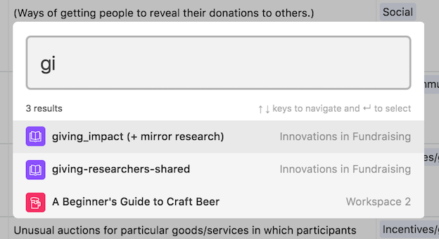

\clearpage

Here, I outline the base "giving-researchers-shared"

#Tools table

There can be  any number of tables in each Airtable Base.

Here, the "Tools" table  defines, discusses, and considers the evidence on a variety of methods that have been used and proposed to increase and improve charitable giving.

The "description" field gives a plain language Description of this tool.

Note that the first column field of every table is its identifier or "primary key" used to identify it in other tables; this should take unique values (but can be a variety of types). Here, the primary field is "toolname".

Note that some of these toolnames begin with "c- "; these are tools that we are considering including, but we are not fully convinced yet that the evidence is reasonably strong or the tool is well defined.

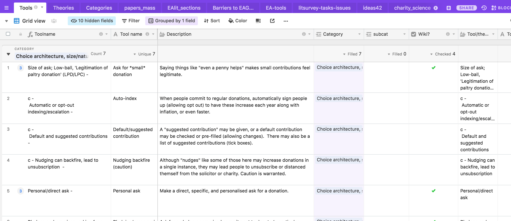

\clearpage

There are a number of helpful shortcut keys you can use to get around an Airtable (click the question mark in the upper right corner to see these). Clicking command/control-j gives a list of all of the tables in the base. This base is used for a variety of purposes, thus it has many tables.

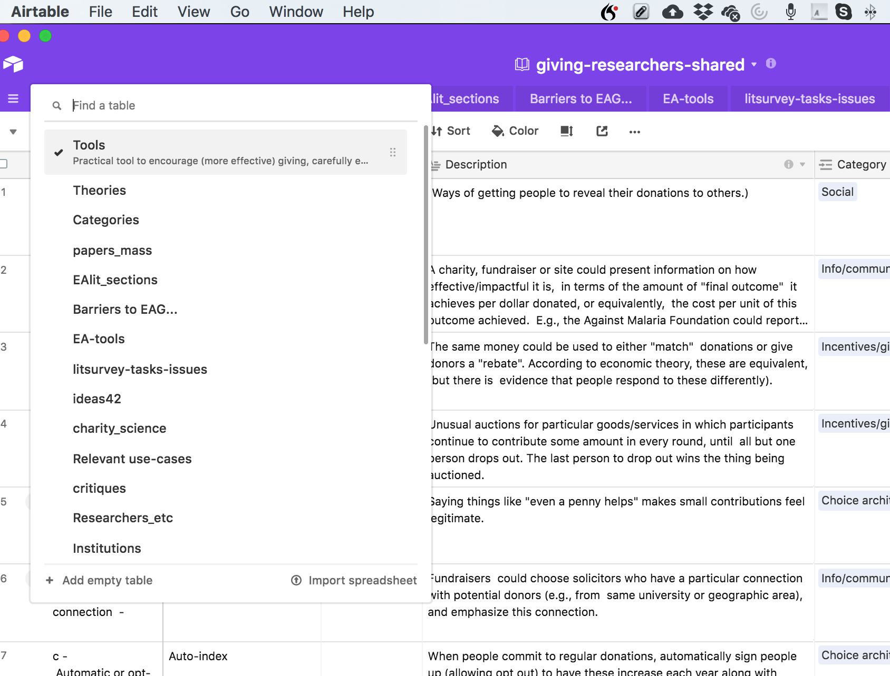

\clearpage

Here, you see the tools table, sorted by the column "evidence strength". We are aiming at a formal classification of the evidence strength for each tool, tied into a quantitative meta-analysis, relying on examples from psychology, the medical literature, and the work of Eva Vivalt (AidGrade). We will consider both the *size* of estimated effects (strength of the effects) and the strength of the evidence base; the confidence we can have in these results. However, for now, these measures of evidence strength are based on our own ad hoc judgments, considering the apparent internal and external validity/generalizability of the experiments and other evidence, the credibility of the techniques used, and whether the results have been replicated by other authors and with other approaches providing "converging validation".

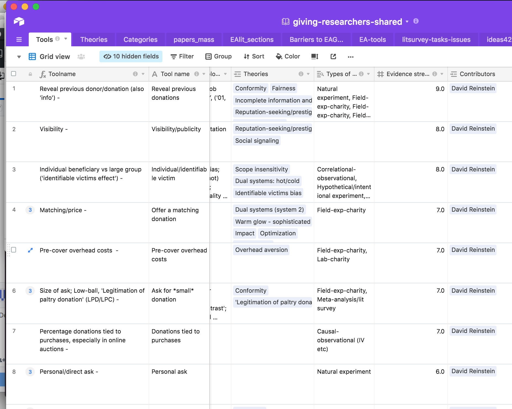

\clearpage

Here we see the tools grouped by the field "category"; a functional classification  which is further explained in the "categories" table.

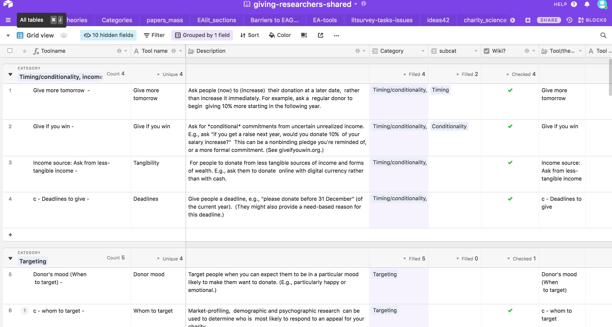

\clearpage

One can create and move between a variety of "views" for each table (control/command-shift-K to quickly access the views). These can have types, including the grids we have already seen, forms for easy input of new rows, galleries to display visual content, and Kanban to organize tasks.

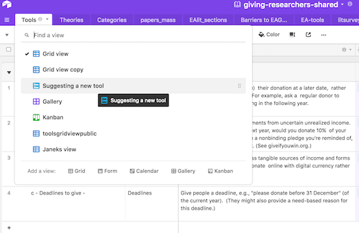

\clearpage

Here we see a "form view" to allow people to suggest a new tool, particularly users of the InnovationsinFundraising.org wiki. We can share a link to this form or embedded in a webpage. We will be notified when a new tool as suggested. It will be incorporated directly into the Airtable, and we can examine and adapt it before potentially including it on the  wiki.

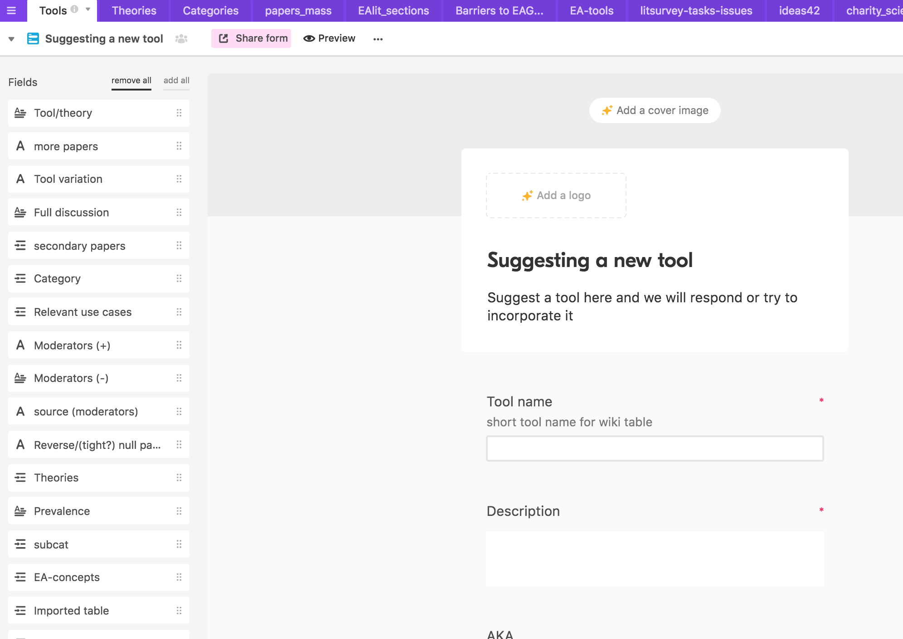

\clearpage

We can adjust the properties of each field (column), give it a description, or use it for sorting, filtering, etc., by clicking the tiny arrow on the upper right of that column.

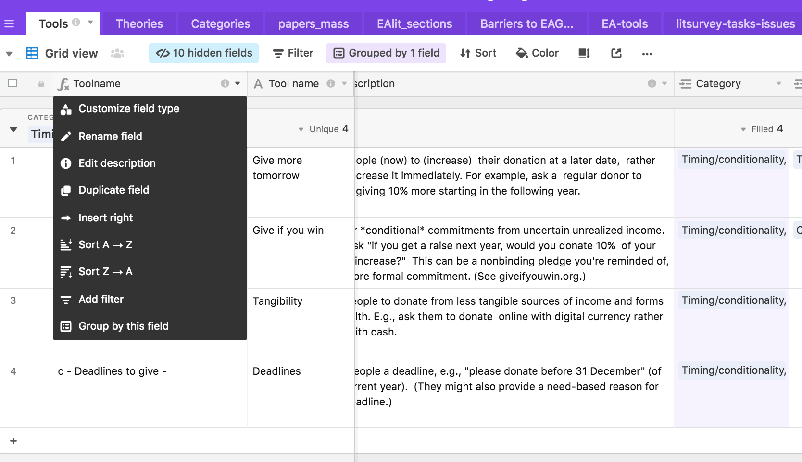

\clearpage

Each field must have a particular type (which can be reassigned later). Most of these field types are just different formats for storing and displaying data/text (also, allowing for easier means of inputting with autofills/dropdowns, or different calculations in "formula" and "count" fields.)

However, one kind of field, the "Link to another record", is distinct and perhaps the most interesting. This field tells me that this row relates to a row in another table, identified by its primary key.  Such a  link allows you to display information from different fields of each table to the other table. A table may have multiple such "Link" fields, and each link field can Linked to multiple records in the other field (if you specify that option).

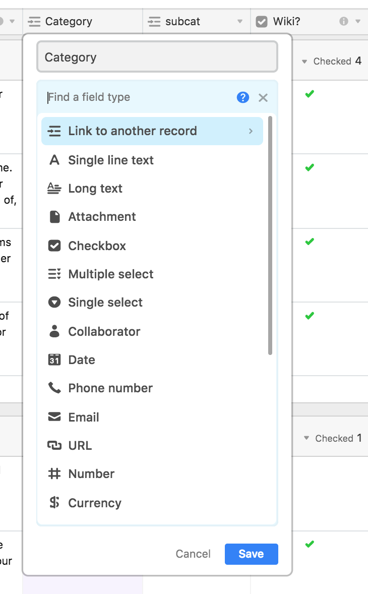

\clearpage

These link fields display as boxes in a table (grid view).

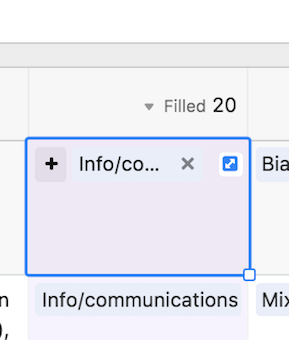

Here we see that the "category" field in the tools table is actually a link to the "Categories" table. By clicking on that box (in the tool table) you can view and edit the entry in its own "home" table.

You can by adding a *new* entry to a link field in a table, and that field will be added as a new row in its home table.

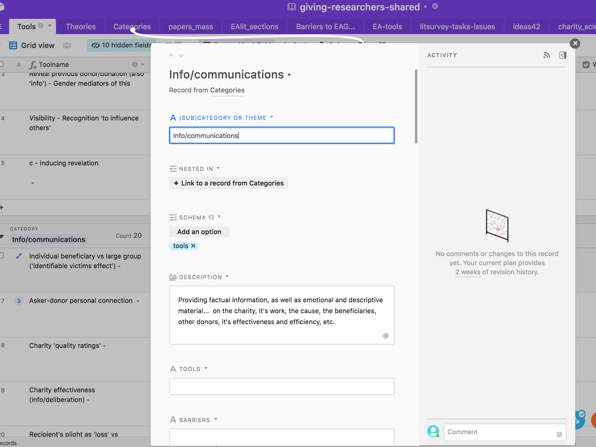

\clearpage

Some more relevant fields in the tools table:

- "Findings summarized" gives the plain language description of what the evidence suggests about the impact of this tool (and where the evidence is limited).

- "Relevance to EA charities": Is this tool especially relevant to more effective charities ("effective" in the sense endorsed by GiveWell and the EA movement), and if so, why?

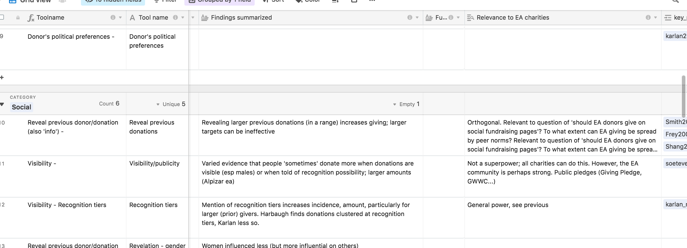

\clearpage

Through our API/application (fundingwiki), we can easily push new entries and updates to the Tools table onto the related table on the Innovations in Fundraising wiki.

\clearpage

This also pushes relevant material into the wiki page entry (on the same site) linked to the table on the wiki.

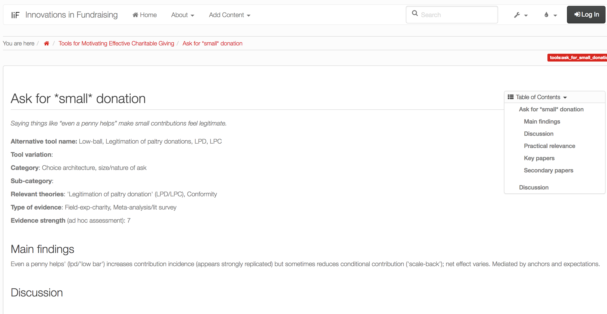

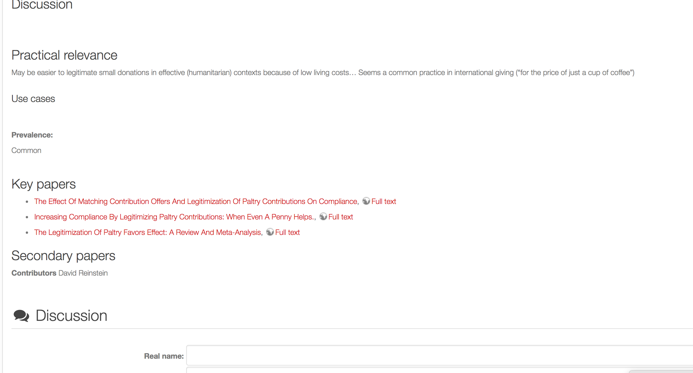

Note (above) that wiki entries also have links to the relevant academic papers' wiki entries, and the full texts of the papers.

Most pages on the wiki also allow discussion (at the moment, not integrated with the Airtable), and we are informed of new comments.

\clearpage

#Other tables

The tools table links to the "papers_mass" table in several fields, including "key_papers"; the papers providing the most relevant and strongest evidence for the tool, and "secondary papers".

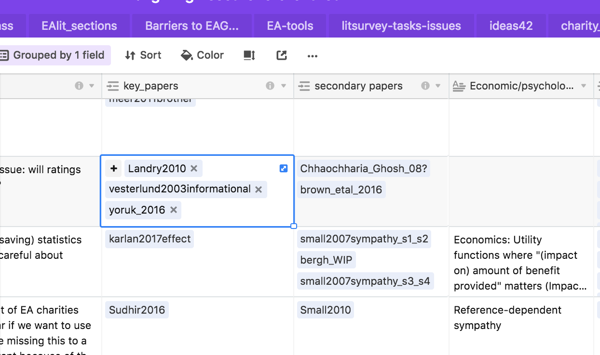

\clearpage

Again, clicking on this box both reveals the link to its home table, and allows you to view and edit this entry within its home table. Note the doi and bibtex citation format is included for this paper.

\includegraphics[height=3in]{picsfigs/link_karlan.png}

\clearpage

Here is the "papers_mass" table, the largest table in this base. We are working to include and flesh out entries the largest set of academic papers relevant to motivators and influencers of charitable giving decisions. We have particularly focused on Economics and Psychology, on *empirical* work directly involving or addressing *actual* charitable giving, and on published or well-cited papers. There is also a focus on studies considering variables that could be *adjusted* to influence giving patterns, and also on issues relating to giving effectiveness. However, none of these are exclusive restrictions.

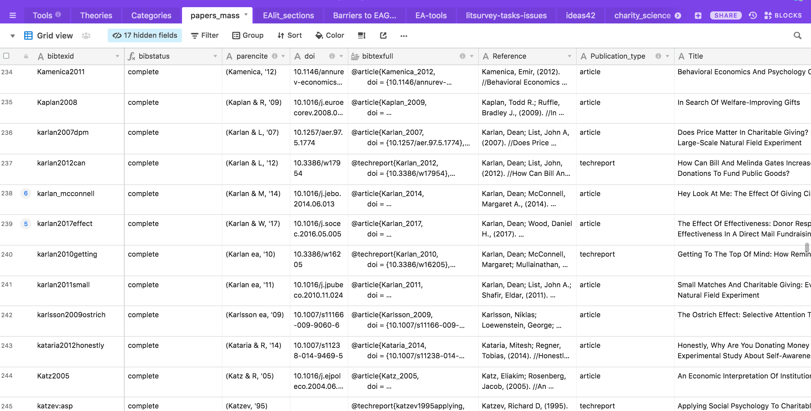

\clearpage

The papers Airtable table is also automatically integrated with the wiki (both an overall "papers" table, and a large set of pages).

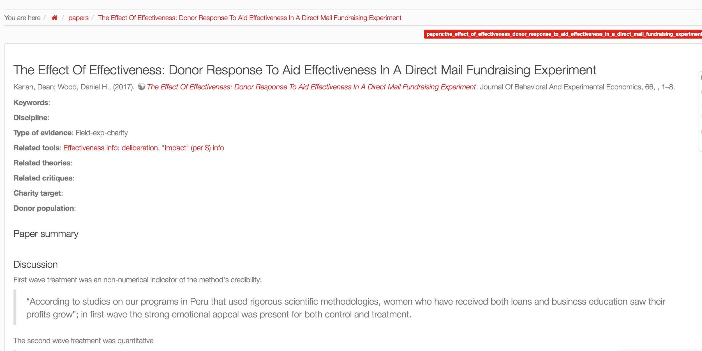

\clearpage

We are working towards collecting a key set of variables from each empirical paper to use in meta-analyses, to feed into our overall evaluations, as well as yielding additional cross-study findings. (We are also tracking, and interested in collecting, archiving, and sharing the full datasets). This will be an involved and time-consuming process; Vivalt (2017; "How much can we generalize from impact evaluations") describes a somewhat-comparable undertaking, which required a substantial organization and time commitment from AidGrade staff and volunteers.

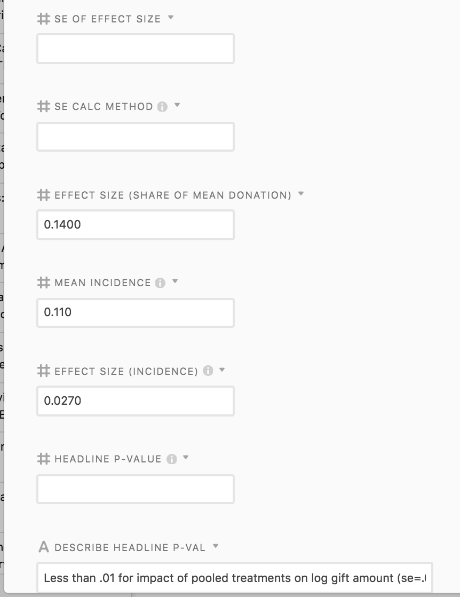

The fundingwiki app automatically populates and updates information on the number of times each paper has been cited, using the Crossref database. Tool such as these will enable this to be a perrenial resource, rather than a frozen-in-time evaluation.

\clearpage

The "Categories" table provides and explains a number of "schema" we use to characterize both the tools and the "Barriers to effective giving" (discussed later).

\clearpage

Our literature survey and synthesis work also engages and connects to previous relevant work, such as the Ideas42 "Behavior and Charitable Giving" report, which is outlined in the  table below.

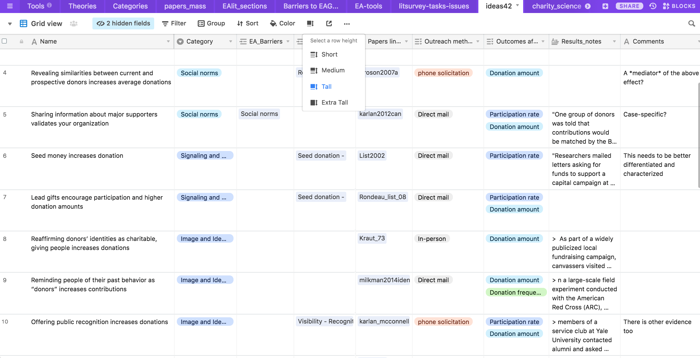

\clearpage

This Airtable contains a host of other tables relevant to the projects mentioned here, and related academic and impact collaborations.

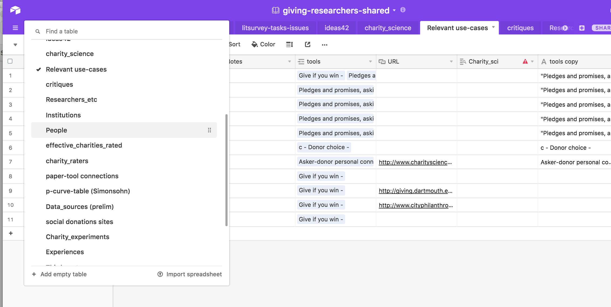

\clearpage

A different airtable base includes a table giving "instructions" for how the giving-researchers-shared Airtable should be integrated with the innovationsinfundraising.org wiki. This is accomplished through the continued coding and running of the fundingwiki app.

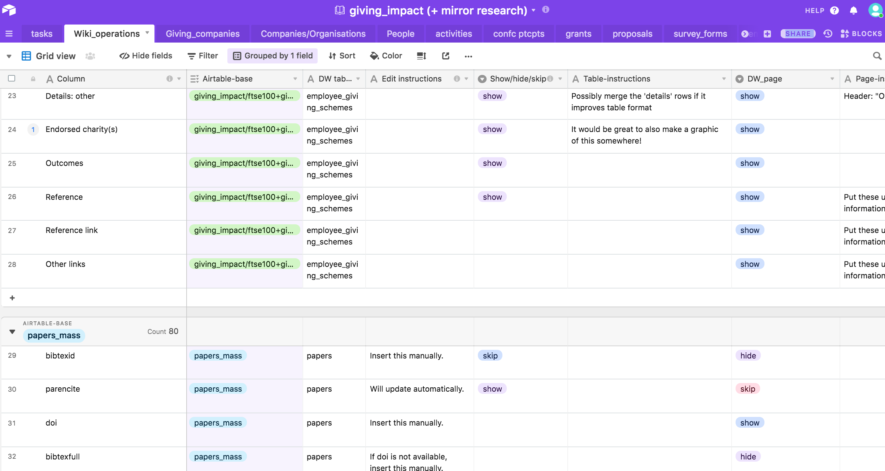

\clearpage

#Increasing effective charitable giving: a review

With a team of academic collaborators, we are working on a review paper highlighting the "puzzle" that while people donate a great deal to charity, they donate relatively little to charities that evidence suggests are the most effective ones.

This paper draws from the database and wiki, and each of these will be integrated with one another. The analysis and discussion in the survey paper will be mirrored on the wiki, providing a platform for discussion and continuous updating. Each element of the surveyed evidence will be provided as a database entry, cross-referencing relevant papers, theories, use-cases, and available raw data.

<!---
removed here: major discussion of the review paper.
-->

\clearpage

#AidGrade offers a partial model for the evaluation and dissemination process

\includegraphics[height=3in]{picsfigs/aidgrade_build_your_own.png}

\includegraphics[height=3in]{picsfigs/AidGrade 2018-08-02 at 13.25.13.png}

\includegraphics[height=3in]{picsfigs/AidGrade 2018-08-02 at 13.25.34.png}

\includegraphics[height=3in]{picsfigs/AidGrade 2018-08-02 at 13.26.05.png}

\includegraphics[height=3in]{picsfigs/AidGrade 2018-08-02 at 13.26.31.png}

\includegraphics[height=3in]{picsfigs/AidGrade 2018-08-02 at 13.27.04.png}

